#目标检测

[toc]

原文见<https://zhuanlan.zhihu.com/p/462919422>

# You Only Learn One Representation: Unified Network for Multiple Tasks
- 论文地址：[You Only Learn One Representation: Unified Network for Multiple Tasks](https://link.zhihu.com/?target=https%3A//arxiv.org/abs/2105.04206)
- 对应代码：[https://github.com/WongKinYiu/yolor](https://link.zhihu.com/?target=https%3A//github.com/WongKinYiu/yolor)

借用网上其他人绘制的一张 yolor 的总体结构图:

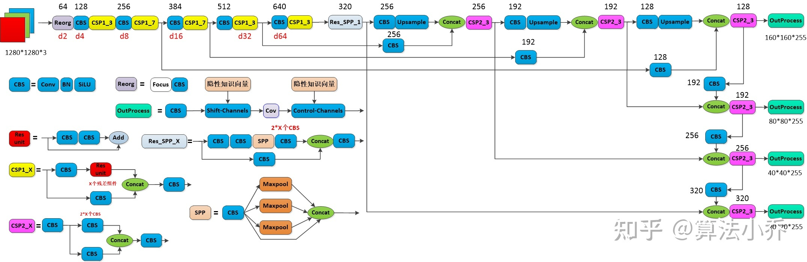

## 摘要

人们通过视觉、听觉、触觉以及过去的经验来“理解”世界。人类的经验可以通过正常的学习（我们称之为显性知识）或潜意识（我们称之为隐性知识）来学习。这些通过正常学习或潜意识学习到的经验将被编码并储存在大脑中。利用这些丰富的经验作为一个巨大的数据库，人类可以有效地处理数据，即使这些数据是事先看不见的。在本文中，我们提出了一个统一的网络，将内隐知识和外显知识编码在一起，就像人脑可以从正常学习和潜意识学习中学习知识一样。统一网络可以生成一个统一的表示，以同时服务于各种任务。我们可以在卷积神经网络中执行核空间对齐、预测细化和多任务学习。结果表明，在神经网络中引入隐式知识有利于所有任务的执行。我们进一步分析了从所提出的统一网络学习到的隐式表示，它显示了捕捉不同任务物理意义的强大能力。这项工作的源代码位于 [https://github.com/WongKinYiu/yolor](https://link.zhihu.com/?target=https%3A//github.com/WongKinYiu/yolor)

## 1 引言

如图 1 所示，人类可以从不同的角度分析同一段数据。然而，经过训练的卷积神经网络（CNN）模型通常只能实现一个目标（也就是一次只能从一个角度来观察一个目标）。一般来说，从经过训练的 CNN 中提取的特征通常对其他类型的问题适应性较差。造成上述问题的主要原因是我们只从神经元中提取特征，而没有使用 CNN 中丰富的内隐知识。当真正的人脑在工作时，上述隐性知识可以有效地帮助大脑执行各种任务。

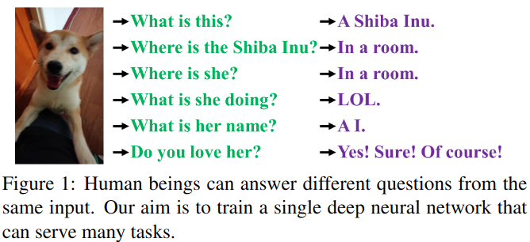

隐性知识是指在潜意识中学习到的知识。然而，没有系统的定义内隐学习如何运作以及如何获得内隐知识。在神经网络的一般定义中，从浅层获得的特征通常称为显式知识，从深层获得的特征称为隐式知识。在本文中，我们将与观察直接对应的知识称为显式知识。对于模型中隐含的与观察无关的知识，我们称之为隐含知识。

我们提出了一个统一的网络来集成隐式知识和显式知识，并使学习模型包含一个通用表示，这种通用表示使子表示 sub-representations 适合于各种任务。图 2.（c）说明了拟议的统一网络体系结构。

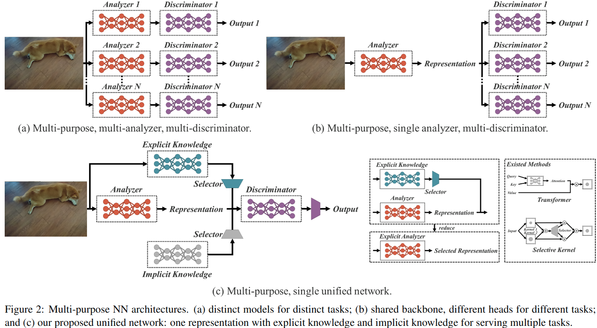

图 2：多用途 [NN](https://link.zhihu.com/?target=https%3A//beta.remnote.io/doc/Q7DdkgW7ExdayBPvo) 架构。（a） 针对不同任务的不同模型（一个任务一个 BackBone）；（b） 共享主干，不同任务的不同头（共享同一个 BackBone，但是不同任务的分类器依然不一样）；和（c）我们提出的统一网络：一个具有显式知识和隐式知识的表示，用于服务多种任务。

构建上述统一网络的方法是将压缩感知和深度学习结合起来，主要的理论基础可以在我们之前的工作中找到 [16,17,18]。在 [16] 中，我们证明了利用扩展字典重构残差的有效性。在 [17,18] 中，我们使用稀疏编码来重建 CNN 的特征图，并使其更加健壮。这项工作的贡献总结如下：

1. 我们提出了一个能够完成各种任务的统一网络，它通过整合隐式知识和显式知识来学习一个通用表示，通过这个通用表示可以完成各种任务。所提出的网络有效地提高了模型的性能，只需很小的额外成本（不到参数和计算量的 1 万）。
2. 将 kernel 空间对齐、预测修正和多任务学习引入到内隐知识学习过程中，验证了它们的有效性。
3. 分别讨论了利用向量、神经网络、矩阵分解等工具对隐含知识进行建模的方法，并验证了其有效性。
4. 我们证实了所提出的内隐表征学习方法能够准确地对应于特定的物理特征，并且我们还以视觉的方式呈现了它。我们还证实，如果算子符合目标的物理意义，它可以用来整合内隐知识和外显知识，并会产生 [乘法效应](https://link.zhihu.com/?target=https%3A//beta.remnote.io/doc/XvYwgJEC6avyP3hF3)。
5. 结合最新的方法，我们提出的统一网络在目标检测方面达到了与 Scaled-YOLOv4-P7[15] 相当的精度，推理速度提高了 88%。

## 2 相关工作

我们对与本研究主题相关的文献进行了回顾。本文献综述主要分为三个方面：（1）外显式深度学习：它将涵盖一些能够根据输入数据自动调整或选择特征的方法；（2）内隐式深度学习：它将涵盖内隐式深度知识学习和内隐微分导数的相关文献；（3）知识建模：它将列出几种可用于集成隐式知识和显式知识的方法。

### 2.1 外显式深度学习

显性深层学习可以通过以下方式进行。其中，Transformer[14,5,20] 是一种方式，它主要使用查询、键或值来获得自我关注。非本地网络 [21,4,24] 是获取注意力的另一种方式，它主要在时间和空间上提取成对注意。另一种常用的显式深度学习方法 [7,25] 是通过输入数据自动选择合适的内核。

### 2.2 内隐深度学习

属于内隐深度学习范畴的方法主要是内隐神经表征 [11] 和深度均衡模型 [2,3,19]。前者主要是获取离散输入的参数化连续映射表示以执行不同的任务，后者是将隐式学习转化为残差形式的神经网络，并对其进行平衡点计算。

### 2.3 知识建模

对于属于知识建模范畴的方法，主要包括稀疏表示 [1,23] 和存储网络 [22,12]。前者使用样例、预定义过完整或学习过的字典来执行建模，而后者依赖于组合各种形式的嵌入来形成内存，并使内存能够动态添加或更改。

## 3 隐性知识是如何运作的？

本研究的主要目的是建立一个能够有效训练内隐知识的统一网络，因此首先我们将关注如何训练内隐知识，并在后续的研究中对其进行快速推理。由于隐式表示 $z_i$ 与观测无关，我们可以将其视为一组常数张量 $Z=\{z_1，z_2，…，z_k\}$。在本节中，我们将介绍作为常数张量的隐式知识如何应用于各种任务。

### 3.1 流形空间缩减

我们认为，一个好的表征应该能够在它所属的流形空间中找到合适的投影，并促进后续目标任务的成功。例如，如图 3 所示，如果目标类别可以通过投影空间中的 [超平面](https://link.zhihu.com/?target=https%3A//beta.remnote.io/doc/PTKSRHv3nThh77utS) 成功分类，那将是最好的结果。在上面的例子中，我们可以利用投影向量的内积和隐式表示来达到降低流形空间维数的目的，有效地完成各种任务。（将线性不可分的样本放到 [高维空间](https://link.zhihu.com/?target=https%3A//beta.remnote.io/doc/i2oLjhd668bwR7vhy) 中，对于超平面而言会变得线性可分）

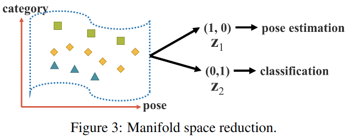

### 3.2. 内核空间对齐

在多任务和多头神经网络中，核空间失调是一个常见的问题，图 4(a) 举例说明了多任务和多头神经网络中的核空间失调。为了解决这个问题，我们可以执行输出特征和隐式表示的加法和乘法，这样可以平移、旋转和缩放内核空间，以对齐神经网络的每个输出内核空间，如图 4（b）所示。上述操作模式可广泛应用于不同领域，如特征金字塔网络（FPN）[8] 中大对象和小对象的特征对齐，使用知识提取集成大模型和小模型，以及处理零拍域转移等问题。

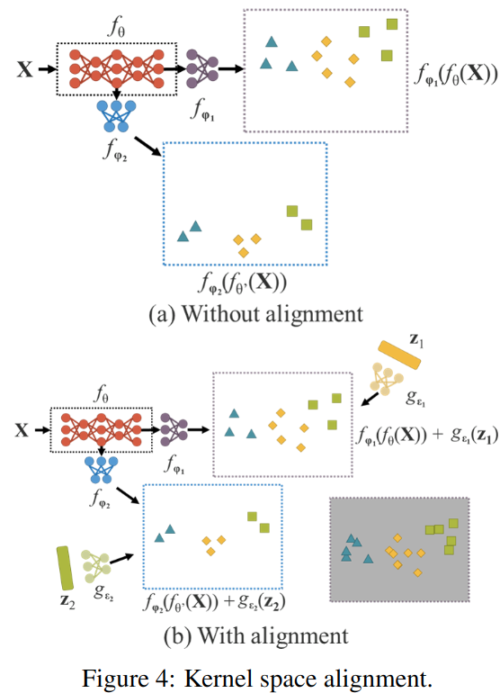

### 3.3. 更多功能

   除了可以应用于不同任务的功能外，内隐知识还可以扩展为更多的功能。如图 5 所示，通过引入加法，可以使神经网络预测中心坐标的偏移量。还可以引入乘法来自动搜索锚点的超参数集，这是基于锚点的对象检测器经常需要的。此外，可以分别使用点乘和串联来执行多任务特征选择，并为后续计算设置前提条件。

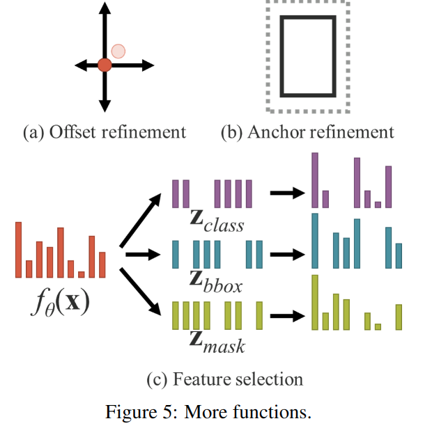

## 4.统一网络中的隐性知识

在本节中，我们将比较传统网络和提议的统一网络的目标函数，并解释为什么引入隐式知识对于训练多用途网络很重要。同时，我们还将详细阐述本文提出的方法。

### 4.1. 内隐知识的表述

传统网络：

对于常规网络训练的目标函数，我们可以用（1）表示如下：

$$
y=f_{\theta}(x)+ \epsilon
$$

$$
minimize \; \epsilon  \tag{1}
$$

其中 x 是观测值，$\theta$ 是神经网络的一组参数，$f_{\theta}$ 代表神经网络的操作，$\epsilon$ 是误差项，y 是给定任务的目标。

在传统神经网络的训练过程中，通常会最小化 $\epsilon$，使 $f_{\theta}(x)$ 尽可能接近目标。这意味着，我们期望相同目标的不同观测值是由 $f_{\theta}$ 获得的子空间中的单个点，如图 6(a) 所示。换句话说，我们期望得到的解空间仅对当前任务 $t_i$ 有区别，对各种潜在任务 $T / t_i$ 中 $t_i$ 以外的任务不变，其中 $T=\{t_1，t_2，…，t_n\}$。

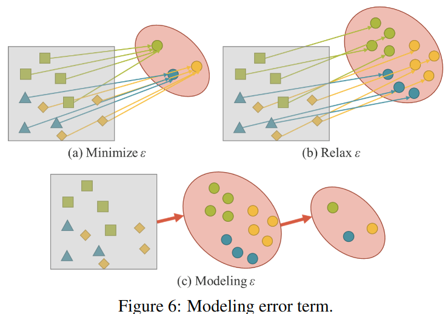

对于通用神经网络，我们希望得到的表示能够服务于属于 T 的所有任务。因此，我们需要 relax，以便能够在流形空间上同时找到每个任务的解决方案，如图 6（b）所示。然而，上述要求使得我们不可能使用简单的数学方法，例如一个 one-hot 向量的最大值或欧氏距离的阈值来获得 $t_i$ 的解。为了解决这个问题，我们必须对错误项进行建模，以便为不同的任务找到解决方案，如图 6（c）所示。

统一网络：

为了训练所提出的统一网络，我们使用显式和隐式知识对错误项进行建模，然后用它来指导多目标网络训练过程。相应的培训方程式如下：

$$
y=f_{\theta}(x)+ \epsilon +g_{\phi}(\epsilon_{ex}(x),\epsilon_{im}(z))
$$

$$
minimize \; \epsilon +g_{\phi}(\epsilon_{ex}(x),\epsilon_{im}(z)) \tag{2}
$$

其中 $\epsilon_{ex}$ 和 $\epsilon_{im}$ 是分别对观测值 x 和潜在代码 z 的显式误差和隐式误差进行建模的操作。$g_{\phi}$ 这里是一个特定于任务的操作，用于组合或选择显性知识和隐性知识中的信息。

已有的一些方法可以将显式知识集成到 $f_{\theta}$ 中，因此我们可以将（2）重写为（3）。

$$
y=f_{\theta}(x)*g_{\phi}(z)  \tag{3}
$$

$*$ 表示可以组合 $f_{\theta}$ 和 $g_{\phi}$ 的一些可能的运算符。在这项工作中，将使用第 3 节中介绍的运算符，即加法、乘法和级联

如果我们将误差项的推导过程扩展到处理多个任务，我们可以得到以下等式：

$$
F(x,\theta,Z,\Phi,Y,\Psi) =0  \tag{4}
$$

其中 $Z=\{z_1，z_2，…，z_T\}$ 是 T 个不同任务的隐式潜在代码集。$\Phi$ 是可用于从 $Z$ 生成隐式表示的参数。$\Psi$ 用于从显式表示和隐式表示的不同组合计算最终输出参数。

对于不同的任务，我们可以使用以下公式来获得所有 $z$ 的预测∈ Z

$$
d_{\Psi}(f_{\theta}(x),g_{\Phi}(z),y)=0  \tag{5}
$$

对于所有任务，我们从一个通用的统一表示 $f_{\theta}(x)$ 开始，通过任务特定的隐式表示 $g_{\phi}(z)$，最后使用任务特定的鉴别器 $d_{\Psi}$ 完成不同的任务。

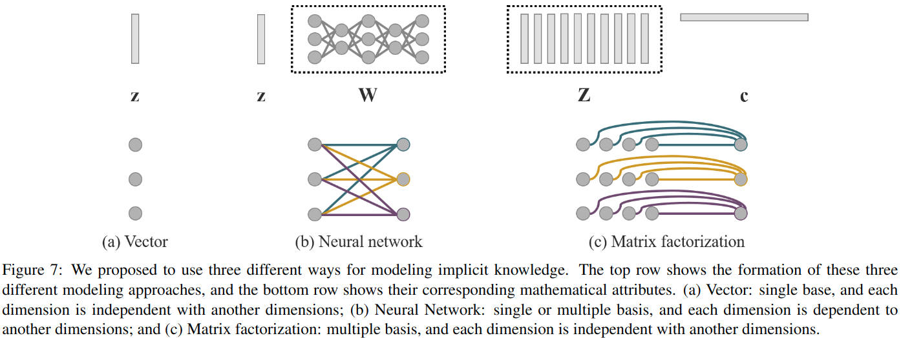

图 7：我们建议使用三种不同的方法对内隐知识进行建模。顶行显示了这三种不同建模方法的形成，底行显示了它们相应的数学属性。（a） 向量：单基，每个维度独立于其他维度；（b） 神经网络：单个或多个基础，每个维度依赖于另一个维度；（c）矩阵分解：多重基，每个维度与另一维度独立。

### 4.2. 内隐知识建模

我们提出的隐性知识可以通过以下方式建模：

**向量/矩阵/张量**：

向量 z- 使用向量 z 直接作为隐式知识的先验知识，并直接作为隐式表示。此时，必须假设每个维度彼此独立。

**神经网络**：

用向量 z 作为隐式知识的先验，然后用权矩阵 W 进行线性组合或非线性化，成为隐式表示。此时，必须假设每个维度都是相互依赖的。我们还可以使用更复杂的神经网络来生成隐式表示。或者使用马尔可夫链来模拟不同任务之间的隐式表示的相关性。

**矩阵分解**：

$$
Z^T c  \tag{8}
$$

使用多个向量作为隐式知识的先验，这些隐式先验基 Z 和系数 c 将形成隐式表示。我们还可以进一步对 c 进行稀疏约束，并将其转换为稀疏表示形式。此外，我们还可以对 Z 和 c 施加非负约束，将它们转换为非负矩阵分解 (NMF) 形式。

### 4.3.训练

假设我们的模型在开始时没有任何先验隐式知识，也就是说，它不会对显式表示 $f_{\theta}$ 产生任何影响。当合并操作 $* \in \{addition,concatenation\}$，隐式先验初始化为 $z \backsim N(0,\sigma)$，当结合操作 $*$ 为乘法时，$z \backsim N(1,\sigma)$。这里，$\sigma$ 是一个非常小的值，接近于零。对于 $z$ 和 $\phi$，在训练过程中均采用反向传播算法进行训练。

### 4.4. 推理

由于隐式知识与观测值 x 无关，因此无论隐式模型 $g_{\phi}$ 有多复杂，都可以在执行推理阶段之前将其简化为一组常数张量。换句话说，隐式信息的形成对算法的计算复杂度几乎没有影响。此外，当上面的运算符是乘法时，如果后续层是卷积层，则我们使用下面的 (9) 进行积分。当遇到加法运算符时，如果前一层是卷积层且没有激活函数，则使用下面所示的 (10) 进行积分。

$$
x_{(l+1)}=\sigma(W_l(g_{\phi}(z)x_l)+b_l)  \\
=\sigma(W^{'}_{l}(x_l)+b_l), \; where \; W_{l}^{'}=W_lg_{\phi}(z)  \tag{9}
$$

$$
x_(l+1)=W_l(x_l)+b_l+g_{\phi}(z)=W_l(x_l)+b^{'}_{l}, \; where \; b^{'}_{l}=b_l+g_{\phi}(z)  \tag{10}
$$

## 5.实验

我们的实验采用了 MSCOCO 数据集 [9]，因为它为许多不同的任务提供了 GT，包括目标检测、实例分割、全景分割、关键点检测、语义分割、图像标题、多标签图像分类和长尾目标检测。这些具有丰富注释内容的数据可以帮助训练一个统一的网络，该网络可以支持与计算机视觉相关的任务以及自然语言处理任务。

### 5.1. 实验设置

在实验设计中，我们选择将内隐知识应用于三个方面，包括 FPN 的特征对齐、预测细化和单个模型中的多任务学习。多任务学习涵盖的任务包括目标检测、多标签图像分类和特征嵌入。我们在实验中选择 YOLOv4CSP[15] 作为基线模型，并在图 8 中箭头所指的位置将隐式知识引入模型。将所有训练超参数与 ScaledYOLOv4 的默认设置进行比较 [15]。

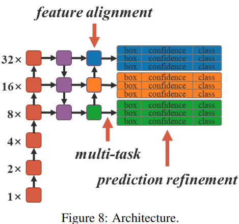

在第 5.2 节、第 5.3 节和第 5.4 节中，我们使用最简单的向量隐式表现形式和加法运算符来验证引入隐式知识对各种任务的积极影响。在第 5.5 节中，我们将在显性知识和隐性知识的不同组合上使用不同的运算符，并讨论这些组合的有效性。在第 5.6 节中，我们将使用不同的方法对隐性知识进行建模。在第 5.7 节中，我们分析了引入和不引入隐式知识的模型。最后，在第 5.8 节中，我们将使用隐式知识训练目标检测器，然后将其性能与最先进的方法进行比较。

### 5.2. FPN 的特征对齐

我们将隐式表示添加到每个 FPN 的特征映射中进行特征对齐，相应的实验结果如表 1 所示。从表 1 所示的这些结果可以看出：在使用隐式表示进行特征空间对齐后，所有性能，包括 $AP_S$、$AP_M$ 和 $AP_L$，都提高了约 0.5%，这是一个非常显著的改进。

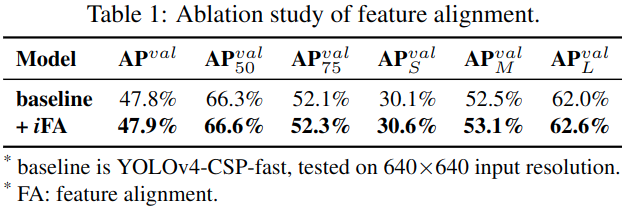

* 基线是 YOLOv4-CSP-fast，在 640×640 输入分辨率下测试。

* FA：特征对齐。

### 5.3. 目标检测的预测细化

隐式表示将添加到 YOLO 输出层以进行预测细化。如表 2 所示，我们看到几乎所有指标得分都有所提高。图 9 显示了内隐表征的引入如何影响检测结果。在目标检测的情况下，即使我们不提供任何隐式表示的先验知识，所提出的学习机制仍然可以自动学习每个锚框的（x，y），（w，h），（obj）和（classes）模式。

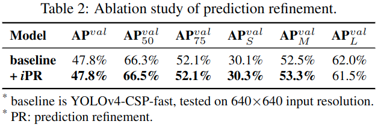

* 基线是 YOLOv4 CSP fast，在 640×640 输入分辨率下测试。

* PR：预测细化。

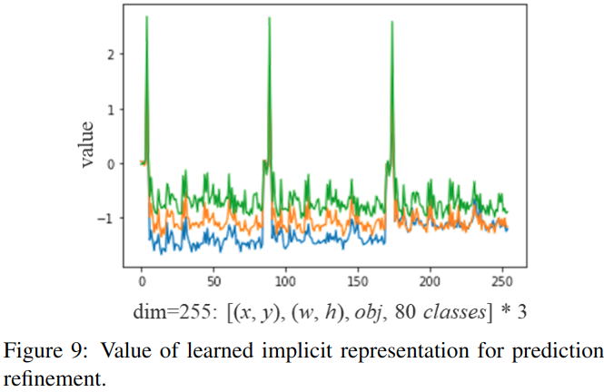

### 5.4. 多任务的规范表示

当一个人想要训练一个可以同时被多个任务共享的模型时，由于必须执行损失函数的联合优化过程，因此在执行过程中，多方往往相互拉动。上述情况将导致最终的整体性能比单独训练多个模型然后将其集成更差。为了解决上述问题，我们建议训练多任务的规范表示。我们的想法是通过在每个任务分支中引入隐式表示来增强表示能力，表 3 列出了它所产生的影响。如表 3 所示，在不引入内隐表征的情况下，多任务训练后，一些指标得分有所提高，一些则有所下降。在联合检测与分类（JDC）中引入隐式表示后，在 $+iJDC$ 对应的模型中，我们可以清楚地看到总体指标得分显著提高，超过了单任务训练模型的性能。与未引入隐式表示时相比，我们的模型在中等大小对象和大型对象上的性能分别提高了 0.3% 和 0.7%。在联合检测与嵌入（JDE）实验中，由于特征对齐所隐含的内隐表征特性，提高指标得分的效果更为显著。在表 3 列出的 JDE 和 $+iJDE$ 对应的指数得分中，$+iJDE$ 的所有指数得分都超过了不引入内隐表征的指数。其中，大型物体的 AP 甚至上升了 1.1%。

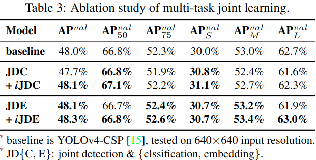

* 基线是 YOLOv4 CSP[15]，在 640×640 输入分辨率下测试。

* JD{C，E}：联合检测和{clssification，embedding}。

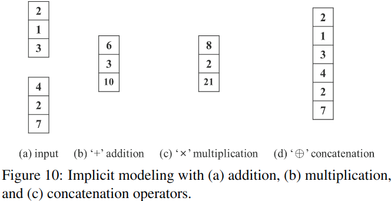

### 5.5. 不同算子的隐式建模

表 4 显示了使用图 10 所示的不同操作符组合显式表示和隐式表示的实验结果。在特征对齐的隐式知识实验中，我们看到加法和 concatenation 都提高了性能，而乘法实际上降低了性能。特征对齐的实验结果完全符合其物理特性，因为它必须处理全局移位和所有单个簇的缩放。在预测精化的隐式知识实验中，由于 concatenation 算子会改变输出的维数，因此我们在实验中只比较了使用加法和乘法算子的效果。在这组实验中，应用乘法的性能优于应用加法的性能。分析原因，我们发现中心移位在执行预测时使用加法解码，而锚定尺度使用乘法解码。由于中心坐标以网格为界，影响较小，且人工设置的锚具有较大的优化空间，因此改进更为显著。

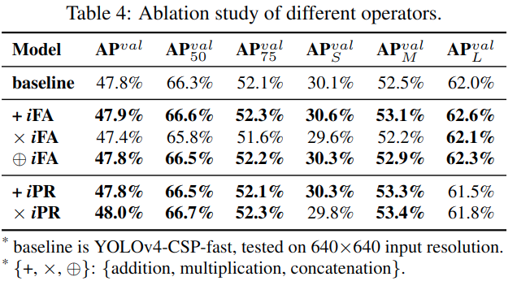

基于上述分析，我们设计了另外两组实验 -$\{ \times iFA^*, \times iPR^* \}$. 在第一组实验中 -$ \times iFA^* $, 我们根据 anchor 聚类结果来划分特征空间，然后使用乘法操作结合。在第二组实验中 - $\times iPR^*$，在预测中，我们只对宽度和高度进行了乘法细化。上述实验的结果如表 5 所示。从表 5 所示的数字中，我们发现经过相应的修改后，各项指标的得分都得到了全面的提高。实验表明，当我们设计如何将显性知识和隐性知识结合在一起时，我们必须首先考虑组合层的物理意义，以达到乘数效应。

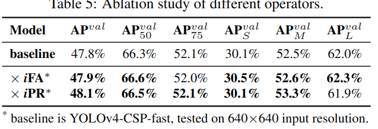

### 5.6. 内隐知识的不同建模方法

我们尝试以不同的方式对隐性知识建模，包括向量、神经网络和矩阵分解。当使用神经网络和矩阵分解进行建模时，隐式先验维度的默认值是显式表示维度的两倍。这组实验的结果如表 6 所示。我们可以看出，无论是使用神经网络还是矩阵分解对隐性知识进行建模，都会提高整体效果。其中，采用矩阵分解模型的效果最好，使 AP、AP50 和 AP75 的性能分别提高了 0.2%、0.4% 和 0.5%。在本实验中，我们展示了使用不同建模方法的效果。同时，我们也证实了内隐表征在未来的发展潜力。

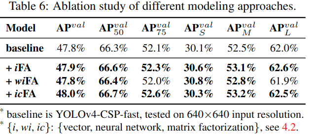

### 5.7. 隐式模型分析

我们使用/w/o 隐式知识分析了模型的参数数量、失败次数和学习过程，结果分别如表 7 和图 11 所示。从实验数据中我们发现，在具有隐式知识集的模型实验中，我们只增加了不到万分之一的参数和计算量，这可以显著提高模型的性能，并且训练过程也可以快速、正确地收敛。

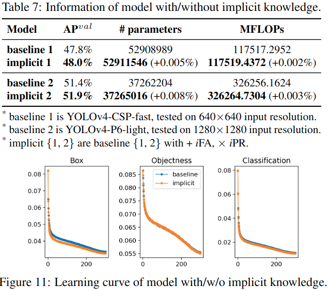

### 5.8. 目标检测的隐式知识

最后，我们将所提出的方法的有效性与目标检测的最新方法进行了比较。表 8 显示了引入隐性知识的好处。对于整个训练过程，我们遵循 scaled-YOLOv4[15] 训练过程，即先从头开始训练 300 个历元，然后微调 150 个历元。表 9 说明了与现有方法的比较。值得注意的是，我们提出的方法没有额外的训练数据和注释。通过引入隐式知识的统一网络，我们仍然可以获得与最先进的方法相匹配的结果。

## 6.结论

在本文中，我们展示了如何构建一个整合了隐式知识和显式知识的统一网络，并证明了它在单模型架构下对于多任务学习仍然是非常有效的。将来，我们将把培训扩展到多模式和多任务，如图 12 所示。

# 其他一些问题的
## 1. 隐式知识是怎么引入的

对应于公式 3 下关于隐式信息相加,相乘,拼接,对应于代码 `ImplicitA`,`ImplicitM`,`ImplicitC`,在最后输出处理阶段,`ShiftChannel` 层是将张量和 `ImplicitA` 产生的参数相加.`ControlChannel` 层是将张量和 `ImplicitM` 产生的参数相乘.具体 `yolor_p6` 的结构参见:

# 个人启发
1. 在接近最终输出的地方设置一个可学习的嵌入可以提升效果,类似 DETR?
2. 使用辅助头形成多级结构来辅助最终任务头输出,若最终任务头设计较为轻量弱鸡,那么一开始网络的收敛效果就会较差,此时辅助头就可以设计重一点,使用比较显式的机制; 若最终任务头设计性能较强或者严格,那么辅助头就可以放松一点,提高 recall