# OpenWAM: An Open, Modular Exploration Towards Systematic World–Action Model Pretraining

# OpenWAM：迈向系统化世界 - 动作模型预训练的开放、模块化探索

**Yuran Wang¹,*,‡ · Siqiao Huang²,*,‡ · Mingleyang Li³,* · Chenhao Zhang³,* Jiaqi Liang³,* · Weiyang Jin⁴ · Yue Chen³ · Xuemin Chi⁵ · Donghao Zhou⁶ · Qize Yu³ · Yu-Kai Wang³ · Yuhan Rui³ · Shenzhe Yao² · Zhen Yuan⁴ · Zhenhao Shen³ · Kefei Zhu³ · Zijie Zhu⁴ · Ning Gao⁷ · Xiaowei Chi³ · Guanqi He² · Shanghang Zhang³ · Hao Dong³ · Lin Shao¹,† · Hang Zhao²,†**

¹ 新加坡国立大学 (National University of Singapore)

² 清华大学 (Tsinghua University)

³ 北京大学 (Peking University)

⁴ 香港大学 (The University of Hong Kong)

⁵ 浙江大学 (Zhejiang University)

⁶ 香港中文大学 (The Chinese University of Hong Kong)

⁷ 上海交通大学 (Shanghai Jiao Tong University)

* 同等贡献 · ‡ 项目负责人 · † 共同指导  
- arXiv: 2609.07398v1  
- 项目主页: [https://openwam-official.github.io/](https://openwam-official.github.io/)  
- 代码仓库: [https://github.com/OpenWAM-Official/OpenWAM](https://github.com/OpenWAM-Official/OpenWAM)  
- 模型权重: [https://huggingface.co/OpenWAM](https://huggingface.co/OpenWAM)

> 译自原始 PDF（`openwam_2609.07398v1.pdf`，共 43 页）的 arXiv LaTeX 源文件。

## 摘要 (Abstract)

世界 - 动作模型（World–Action Models, WAMs）从视频生成先验中继承世界知识，并通过具身体验将其转化为可执行的控制信号。然而，现有的系统往往是单体化（monolithic）的：生成式骨干网络、视觉表征、架构、信息流、推理过程和训练数据紧密耦合，使得外界难以厘清究竟哪些设计选择至关重要以及其背后的机理。本文提出了 `OpenWAM`，一个将世界 - 动作预训练转变为受控实验研究项目的开放式研究技术栈。`OpenWAM-Infra` 将 WAM 的设计空间解耦为可组合的模块，并提供统一的训练、推理、部署和评测基准。在此基底之上，`OpenWAM-Study` 通过受控实验探讨了三个核心问题：继承什么知识、世界与动作学习如何相互作用、以及两者的协同效应如何扩展；并提炼出三大原则：上游知识通过具备足够能力的生成骨干网络和紧凑且信息丰富的潜空间进行传递；世界与动作的协同需要专门的动作容量、显式的世界到动作信息流，以及同步联合去噪；具身预训练主要提升分布外（OOD）泛化能力，其中在第一人称视角的以人为中心数据与机器人数据上进行单阶段协同训练（one-stage co-training）能够有效融合世界覆盖度与动作具身基础。综合上述原则，我们构建了 `OpenWAM-`$\alpha$，这是一个在约 6,400 小时的第一人称人类和机器人数据上预训练的开源 WAM，并在仿真和真实世界基准上进行了全面评测。在涵盖单臂、双臂操作以及灵巧手等多种构型具身（embodiments）的八个仿真基准和真实机器人实验中，OpenWAM-$\alpha$ 均展现出稳定优异的性能，将其顶级地位从仿真延续到了物理世界。我们开源了完整的技术栈，包括基础设施、评测协议、预训练模型和数据配方，以促进未来的学术研究。

---

## 目录 (Contents)

- [引言 (Introduction)](#引言-introduction)  
- [相关工作 (Related Work)](#相关工作-related-work)  
- [OpenWAM-Infra：用于世界-动作建模的模块化基础设施 (OpenWAM-Infra: A Modular Infrastructure for World–Action Modeling)](#openwam-infra用于世界-动作建模的模块化基础设施-openwam-infra-a-modular-infrastructure-for-worldaction-modeling)  
  - [可组合模型 (Composable Model)](#可组合模型-composable-model)  
  - [训练运行时 (Training Runtime)](#训练运行时-training-runtime)  
  - [部署运行时 (Deployment Runtime)](#部署运行时-deployment-runtime)  
  - [评测协议 (Evaluation Protocol)](#评测协议-evaluation-protocol)  
- [OpenWAM-Study：世界-动作模型的设计原则 (OpenWAM-Study: Design Principles for World–Action Models)](#openwam-study世界-动作模型的设计原则-openwam-study-design-principles-for-worldaction-models)  
  - [继承上游世界知识 (Inheriting Upstream World Knowledge)](#继承上游世界知识-inheriting-upstream-world-knowledge)  
    - [生成式世界先验 (Generative World Priors)](#生成式世界先验-generative-world-priors)  
    - [视觉表征先验 (Visual Representation Priors)](#视觉表征先验-visual-representation-priors)  
  - [构建世界与动作学习之间的协同效应 (Building Synergy between World and Action Learning)](#构建世界与动作学习之间的协同效应-building-synergy-between-world-and-action-learning)  
    - [架构容量 (Architectural Capacity)](#架构容量-architectural-capacity)  
    - [训练期信息流 (Training-Time Information Flow)](#训练期信息流-training-time-information-flow)  
    - [推理期信息流 (Inference-Time Information Flow)](#推理期信息流-inference-time-information-flow)  
  - [跨领域整合知识 (Consolidating Knowledge Across Domains)](#跨领域整合知识-consolidating-knowledge-across-domains)  
    - [问题设定与评测协议 (Problem Setup and Evaluation Protocol)](#问题设定与评测协议-problem-setup-and-evaluation-protocol)  
    - [具身预训练主要扩展分布外泛化能力 (Embodied Pretraining Primarily Expands OOD Generalization)](#具身预训练主要扩展分布外泛化能力-embodied-pretraining-primarily-expands-ood-generalization)  
    - [预训练改变了偏好的信息流 (Pretraining Changes the Preferred Information Flow)](#预训练改变了偏好的信息流-pretraining-changes-the-preferred-information-flow)  
  - [总结性评论 (Concluding Remarks)](#总结性评论-concluding-remarks)  
- [OpenWAM-$\alpha$：从原则到预训练模型 (OpenWAM-$\alpha$: From Principles to a Pretrained Model)](#openwam-alpha从原则到预训练模型-openwam-alpha-from-principles-to-a-pretrained-model)  
  - [OpenWAM-$\alpha$ 的架构、训练与部署 (OpenWAM-$\alpha$ Architecture, Training, and Deployment)](#openwam-alpha-的架构训练与部署-openwam-alpha-architecture-training-and-deployment)  
    - [架构 (Architecture)](#架构-architecture)  
    - [训练 (Training)](#训练-training)  
    - [部署 (Deployment)](#部署-deployment)  
  - [多领域预训练数据与清洗构建 (Multi-Domain Pretraining Data and Curation)](#多领域预训练数据与清洗构建-multi-domain-pretraining-data-and-curation)  
    - [预训练数据混合配比 (Pretraining Data Mixture)](#预训练数据混合配比-pretraining-data-mixture)  
    - [数据清洗 (Data Curation)](#数据清洗-data-curation)  
  - [仿真基准评测 (Simulation Benchmark Evaluation)](#仿真基准评测-simulation-benchmark-evaluation)  
    - [OpenWAM-$\alpha$ 表现如何？ (How Does OpenWAM-$\alpha$ Perform?)](#openwam-alpha-表现如何-how-does-openwam-alpha-perform)  
    - [VLA 与 WAM：哪种范式更胜一筹？ (VLA versus WAM: Which Paradigm Prevails?)](#vla-与-wam哪种范式更胜一筹-vla-versus-wam-which-paradigm-prevails)  
  - [真实机器人评测 (Real-Robot Evaluation)](#真实机器人评测-real-robot-evaluation)  
- [结论 (Conclusions)](#结论-conclusions)  
- [致谢 (Acknowledgements)](#致谢-acknowledgements)  
- [附录 (Appendix)](#附录-appendix)  
- [局限性与未来工作 (Limitations and Future Work)](#局限性与未来工作-limitations-and-future-work)  
- [训练细节 (Training Details)](#训练细节-training-details)  
  - [预训练配置 (Pretraining Configuration)](#预训练配置-pretraining-configuration)  
  - [数据集特定的 SFT 配置 (Dataset-Specific SFT Configuration)](#数据集特定的-sft-配置-dataset-specific-sft-configuration)  
- [真实世界评测协议 (Real-World Evaluation Protocols)](#真实世界评测协议-real-world-evaluation-protocols)  
  - [单臂真机实验 (Single-Arm Real-Robot Experiments)](#单臂真机实验-single-arm-real-robot-experiments)  
  - [灵巧手真机实验 (Dexterous-Hand Real-Robot Experiments)](#灵巧手真机实验-dexterous-hand-real-robot-experiments)  
  - [双臂真机实验 (Bimanual Real-Robot Experiments)](#双臂真机实验-bimanual-real-robot-experiments)  
- [分项基准仿真结果 (Per-Benchmark Simulation Results)](#分项基准仿真结果-per-benchmark-simulation-results)  
- [参考文献 (References)](#参考文献-references)

---

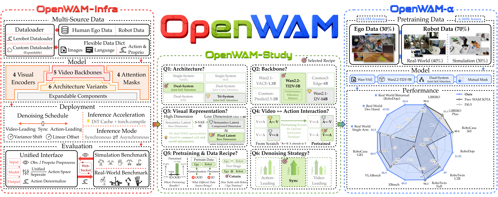

**图 1\.** **`OpenWAM` 概览。** **OpenWAM-Infra**（*左*）将世界 - 动作建模解构为可组合的模块，并配备统一的训练、部署和评测；**OpenWAM-Study**（*中*）通过受控的科学问题解析设计空间并提炼出预训练配方；**OpenWAM-$\alpha$**（*右*）在 5.185 亿帧以人为中心的第一人称及机器人数据上预训练，将顶尖性能从仿真成功延续到了真实世界。

# 引言 (Introduction)

> “知是行之始，行是知之成。”

> ——王阳明，《传习录》\[1\]

智能所需要的远不止识别世界：一个具身智能体必须能够预判世界如何变化，并采取动作促成期望的变化。现代视觉模型与视觉 - 语言模型已经从大规模图像 - 文本数据中学到了丰富的语义表征 \[2\], \[3\], \[4\]。视频生成模型更进一步，学会了合成视觉世界如何随时间推移而演变 \[5\], \[6\]。然而，一个具身系统不仅需要学习*世界上会发生什么*，还必须学习*它可以采取什么动作来让这些事情发生*。

这一区分揭示了具身学习中根本性的数据不对称性。展示世界变化的视频资源十分丰富，而带有可执行动作标签的机器人轨迹相对而言非常匮乏 \[7\]。早期的方案（如 ACT \[8\] 和 Diffusion Policy \[9\]）主要仅从机器人演示数据中同时学习视觉规律与控制。最近，视觉 - 语言 - 动作（VLA）模型 \[10\], \[11\], \[12\] 转而从预训练的视觉 - 语言模型中继承语义和语言知识。而世界 - 动作模型（World–Action Models, WAMs）\[13\], \[14\], \[15\] 则提供了另一种不同的热启动途径：它们从视频生成预训练中继承关于视觉动力学的生成先验，并通过具身体验对其进行适配。由于视频生成显式地针对时间演化进行训练，它为学习动作如何与物理变化相互作用提供了直接的起点。从这个意义上说，WAM *从视频生成先验中继承世界知识，然后通过具身体验学习在这个世界中如何采取动作*。

然而，WAM 的前景并不仅仅在于用视频模型初始化策略网络或为视频生成器附加一个动作头。其核心假设是，世界预测与动作生成可以在*协同（synergy*中学习：世界建模提供了关于状态、动力学和未来可能演变的结构化知识，这些知识可以指导动作；而动作学习则使模型专注于对控制至关重要的物理变化。然而，实现这种协同绝非易事。有用的知识可能分散在上游视频模型的不同部分；名义上的世界与动作联合预测可能仍然缺乏有效的信息传递路径；并且在一个训练领域表现良好的设计可能无法在新的场景或构型具身中保持其优势。这些挑战引出了三个核心问题：

> **问题 1 (Question 1)：** **WAM 应该继承什么世界知识？**

> **问题 2 (Question 2)：** **我们如何构建世界与动作学习之间的协同效应？**

> **问题 3 (Question 3)：** **这种协同效应如何跨领域进行扩展？**

在现有的单体化系统中回答这些问题极为困难，因为生成式骨干网络、视觉表征、模型架构、信息流、推理过程以及训练数据的组成往往紧密交织在一起 \[16\], \[17\], \[18\]。为此，我们提出了 **OpenWAM**，一个用于系统化开发世界 - 动作模型的开放式研究技术栈。**OpenWAM-Infra** 将 WAM 的设计空间解耦为模块化组件，同时跨领域和具身构型提供统一的训练、推理、部署与评测（第 3 节）。这种模块化使得世界 - 动作建模从一系列纠缠不清的工程实现选择，转变为一个受控的科学实验研究项目。

以此框架为基底，**OpenWAM-Study** 深入探究了支撑世界 - 动作模型的设计原则（第 4 节）。我们的研究得出了三个核心发现。首先，上游世界知识通过具备足够能力的生成骨干网络和紧凑且信息丰富的视觉潜空间能实现最有效的传递。其次，世界 - 动作的协同效应并不会仅仅从参数量的增加或联合预测本身中自发涌现，而是需要通过充足的动作专用容量、显式的世界到动作信息流，以及测试期联合去噪调度来促成。第三，具身预训练主要改善的是分布外（OOD）泛化性能，而非分布内拟合：人类第一人称视角的视频拓宽了世界覆盖面，机器人轨迹提供了可执行的动作知识，而它们的联合训练在我们实验中提供了最稳健实用的整合策略。综合起来，这些发现构成了一条从*继承世界知识*、到*促成世界 - 动作协同*、再到*跨领域扩展协同效应*的实用配方。

最后，我们将这些设计原则凝练为 OpenWAM- $\alpha$ ，一个开源预训练的世界 - 动作模型（第 5 节）。OpenWAM- $\alpha$ 通过统一的 80 维动作空间，在约 5.18 亿帧（ $\approx$ 6,400 小时）的人类第一人称及机器人数据上进行了预训练，验证了从受控环境中提炼出的技术配方在跨异构数据、跨领域和跨具身扩展时依然保持高效。它在涵盖五大具身类别的八个仿真基准上取得了一致优异的成绩，并在单臂、双臂以及灵巧手平台上的真实机器人实验中延续了顶尖表现。除了评测指标本身，这些大规模实验还进一步加深了对具身基础模型设计与扩展行为的规律性认知。为了便于社区复现并进一步拓展这些发现，我们在开源模型的同时，发布了全套技术栈：包括基础设施、评测协议、预训练权重以及数据配方。

综上所述，本文的主要贡献如下：

- **OpenWAM-Infra：用于世界 - 动作建模的模块化基础设施。** 它解耦了解耦模型、表征、训练、推理、部署和评测等各项设计选择，支持跨 WAM 设计与跨具身构型的严谨受控对比（第 3 节）。

- **OpenWAM-Study：世界 - 动作协同的设计原则。** 通过针对上游先验、架构容量、信息流、去噪调度及多领域预训练的受控研究，我们明确了世界知识与动作学习之间如何产生高效协同（第 4 节）。

- **OpenWAM-$\alpha$：预训练世界 - 动作模型。** 它将推导出的原则具体化并扩展为一个开源模型，用于跨领域和跨具身评估泛化能力与运行效率（第 5 节）。

# 相关工作 (Related Work)

#### 世界 - 动作模型 (World–Action Models)。

世界模型 \[19\], \[20\] 从观测中学习预测结构，长期以来通过规划 \[21\], \[22\], \[23\]、基于模型的强化学习 \[24\], \[25\] 以及策略评估 \[26\], \[27\] 支持控制。世界 - 动作模型（WAMs）\[13\], \[14\], \[15\] 通过直接作为策略模型，更加紧密地将这种预测能力与可执行行为连接起来。相较于 VLA 模型 \[10\], \[11\], \[12\] 主要从视觉 - 语言预训练 \[28\], \[29\] 中继承语义与语言知识，WAM 则初始化自视频生成先验，从而使动作学习始于具有丰富视觉动力学先验的模型 \[30\], \[31\]。然而，现有系统在很大程度上仍是*单体式*的，模型架构、训练流程、数据配方与采样调度的改变往往相互耦合。因此，究竟哪些组件负责传递世界知识、哪些交互催生了世界 - 动作协同、以及哪些收益能够跨领域保持，仍不明确。**OpenWAM** 将这些交织在一起的选择拆解为受控变量，并紧扣上述三大核心问题进行系统探索。

#### 通用机器人策略学习的开放研究生态 (Open Research Ecosystems for Generalist Robot Policy Learning)。

开源模型与代码库使得通用机器人学习的研究门槛不断降低。OpenVLA \[11\] 确立了一个开源权重的预训练基线，而 StarVLA \[32\] 为多样化的设计选择提供了模块化且高性能的平台。StarVLA-$\alpha$ \[33\] 则以极简设计的预训练模型对这一研究广度进行了补充，XPolicyLab \[34\] 为策略评估与部署贡献了统一步调的规范和开放生态。这些努力显著降低了 VLA 研究社区的开发复杂度；然而，在 WAM 研究社区中，这类开放式研究生态系统依然极度匮乏。该领域若能拥有一套模块化系统并辅以强劲的预训练模型，不仅有助于推动研究的普惠化，还将成为理解与扩展世界 - 动作模型预训练的原则性基石。

#### 迈向模型设计的科学化认知 (Towards a Scientific Understanding of Model Design)。

越来越多的研究工作将模型设计视为一门实验科学 \[35\], \[36\], \[37\], \[38\], \[39\]：将复杂的系统分解为受控变量，检验观察到的增益背后的根本机制，推导出技术配方，并验证其能否在规模扩展下继续成立。在多模态学习中，Cambrian-1 \[4\] 与 Beyond Language Modeling \[40\] 系统地研究了视觉表征、模态专用容量、数据组成与统一预训练；Towards Physics of Multimodal Pretraining \[41\] 进一步隔离了知识流、协同与竞争、以及模态统一的时机。在机器人学习领域，围绕动作分块（Action Chunking）\[42\], \[43\], \[44\] 和生成式控制策略（Generative Control Policies）\[45\] 的分析深刻重塑了社区对这些课题的认知。在数据与系统层面，Large Behavior Models \[46\]、LBM co-train \[47\]、StarVLA-$\alpha$ \[33\] 与 OpenHLM \[48\] 同样利用受控对比研究了多任务迁移、异构监督、动作设计以及具身接口。**OpenWAM** 将这种科学方法论引入 WAM 领域：**OpenWAM-Infra** 搭建了受控实验的基底，**OpenWAM-Study** 将其转化为围绕继承、协同与扩展的严谨科学问题，而 **OpenWAM-$\alpha$** 则在异构多领域预训练的大规模实践中验证并扩展了所得出的技术配方。

# OpenWAM-Infra：用于世界 - 动作建模的模块化基础设施 (OpenWAM-Infra: A Modular Infrastructure for World–Action Modeling)

大多数现有的世界 - 动作模型在架构和基础设施实现上差异巨大，缺乏统一标准；由于各个系统往往围绕单一模型设计构建，其模型、训练、部署服务和评测组件的组织方式也各具特异性，且通常紧密交织。这导致了两个主要问题：1）这类代码库极其难以扩展或供他人二次开发；2）组件间的耦合使得各模块容易互相干扰，从而混淆了受控对比所能得出的结论。**OpenWAM-Infra** 通过将世界 - 动作建模解耦为具有显式接口的四个独立组件，一举解决了上述问题：由可互换的编码器、流主干网络和可见性注意力掩码组装而成的*可组合模型*（第 3.1 节）；使用单一训练器训练所有此类模型的*训练运行时*（第 3.2 节）；通过统一策略服务器提供所有检查点服务的*部署运行时*（第 3.3 节）；以及所有基准测试借以访问该服务器的*评测协议*（第 3.4 节）。这些组件之间要么相互独立，要么维持严格的单向依赖，这既确保了代码库易于扩展，又隔离了模块间的相互干扰，进一步为 **OpenWAM-Study**（第 4 节）开展受控实验以及 **OpenWAM-$\alpha$**（第 5 节）的大规模实例化提供了基底。

## 可组合模型 (Composable Model)

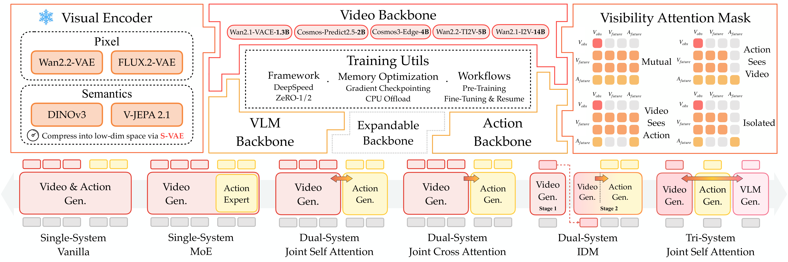

**图 2\.** **OpenWAM 模型基础设施 (Model Infra)。** *顶部*：三类可互换模块：视觉编码器 $\mathcal{E}$（左）；流主干网络 $\mathcal{S}$（中）；以及可见性注意力掩码 $\mathcal{M}$（右）。中央的 Training Utils（训练工具）面板概括了训练运行时的各项实用组件（第 3.2 节）。*底部*：组合规则 $C$ 将这些模块组装为单系统（Single-System）、双系统（Dual-System）与三系统（Tri-System）三大体系下的六种架构变体。

如图 2 所示，OpenWAM-Infra 将世界 - 动作模型（WAM）组织为三类可互换模块，由组合规则 $C$ 将其组装为具体的**架构**，记作 $C(\mathcal{E},\mathcal{S},\mathcal{M})$：

- **视觉编码器 (Visual Encoder)** $\mathcal{E}$：将观测映射为世界流所预测的潜序列（latent sequence）；

- **流主干网络 (Stream Backbones)** $\mathcal{S}$：处理模型的各个标记流（token stream）：世界流 $\mathcal{W}$、动作流 $\mathcal{A}$，可选的理解流 $\mathcal{U}$，以及特定设计可能引入的任何其他流；不同的流可以共享单一主干；

- **可见性注意力掩码 (Visibility Attention Mask)** $\mathcal{M}$：指定流与标记之间的注意力关系，即流内部及跨流之间哪些标记可以关注（attend to）哪些标记。

#### 视觉编码器 (Visual Encoder)。

编码器 $\mathcal{E}$ 将观测映射为世界流所预测的潜序列，并始终保持冻结状态；不同的编码器在其潜变量中捕获不同的信息，进而诱发不同的世界流行为。在大多数情况下，视频主干网络配备了原生匹配的编码器，此时可以直接复用基础 DiT 的预训练参数，从而完整保留预训练的好处。在此默认配置之外，OpenWAM-Infra 还支持可插拔编码器：更换 $\mathcal{E}$ 可以改变待预测的潜表征，并且可以进一步对基础 DiT 进行重新初始化，以排除预训练参数的影响。目前，OpenWAM-Infra 提供了两种基于像素重建目标训练的重建型编码器：Wan2.2-VAE \[30\] 和 FLUX.2-VAE \[49\]，以及两种表征型编码器 \[50\]：DINOv3 \[51\] 和 V-JEPA 2.1 \[52\]，同时包含一个可选的用于压缩潜变量维度的 S-VAE \[53\] 模块。这些能力共同支持了第 4.1.2 节对视觉表征的研究。

#### 流主干网络 (Stream Backbones)。

$\mathcal{S}$ 中的各个主干网络展示在图 2 的中央面板及其周围。*视频主干*（$\mathcal{W}$）预测未来世界视觉状态的时间演变，而*动作主干*（$\mathcal{A}$）预测即将到来的动作分块（action chunk）\[8\]；它们共同构成了模型的世界 - 动作核心。可选的 *VLM 主干*（$\mathcal{U}$）则利用对当前观测的语义理解来对该核心进行补充。除此之外，主干阵容本身是**可扩展的**：可以注册更多的主干网络来执行模型设计可能引入的任何额外流。无论类型如何，每个主干网络都通过统一的代码规范执行，将其前向传播解构为三个阶段：

- `prepare`（准备阶段）：在网络层堆叠之前调用一次，将输入嵌入到初始标记状态中；

- `per-layer block step`（逐层块单步执行）：在每层调用一次，推动该状态通过一个 Transformer 层；

- `finalize`（终结阶段）：在网络层堆叠之后调用一次，将最终状态映射为对应流的预测输出。

每个层还可以进一步将其单步执行拆分为 `pre-attention`（注意力前半程，发射该层的查询 Q、键 K 和值 V）和 `post-attention`（注意力后半程，接收并处理注意力计算的输出），以便跨流联合计算两半程之间的注意力。

对于视频主干网络，OpenWAM-Infra 支持五个参数量递增的预训练视频生成模型，即 Wan2.1-VACE-1.3B、Cosmos-Predict2.5-2B、Cosmos3-Edge-4B、Wan2.2-TI2V-5B 以及 Wan2.1-I2V-14B \[30\], \[31\]。对于 VLM 主干，OpenWAM-Infra 目前仅支持 Qwen3-VL 系列 \[29\]。对于动作主干，OpenWAM-Infra 提供两种选项：存在于独立 ActionDiT 中的独立参数集合，或者让动作标记加入视频标记序列并进行联合处理的共享视频主干。

#### 可见性注意力掩码 (Visibility Attention Mask)。

掩码 $\mathcal{M}$ 通过各流交互所依赖的混合自注意力机制来调控信息流：它被解构为模态内（intra-modality）和跨模态（cross-modality）块，在标记能够相互增强的地方赋予注意力，而在需要隔离彼此影响的地方截断注意力。在视频和动作模态之上，该因式分解形式表示为： 

$$
\mathcal{M}=
\begin{pmatrix}
\mathcal{M}_{V\leftarrow V} & \mathcal{M}_{V\leftarrow A}\\
\mathcal{M}_{A\leftarrow V} & \mathcal{M}_{A\leftarrow A}
\end{pmatrix}, \tag{1}
$$

其中块 $\mathcal{M}_{X\leftarrow Y}$ 指定了模态 $X$ 的标记是否可以关注模态 $Y$ 的标记。OpenWAM-Infra 固定了两个模态内部块： $\mathcal{M}_{V\leftarrow V}$ 采用首帧因果（first-frame causal）注意力，其中带有噪声的帧相互关注并关注纯净的首帧，而纯净首帧仅关注自身，从而保护纯净的条件输入免受噪声干扰； $\mathcal{M}_{A\leftarrow A}$ 采用双向（bidirectional）注意力，其中一个分块内的各带噪动作标记相互可见，使得预测的动作能够互相提供信息。另外两个跨模态块则定义了 OpenWAM-Infra 支持的四种注意力掩码模式，如图 2 右侧面板所示：*mutual（互见）* 同时启用 $\mathcal{M}_{A\leftarrow V}$ 和 $\mathcal{M}_{V\leftarrow A}$ ，使得两种模态相互关注；*action-sees-video（动作见视频）* 仅启用 $\mathcal{M}_{A\leftarrow V}$ ，允许动作读取预测的世界，同时使视频生成过程不受干扰；*video-sees-action（视频见动作）* 仅启用 $\mathcal{M}_{V\leftarrow A}$ ，方向相反；而 *isolated（相互隔离）* 则禁用两者，对两种模态进行独立去噪。基于这一原生支持，第 4.2.2 节随后在受控环境下对这些模式展开了对比。

#### 架构体系 (Architectures)。

组合规则 $C$ 指定了信息在各流之间传递的位置和方式，并且它完全通过上述执行规范实现：它对参与主干网络的 **prepare**、**per-layer block** 和 **finalize** 阶段进行编排排序；当交互必须在注意力内部发生时，将逐层块单步执行拆分为 **pre-attention** 和 **post-attention** 两半程以替换注意力计算本身，从而绝不修改主干网络内部结构。因此，组合规则本身不带有任何可学习参数；所有学习容量均驻留在各流的主干网络中。一个具体的架构即为一项选择 $C(\mathcal{E},\mathcal{S},\mathcal{M})$；目前支持的设计分为三大族系，如图 2 底行从左至右展示：

- **单系统 (Single-System)。** 该族系仅包含视频主干网络：动作主干采用共享形式，将其标记注入视频序列中，因此由一个 Transformer 处理两种模态，且绝大部分参数是共享的；代表性系统包括 Cosmos Policy \[16\] 和 DreamZero \[14\]。OpenWAM-Infra 提供了两种在模态特定容量上存在差异的变体：

  - *Vanilla（朴素版）* 将视频、动作和本体感知状态标记作为一个序列，通过相同的注意力机制和稠密前馈层（FFN）模块进行处理，不提供针对特定模态的专用容量。

  - *MoE（混合专家版）* 保留共享序列和自注意力，但将动作标记硬路由（hard-route）到专用的前馈专家网络，而视频标记遵循默认路径，在不分离流的前提下增加了模态专用容量 \[54\]。

- **双系统 (Dual-System)。** 该族系包含独立的视频主干网络和动作主干网络，后者为一个专门的 ActionDiT：两个流拥有独立的参数集合，并通过自注意力或交叉注意力连接；代表性系统包括 Fast-WAM \[55\] 和 LingBot-VA \[15\]。OpenWAM-Infra 提供了三种在两流通信机制上存在差异的变体：

  - *联合自注意力 (Joint self-attention)* 在指定的桥接层将两个流的隐藏状态合并为一个联合序列，在状态返回各自流之前实现双向标记级交互。

  - *联合交叉注意力 (Joint cross-attention)* 允许动作流在桥接层通过视频到动作的交叉注意力查询视频特征，进行端到端训练以便动作学习的梯度更新视频流；可选地，可以在视频特征处截断梯度（detach gradients），以使动作学习与视频参数更新相互隔离。

  - *逆动力学模型 (IDM)* 将动作模块构建为以视频特征为条件的逆动力学模型，使用教师强制（teacher-forced）的视频状态进行训练，并在两个推理阶段中运行：首先生成视频轨迹，然后根据视频轨迹预测动作。

- **三系统 (Tri-System)。** 该族系在双系统布局的基础上扩展了 VLM 主干网络，其中冻结的视觉 - 语言模型为单独的可训练理解流提供输入；代表性系统包括 Motus \[17\]。OpenWAM-Infra 提供了一个变体：

  - *联合自注意力 (Joint self-attention)* 将联合序列扩展到所有三个流，各流在保留自身特定参数的同时交换信息；理解流作为一个只读的尾部加入，其他流可以关注它，而它只关注自身。

在每种架构 $C(\mathcal{E},\mathcal{S},\mathcal{M})$ 内，每个模块（视觉编码器、流主干网络和可见性注意力掩码）均独立于组合规则从注册表实例化：所有组合均通过配置文件组装，无论是训练器还是策略服务器都无需感知当前正在运行何种具体架构。

## 训练运行时 (Training Runtime)

#### 训练形式化表述 (Training Formulation)。

OpenWAM-Infra 在单一训练器下，根据统一的样本规范和联合流匹配（flow-matching）目标训练所有架构。训练器从不检查架构内部结构：它要求所选架构准备其自身的输入并执行其自身的前向传播，然后在得到的预测上优化目标。将一个样本定义为 $(\ell,\mathbf{o}_{1:T},\mathbf{a}_{1:H},\mathbf{q},\mathbf{m})$ ，分别代表语言指令、视频窗口、动作分块、可选的本体感知状态以及逐维度的有效性掩码。在输入准备阶段，架构的视觉编码器 $\mathcal{E}$ 将 $\mathbf{o}_{1:T}$ 编码为潜变量 $\mathbf{z}$ ，而 $\ell$ （可选择与 $\mathbf{q}$ 拼接）构成了上下文 $\mathbf{c}$ 。在全篇论文中， $t=0$ 表示纯噪声， $t=1$ 表示纯净数据。每个流被加噪到各自的时间步，视频为 $t_v$ ，动作为 $t_a$ ，产生插值样本 $\mathbf{z}^{t_v}=t_v\,\mathbf{z}+(1-t_v)\,\boldsymbol{\epsilon}_v$ 以及 $\mathbf{a}^{t_a}=t_a\,\mathbf{a}+(1-t_a)\,\boldsymbol{\epsilon}_a$ ，其中 $\boldsymbol{\epsilon}_v,\boldsymbol{\epsilon}_a$ 为高斯噪声；架构的单次联合前向传播 $(\hat{\mathbf{v}}_z,\hat{\mathbf{v}}_a)=\mathbf{v}_\theta\big(\mathbf{z}^{t_v},\mathbf{a}^{t_a},t_v,t_a,\mathbf{c}\big)$ 同时预测两者的速度场，目标函数形式如下： 

$$
\mathcal{L}
=\lambda_v\,\mathbb{E}_{t_v,\epsilon_v}\!\Big[w(t_v)\,\big\lVert \hat{\mathbf{v}}_z-(\mathbf{z}-\boldsymbol{\epsilon}_v)\big\rVert_2^2\Big]
+\lambda_a\,\mathbb{E}_{t_a,\epsilon_a}\!\Big[w(t_a)\,\big\lVert \mathbf{m}\odot\big(\hat{\mathbf{v}}_a-(\mathbf{a}-\boldsymbol{\epsilon}_a)\big)\big\rVert_2^2\Big], \tag{2}
$$

其中 $\lambda_v,\lambda_a$ 和 $w(\cdot)$ 分别对各流和各时间步进行加权，而有效性掩码 $\mathbf{m}$ 将动作损失限制在特定具身构型实际占用的坐标维度上，纯净的条件帧则从视频项中排除。由于 $t_v$ 和 $t_a$ 是*独立*采样的，因此训练过程覆盖了整个 $(t_v,t_a)$ 噪声平面；任何推理调度策略，无论是在共享时间步下同步对两流进行去噪，还是以一流领先另一流的方式异步去噪，都只是在该平面中描摹出一条路径，因而均保持在训练分布内（in-distribution）。

#### 训练实用组件 (Training Utilities)。

如图 2 中央的 Training Utils 面板所示，三大核心组件为 OpenWAM-Infra 的训练提供支撑：

1. **框架支持 (Framework)。** OpenWAM-Infra 通过 Accelerate 集成了 DeepSpeed ZeRO（Stage 1 或 Stage 2），并支持混合精度（默认为 bf16）、梯度累积和梯度裁剪；单一入口即可从单 GPU 运行无缝扩展至多节点集群作业。

2. **显存优化 (Memory optimization)。** 为降低显存占用，OpenWAM-Infra 提供了梯度检查点机制（gradient checkpointing），并支持将检查点激活值可选卸载到 CPU，以及将优化器状态卸载到 CPU。

3. **工作流支持 (Workflows)。** OpenWAM-Infra 支持三种训练工作流。*预训练 (Pretraining)* 启动全新任务。*微调 (Fine-tuning)* 启动从先前检查点初始化的新任务：架构根据检查点自带的记录重建，新的配置叠加于其上，且权重所属模块的身份受到保护以免被意外覆盖。*恢复 (Resume)* 精确继续同一运行：完整恢复优化器与调度器状态，训练从记录的精确位置重新接入数据流，若数据集的归一化统计数据与运行记录发生偏差，系统将拒绝继续执行。

#### 自包含检查点 (Self-Contained Checkpoints)。

一个自包含的检查点包含三个部分：模型权重、完全解析好的配置（合并了每个模块的重构规范以及分词器等依赖项），以及动作归一化统计信息。微调、恢复训练和部署服务在加载参数前均从该记录中重建架构；在部署时，缺少归一化记录将被视作致命错误。因此，评测环节绝不会静默篡改已训练模型的编码器、动作布局或缩放比例，检查点即是部署运行时提供服务所需的完整实体。

## 部署运行时 (Deployment Runtime)

每个检查点均由一个统一的策略服务器提供服务，该服务器从自包含记录中重建架构，并将两个选择保持解耦正交：推理何时运行（推理模式）以及两个流如何去噪（去噪调度策略）。图 3 分别在子图 (a) 和 (b) 中对这两种选择进行了说明。

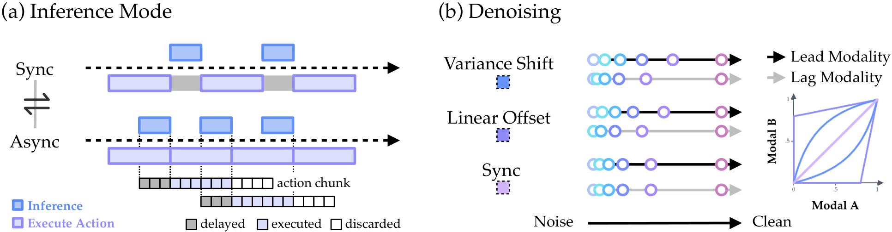

**图 3\.** **部署运行时的推理模式与去噪调度策略。** (a) 同步与异步推理模式示意图。(b) 三种去噪调度策略（方差偏移、线性偏移和同步）示意图；图中画出 5 个去噪步骤作为示意，相同颜色的圆圈表示两种模态在同一步去噪中所达到的时间步。

#### 推理模式 (Inference Modes)。

OpenWAM-Infra 基于通用的缓冲区机制提供了两种推理模式（图 3(a)）：
每次推理生成一个动作分块并存入缓冲区，服务器根据每个请求弹出一个动作。在*同步 (synchronous)* 推理模式下，每当缓冲区清空时，服务器会阻塞等待新的推理，因此机器人执行会因推理延迟而停顿。
在*异步 (asynchronous)* 推理模式下，令 $H$ 表示预测分块的长度， $n\le H$ 表示推理步长， $d<n$ 表示以步数计的提前触发阈值（默认为 $n/2$ ）。一旦缓冲区中仅剩余 $d$ 个动作，单个后台工作线程便会在这些动作继续执行的同时预先获取下一个分块。随后，所采用的分块按顺序拆分为：一个包含 $d$ 个动作的 *延迟（delayed）*  前缀，该部分在推理运行时已被前一个缓冲区执行完毕，因而被跳过；一个包含后续 $n$ 个动作的*执行（executed）* 窗口，它成为新的缓冲区；以及剩余 $\max\{H-d-n,,0\}$ 个动作的*丢弃（discarded）* 尾部。这两种模式对客户端而言完全透明无感：每个请求都是“输入一个观测，输出一个动作”。

#### 去噪调度策略 (Denoising Schedules)。

去噪调度策略是在联合噪声平面中穿行的一条路径 $\tau=\{(t_v^i,t_a^i)\}_{i=0}^{N}$ ，其中如第 3.2 节所定义， $t=0$ 为纯噪声， $t=1$ 为纯净数据；图 3(b) 绘制了 OpenWAM-Infra 支持的三种调度策略。在同步 (sync) 调度下，两个流沿着对角线统一步调推进：每一步执行一次联合前向传播和耦合的欧拉更新，其中每个流按照各自的时间步增量移动；视频潜变量 $\mathbf{z}$ 遵循 $\mathbf{z}^{t_v^{i+1}}=\mathbf{z}^{t_v^i}+(t_v^{i+1}-t_v^i)\,\hat{\mathbf{v}}_z$ ，动作分块 $\mathbf{a}$ 遵循 $\mathbf{a}^{t_a^{i+1}}=\mathbf{a}^{t_a^i}+(t_a^{i+1}-t_a^i)\,\hat{\mathbf{v}}_a$ 。异步调度策略则通过两个可组合的函数族允许某一模态领先 \[56\]：

$$
f_{\alpha}(s)=\frac{\alpha s}{1+(\alpha-1)s},
\qquad
h_{o}(s)=\max\!\left\{\frac{s-o}{1-o},\,0\right\}, \tag{3}
$$

其中 $s=i/N$ 表示全局进度，方差偏移 (variance shift) 曲线 $f_{\alpha}$ 在 $\alpha>1$ 时将领先流抬升至对角线上方，使其更早到达纯净数据，而*线性偏移 (linear offset)* $h_{o}$ 则将落后流保持在纯噪声状态，直至全局进度超过 $o$。将领先优势赋予世界流或动作流分别对应*视频领先 (video-lead)* 和*动作领先 (action-lead)* 机制，而 $(\alpha,o)=(1,0)$ 精确还原了同步对角线：同步服务只是一个特例而非独立的代码分支，每个异步运行都有严格对齐的基线。由于训练过程是独立采样两个时间步的（第 3.2 节），任何此类路径均严格保持在分布内。与调度曲线形状无关的是，每个流的时间步扭曲函数（warp）都是保存在检查点中的主干网络属性并在推理时复用，从而确保训练与服务时的噪声网格不会发生漂移。

#### 推理加速 (Acceleration)。

OpenWAM-Infra 提供了四种服务端加速机制，每种机制均可独立配置。

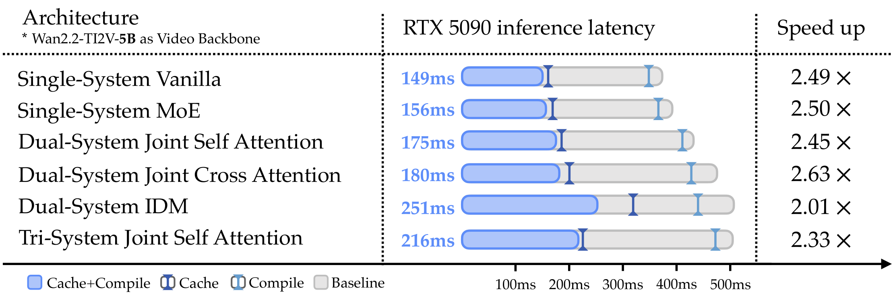

**图 4\.** **各架构的服务端推理延迟对比。** 在 RTX 5090 上以 Wan2.2-TI2V-5B 作为视频主干时的推理延迟。提示词嵌入缓存和跳过视频解码默认开启；本图消融对比了模型编译和 DiT 速度缓存的效果。

• **提示词嵌入缓存 (Prompt-embedding cache)**：基于服务器生命周期的缓存将每个提示词映射到其文本编码器嵌入，从而将文本编码器从单次请求的处理路径中剥离。

• **跳过视频解码 (Video-decode skip)**：机器人控制消费的是动作而非像素，因此服务路径可以完全跳过 VAE 视频解码。

• **模型编译 (Compilation)**：每个架构为其内部的联合去噪循环注册固定的静态形状 `torch.compile` 执行路径，并在 CUDA 图（CUDA graphs）下重放，以消除逐层启动开销；首个请求承担编译预热。

• **DiT 速度缓存 (DiT velocity cache)**：当*两个*流近期的速度预测均表现出相似度稳定性（余弦相似度高于设定阈值）时，跳过下一次联合前向传播，直接积分复用缓存的速度场，并限制连续跳过的最大步数，参考了 \[14\] 的跨步复用思想。

在采用 Wan2.2-TI2V-5B 作为视频主干网络时，图 4 展示了不同架构下所实现的推理加速成效。

## 评测协议 (Evaluation Protocol)

OpenWAM-Infra 通过第 3.3 节所述的策略服务器评测训练完成的检查点：各个基准测试作为客户端接入，发送观测数据，并执行服务器返回的动作，如图 5 所示。

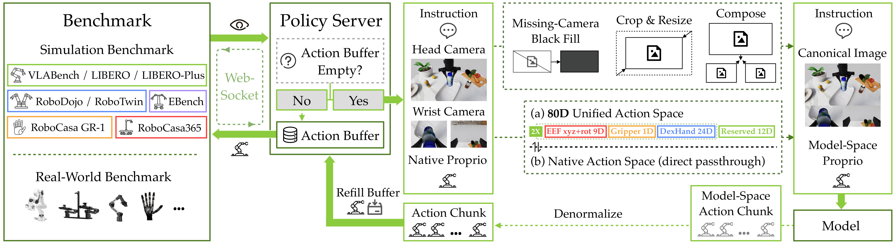

**图 5\.** **OpenWAM-Infra 的评测协议。** 基准测试通过 WebSocket 作为瘦客户端连接到策略服务器。服务器对每个观测进行规范化处理，将本体感知状态映射到模型端的动作表征中（80 维统一动作空间或基准测试原生动作空间），并在返回动作之前将预测的动作分块反归一化回原生物理单位。

#### 客户端 - 服务器流水线 (Client–Server Pipeline)。

各基准测试通过一条持久的 WebSocket 连接作为轻量瘦客户端接入部署运行时，无需从模型或训练栈导入任何代码。在控制步 $k$ ，客户端发送一个观测元组 $(\mathbf{o}_k,\,\ell,\,\mathbf{q}_k)$ ：包含最多三个相机视角 $\mathbf{o}_k$ （头部视角必须提供，手腕视角可选）；语言指令 $\ell$ ；以及可选的原始机器人本体感知状态 $\mathbf{q}_k$ 。响应则是机器人物理单位下的单个动作 $\mathbf{a}_k$ 。所有面向模型的格式转换均在服务端进行，由第 3.2 节的自包含检查点驱动：如图 5 所示，视角图像经过裁剪、缩放并排布为模型训练时的规范图像画幅（缺失的相机由黑帧填充）， $\mathbf{q}_k$ 经过归一化并映射到下文定义的模型端动作表征中。随后，在第 3.3 节的服务端栈下进行推理，生成模型空间的动作分块 $\hat{\mathbf{a}}_{1:H}$ ，该动作分块被映射回原生维度并反归一化为物理单位，然后重新填充到用于响应请求的动作缓冲区中；因此，归一化后的数值绝不会发送至真实机器人。在回合（episode）之间，单一重置请求即可清除所有针对单回合的执行器状态。

#### 基准测试套件 (Benchmark Suite)。

OpenWAM-Infra 目前集成了八个仿真基准测试：LIBERO 与 LIBERO-Plus \[57\], \[58\]、VLABench \[59\]、RoboTwin2.0 \[60\]、RoboDojo \[61\]、RoboCasa365 \[62\]、RoboCasa-GR1 \[63\], \[64\] 以及 EBench \[65\]，涵盖单臂与双臂桌面操作、灵巧手人形机器人控制以及移动操作。由于该协议仅交换图像、文本和动作向量，真实机器人平台能够以与仿真器完全相同的接口接入。每个内置的适配器严格复现了对应基准测试在训练数据读取时的观测预处理流程，确保评测视角的分布与训练分布对齐；集成一个新的基准测试仅仅需要编写这样一个适配器，而无需变动模型和两个运行时的核心代码。

#### 动作空间定义 (Action Space Definition)。

动作在该流水线中以两种表征之一传递（图 5）。默认情况下，每个基准测试保留其原生（native）动作空间——例如，RoboTwin2.0 可以采用 14 维关节空间或 20 维双臂末端执行器空间提供服务，LIBERO 采用 10 维末端执行器空间——因此在单一基准测试上训练的检查点可以直接透传动作。然而，跨具身构型训练统一模型时，需要单一动作头覆盖那些在位宽和语义上均存在差异的不同本体。因此，OpenWAM-Infra 还定义了一个具有固定槽位语义的统一动作空间 $\mathbf{u}\in\mathbb{R}^{80}$：包含两个镜像对称的 34 维机械臂块，每个块包含末端执行器位置 (3)、6D 旋转 (6)、夹爪 (1) 以及灵巧手 (24)，其后跟随 12 个为特定具身保留的专用通道插槽（例如 EBench 和 RoboCasa365 的移动底盘通道）。由于槽位语义是固定的，不同具身之间共享的物理结构自然对应到相同的坐标位。每个数据集声明一个从其原生维度到这些槽位的索引映射 $\pi$，归一化在离散散播（scatter）*之前*应用，并在汇聚（gather）*之后*进行逆变换：

$$
\mathbf{u}=\mathrm{Scatter}_{\pi}\big(\mathrm{Norm}(\mathbf{a})\big),
\qquad
\mathbf{a}=\mathrm{Norm}^{-1}\big(\mathrm{Gather}_{\pi}(\mathbf{u})\big), \tag{4}
$$

传入的本体感知数据在前向路径中通过同一映射处理。公式 (2) 中的有效性掩码 $\mathbf{m}$ 精确标记了已被映射的槽位，从而未被映射的坐标在训练期间不会接收到梯度更新，并在推理时保持其解析噪声路径。

# OpenWAM-Study：世界 - 动作模型的设计原则 (OpenWAM-Study: Design Principles for World–Action Models)

#### OpenWAM-Study 概述。

在 **OpenWAM-Infra** 提供的坚实基底之上，我们通过系统的受控实验深入分析世界 - 动作模型的设计原则。在这一节中，我们首先在第 4.1 节探讨 WAM 应当如何继承上游世界先验；接着在第 4.2 节理解如何在世界先验与动作学习之间建立协同效应；最后在第 4.3 节测试哪些设计选择能够泛化并扩展到跨领域的具身预训练中。

#### 评测协议 (Evaluation Protocol)。

在这一节中，我们选用 **RoboTwin2.0** \[60\] 作为评测基准环境，这是一个涵盖 50 多个任务且被广泛采用的双臂操作基准。在我们的实验中，我们在两种设定下进行评估：(1) **分布内性能 (RoboTwin2.0-Full)**：遵循 \[17\]，我们在包含在纯净场景中收集的 2,500 条演示以及在高强度场景随机化下收集的 25,000 条演示的完整多任务数据语料库上训练模型，并分别在纯净环境和随机化环境下进行评测。(2) **分布外泛化能力 (RoboTwin2.0-Clean2Random)**：遵循 \[66\]，我们仅在纯净数据上训练模型，并分别在纯净环境和随机化环境下进行评测。由于训练混合集中从未见过随机化的场景配置，因此它可作为评估模型对全新场景泛化能力的代理指标。我们使用任务成功率（Success Rate, %）作为核心度量指标。

## 继承上游世界知识 (Inheriting Upstream World Knowledge)

在这一小节中，我们专注于以下核心问题：

> **问题 1 (Question 1)：** WAM 应当继承哪些世界知识？如何最好地继承这些知识？

世界知识在很大程度上可以通过两条途径继承：生成式世界先验与视觉表征先验。生成式世界先验指的是内嵌在视频生成主干网络中的视觉与动力学知识，而视觉表征先验则指视觉编码器所诱导的表征空间 \[2\], \[3\], \[30\]。

### 生成式世界先验 (Generative World Priors)

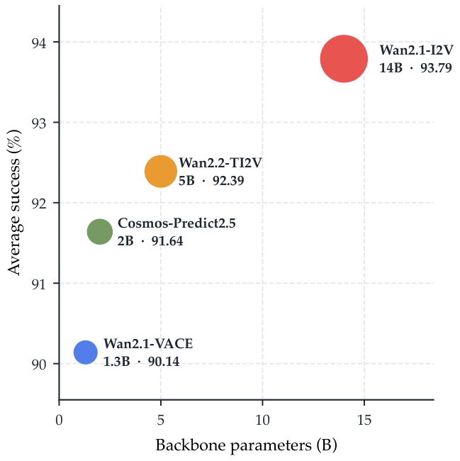

**图 6\.** **不同视频主干网络规模下的 WAM 性能对比。** 随着视频生成主干网络规模的增大，最终 WAM 模型的性能呈现出一贯且显著的提升。

为了探究生成式世界先验是否以及在多大程度上能够促进 WAM 的性能，我们对比了四种不同参数规模的视频生成主干网络：Wan2.1-VACE-1.3B \[30\]、Cosmos-Predict2.5-2B \[31\]、Wan2.2-TI2V-5B \[30\] 以及 Wan2.1-I2V-14B \[30\]。我们将世界 - 动作模型实例化为双系统架构，由视频生成模块和动作生成模块组成，二者通过联合自注意力连接，其中视频生成模块的参数直接复制自预训练的视频生成模型。实验结果在 RoboTwin2.0-Full 上进行评测。

在所测试的四种主干网络中，随着视频生成主干容量的提升，所得到的 WAM 的平均成功率保持了一贯的增长趋势（图 6）。Wan2.1-I2V-14B 取得了最佳表现，而 Wan2.2-TI2V-5B 仅落后其 1.40 个百分点，尽管前者的参数量几乎是后者的 **3 倍**。综合权衡四种主干网络在性能表现与训练、部署效率之间的关系，我们最终将 5B 模型确定为后续受控研究的默认主干。由于这些主干网络在架构、预训练数据和训练目标上也存在差异，这一对比将主干选择确立为一个至关重要的设计变量，而不仅仅是将所有收益简单归因于参数规模。选择 5B 作为默认主干，也在保持继承世界先验恒定的同时，确保了后续动作端消融实验的计算可行性。

### 视觉表征先验 (Visual Representation Priors)

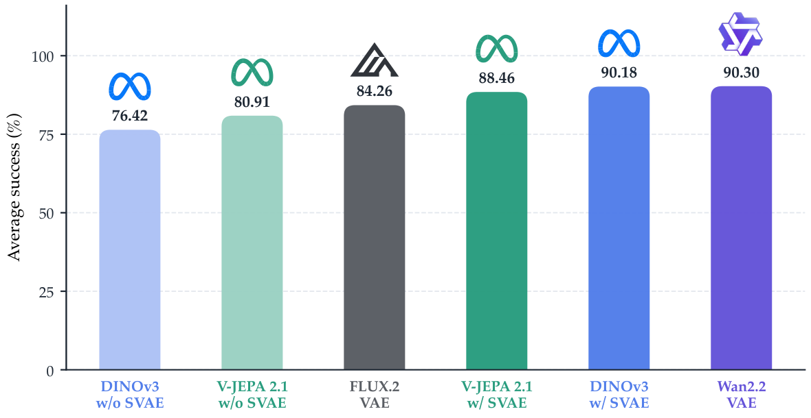

**图 7\.** **视觉表征先验。** 我们探索了利用重建型编码器和表征型编码器构建 WAM，并引入了结合 S-VAE \[53\] 的表征型编码器变体，该适配器能够将表征编码器产生的高维潜变量转换为适用于 DiT 处理的低维向量。

世界知识的另一个重要来源是由视觉编码器诱导的潜表征空间。广义而言，这些编码器可划分为两类：(1) **重建型编码器 (Reconstructive Encoders)**：这类编码器的目标是数据压缩，完全基于像素重建任务进行训练；(2) **表征型编码器 (Representation Encoders)**：植根于自监督学习或多模态表征学习，这类编码器学习语义结构化的视觉特征，为视觉理解提供了基石。受到近来基于表征编码器的生成模型与世界模型研究进展 \[21\], \[50\], \[67\], \[68\], \[69\] 的启发，我们重新审视了世界 - 动作模型语境下的潜空间设计。

在这组实验中，我们从两类编码器中分别选取了代表性模型。对于重建型编码器，我们使用了 Wan2.2-VAE \[30\]（具备 4 倍时间压缩率的顶尖视频编码器）和 FLUX.2-VAE \[49\]（在其潜空间上构建了极高性能图像生成模型的先进图像编码器）。对于表征型编码器，我们使用了 DINOv3 \[51\]（通过自监督学习训练的经典视觉编码器 DINO \[3\] 的最新一代版本）以及 V-JEPA 2.1 \[52\]（基于联合嵌入预测架构 \[19\] 的稠密特征编码器）。为了隔离仅由视觉表征带来的性能收益，我们继承了 Wan2.2-TI2V-5B 的模型架构，但对其权重进行了随机初始化。为了公平对比，我们将与 Wan2.2-VAE 相同的 4 倍时间压缩应用于 FLUX.2-VAE、DINOv3 和 V-JEPA 2.1：由于这些编码器本身均不具备原生时间压缩能力，我们通过对每四个连续帧的特征取平均来强制实施 4 倍下采样。

由于现代扩散 Transformer（DiT）架构 \[70\] 主要针对重建型编码器进行了优化，直接朴素采用表征型编码器会产生高维潜变量（例如 DINOv3 为 768 维特征，V-JEPA 2.1 为 1024 维），由于架构兼容性问题往往导致性能较差 \[50\]。参考 \[68\]，我们引入了一种针对表征型编码器的改进变体，训练了一个 S-VAE \[53\] 适配器，将表征型编码器输出的高维特征转换为更低维度的向量（在本实验中为 48 维，与 Wan2.2-VAE 的潜空间维度对齐）。

如图 7 所示，在 S-VAE 的辅助下，表征型编码器在世界 - 动作建模中能够取得与重建型编码器相当甚至更强的性能表现。具体而言，虽然直接朴素采用表征型编码器的模型表现逊于基于重建型编码器 FLUX.2-VAE 训练的模型，但在使用 S-VAE 进行维度收缩后，表征型编码器的收缩变体（DINOv3 w/ SVAE、V-JEPA 2.1 w/ SVAE）显著超越了 FLUX.2-VAE。DINOv3 w/ SVAE 取得了与 Wan2.2-VAE 近乎持平的表现，我们将残存的微弱差距归因于 Wan2.2-VAE 的两项原生优势：它是专门适配视频主干架构的重建型编码器，并且其时间压缩是编码器原生学习到的，而非通过帧平均强制施加的。

综上所述，决定 WAM 潜空间质量的关键不在于重建型编码器与表征型编码器之间的范畴界限，而在于潜变量本身的实用操作特性：**紧凑性**（兼顾时间维度和标记维度）以及**丰富的世界信息**。因此，在**时间压缩**与**维度收缩**的协同辅助下，完全可以继承表征型编码器中的先验来构建极具竞争力的 WAM。我们也呼吁社区积极研发具备原生时间压缩能力的表征型编码器，这有望带来更出色的先验继承效果。

> **发现 1 (Finding 1)：** WAM 通过具备足够能力的生成式主干网络和紧凑且信息丰富的视觉表征空间，能够最有效地继承上游世界知识。重建型编码器并非唯一选择；经过维度压缩的表征型编码器同样具有优异的性能。

## 构建世界与动作学习之间的协同效应 (Building Synergy between World and Action Learning)

仅仅继承恰当的先验是不够的；世界 - 动作模型需要在世界学习与动作学习之间构建协同效应。这需要在系统的不同层次做出三项关键决策：专用动作容量应当置于何处？训练期间提供哪些跨模态信息通道？以及推理过程是否能够维持这些通道赖以学习的噪声 - 状态关系？

> **问题 2 (Question 2)：** 继承的世界知识应当如何与动作学习进行交互？

### 架构容量 (Architectural Capacity)

**表 1\.** **架构消融实验。** 在 RoboTwin2.0-Full 上的平均成功率（%）。粗体表示最优值。

| 架构体系 | 变体 | 纯净场景 (Clean) | 随机化场景 (Randomized) | 平均 (Average) |
| :---- | :---- | :---: | :---: | :---: |
| **单系统 (Single-System)** | **Vanilla** | 85.20 | 85.80 | 85.50 |
|  | **MoE** | 86.22 | 83.04 | 84.63 |
| **双系统 (Dual-System)** | **联合自注意力 (Joint Self-Attention)** | 92.34 | **92.38** | 92.36 |
|  | **联合交叉注意力 (Joint Cross-Attention)** | 87.86 | 88.64 | 88.25 |
|  | **截断交叉注意力 (Detached Cross-Attention)** | 92.06 | 91.64 | 91.85 |
|  | **逆动力学模型 (IDM)** | 87.76 | 88.14 | 87.95 |
| **三系统 (Tri-System)** | **联合自注意力 (Joint Self-Attention)** | **92.84** | 92.36 | **92.60** |

世界 - 动作建模中的一个核心问题是：WAM 需要多少专门的动作容量，以及其视频流和动作流应当在多大程度上解耦分离？第 3.1 节的三大架构族系恰好跨越了这一容量轴，我们对所有六种变体进行了评估，其中联合交叉注意力分别以端到端方式以及在视频特征处截断梯度的方式进行实例化，共得到七个基线（表 1）。

#### 实验结果。

如表 1 所示，随着架构容量的增加，从单系统到双系统再到三系统，模型性能持续攀升。联合自注意力是双系统中最强的变体，而三系统模型取得了最佳的整体综合表现。权衡性能与架构复杂度，并为了将世界知识与动作学习之间的交互从 VLM 理解特征的潜在影响中解耦隔离出来，我们在后续实验中采纳了双系统联合自注意力架构，从而确保后续发现能够纯粹反映这一核心交互。

### 训练期信息流 (Training-Time Information Flow)

架构对比选定联合自注意力作为世界流与动作流之间的接口，但联合注意力本身并未规定哪种具体的信息流能够产生最佳协同。我们对比了训练期间通过注意力掩码控制的四种信息流策略：**相互隔离 (Isolated)**，无跨流通信；**视频见动作 (Video Sees Action)**，将动作特征暴露给世界流；**动作见视频 (Action Sees Video)**，将世界特征暴露给动作流；以及**互见 (Mutual)**，同时开启两个方向。

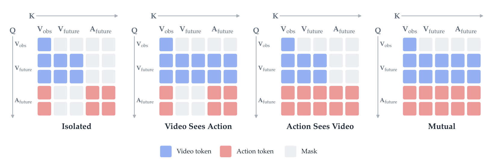

**图 8\.** **注意力掩码策略。** 我们在训练阶段通过注意力掩码控制跨模态信息流。

**表 2\.** **动作学习需要访问世界信息。** RoboTwin2.0-Full 上的成功率（%）。

| 掩码策略 (Mask) | 成功率 (%) |  |  |
| :---- | :---: | :---: | :---: |
|  | 纯净场景 (Clean) | 随机化场景 (Random.) | 平均 (Average) |
| **相互隔离 (Isolated)** | 88.08 | 86.74 | 87.41 |
| **视频见动作 (Video Sees Action)** | 87.92 | 87.34 | 87.63 |
| **动作见视频 (Action Sees Video)** | **92.98** | **91.80** | **92.39** |
| **互见 (Mutual)** | 92.50 | **91.80** | 92.15 |

对比结果清晰地依照动作流是否能够访问世界特征而分化（图 8 和表 2）。相互隔离与“视频见动作”掩码的性能落后约 5 个百分点，而“动作见视频”与“互见”两者均保持了出色的强劲表现。因此，在此设定下，世界到动作的信息流动是必不可少的。相比之下，反向增加动作到世界的路径对从头训练的结果影响甚微，这使得“动作见视频”与“互见”成为在预训练后值得重新审视的两种可行掩码候选。

### 推理期信息流 (Inference-Time Information Flow)

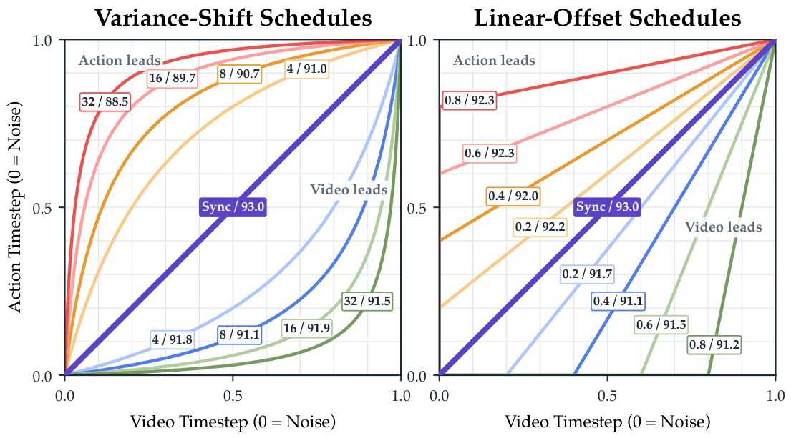

**图 9\.** **通过去噪调度实现的推理期信息流。** 每条曲线描绘了动作去噪进度相对于视频去噪进度的轨迹。对角线上方/下方的曲线分别表示优先去噪动作/视频。

训练期的注意力掩码实现了*全掩码（full masking）*，而推理期的去噪调度则提供了一种更为平滑的信息门控，即*部分掩码（partial masking）*。在这一消融实验中，我们固定采用互见模式，并在训练视频流和动作流时采用独立采样的噪声水平，覆盖了二维联合噪声状态空间。

我们实例化了第 3.3 节的调度抽象：同步去噪沿着对角线 $(t_v^i,t_a^i)=(s_i,s_i)$ 进行，而公式 (3) 的方差偏移和线性偏移函数族允许任一流领先 \[56\]。我们在两个领先方向上分别评估了 $\alpha\in{4,8,16,32}$ 和 $o\in{0.2,0.4,0.6,0.8}$。

#### 实验结果。

同步去噪取得了最佳性能，且没有任何一种异步调度能够改善性能，无论哪一流处于领先地位，亦或相对进度的参数化形式如何（图 9）。在方差偏移调度下，视频领先优于动作领先；而在线性偏移调度下，动作领先优于视频领先。这表明，尽管在训练期显式的视频到动作信息流至关重要，但在推理期的去噪调度中强制推行此类先验并不能带来增益，这有力支持了世界 - 动作模型的“表征学习假说”\[55\]，而非测试期的“隐式规划继以 IDM”调度假说 \[14\]。

> **发现 2 (Finding 2)：** 世界 - 动作协同需要训练阶段显式的世界到动作信息流，以及推理阶段的同步联合去噪。我们将双系统联合自注意力与同步去噪策略结合作为后续基准，并将单向可见与互见之间的微弱抉择留待预训练阶段再作裁定。

## 跨领域整合知识 (Consolidating Knowledge Across Domains)

上述研究明确了应当继承哪些世界先验，以及世界流和动作流应当如何交互。然而，仅仅在单一领域表现优异并不能证明模型获得了可迁移的世界 - 动作知识：模型可能仅仅拟合了目标任务的视觉和动作分布，而跨领域预训练能够鲜明地检验这一差异。机器人轨迹提供了可执行的动作监督，但视觉覆盖面有限；人类第一人称视角的视频提供了更广阔的视觉多样性，但缺乏机器人动作标签。因此，我们要探究：预训练的收益源自何处？这两种数据源应当如何结合？从头训练时确立的信息流选择在预训练之后是否依然有效？

> **问题 3 (Question 3)：** 世界 - 动作知识如何跨领域整合并有效迁移？

### 问题设定与评测协议 (Problem Setup and Evaluation Protocol)

#### 受控迁移协议 (Controlled Transfer Protocol)。

所有实验保持主干网络、优化预算和推理流程严格一致——均采用上文选定的双系统联合自注意力架构与同步去噪——仅改变模型是否以及如何使用具身数据进行预训练；信息流掩码在最终消融实验中重新检验。评估由两个互补的协议支撑：**RoboTwin2.0-Clean2Random** 在 Clean 数据上微调，并在 Clean 上评估分布内（ID）性能，在 Randomized 上评估分布外（OOD）性能，以衡量迁移能力；**RoboTwin2.0-Full** 在完整的 RoboTwin2.0 训练集上微调，并报告两种环境下的平均成功率。

#### 具身预训练数据混合配比 (Embodied Pretraining Data Mixture)。

我们在相同的 600 小时数据预算下，对比了从头监督微调与三种预训练策略，其中人类第一人称视频选自 EgoDex \[71\]，真实机器人操作轨迹选自 RoboCOIN \[72\]。*纯机器人 (Robot-only)* 将全部 600 小时预算投入机器人数据；两种混合变体将 350 小时第一人称数据与 250 小时机器人数据结合，分别以两阶段课程形式（*先第一人称再机器人*）或单阶段联合形式（*第一人称 \+ 机器人协同训练*）进行。所有四个变体随后经历完全一致的下游微调。

### 具身预训练主要扩展分布外泛化能力 (Embodied Pretraining Primarily Expands OOD Generalization)

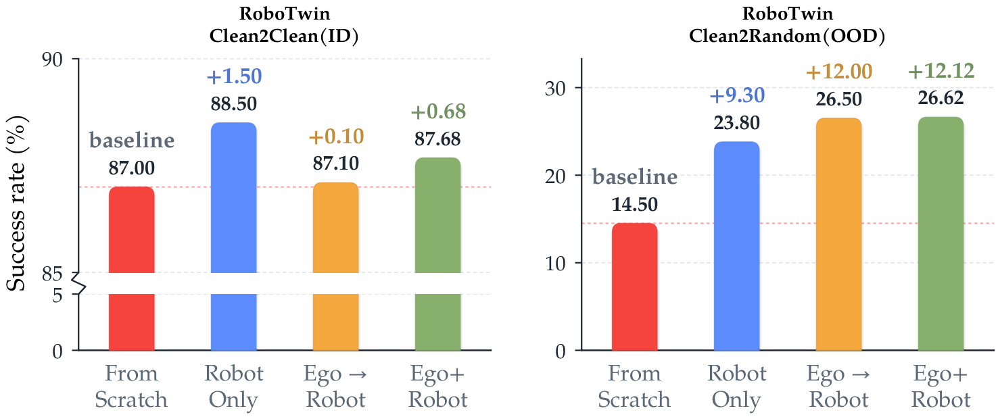

**图 10\.** **具身预训练主要改善 OOD 泛化性能。** 在 RoboTwin2.0-Clean2Random 上的成功率，在各个评测设定内部按性能由低到高排列。

#### 预训练主要改善 OOD 泛化能力。

如图 10 所示，具身预训练对分布内性能的增益相对有限，但在 OOD 评测中带来了强劲的性能跃升。因此，具身预训练主要贡献的是能够迁移到下游训练分布之外的知识，而非进一步去拟合一个本已饱和的 ID 基准。

#### 机器人数据与第一人称视频各具优势。

纯机器人预训练取得了最强的 ID 表现，而两种混合策略在 OOD 泛化上表现更好。这种权衡与我们的洞察高度吻合：机器人轨迹强化了可执行动作的基础锚定，而以人为中心的第一人称视频则拓宽了视觉与交互的多样性分布。

#### 吸收第一人称视频：顺序训练对比协同训练。

顺序训练与单阶段协同训练在分布内和分布外评测中的表现几乎旗鼓相当，这表明充分利用这两种数据源本身比它们之间精确的时序安排更为重要。协同训练在综合表现上略胜一筹，并且省去了额外的课程学习切换成本，因此我们将其采纳为实际的默认方案。

### 预训练改变了偏好的信息流 (Pretraining Changes the Preferred Information Flow)

从头训练的消融实验证明动作流必须能够看见世界流，但单向可见与互见模式之间基本持平。我们在经历了跨领域预训练之后，在 RoboTwin2.0-Clean2Random 和 RoboTwin2.0-Full 下重新展开了这一对比。

#### 在经历具身预训练后，互见模式更具优势。

在没有具身预训练的情况下，RoboTwin2.0-Full 略微偏向单向可见；然而，在经历预训练之后，同一协议转而明显偏向互见模式（Mutual）。RoboTwin2.0-Clean2Random 在 ID 和 OOD 两个评测集上也展现出相同的反转趋势，且在两个划分上的增益幅度相当（图 11）。因此，这种偏好反转既不是领域偏移带来的假象，也不是评测协议所致：预训练将世界 - 动作之间的交互转化为一种真正意义上的**双向交互**，其中预测的未来帧为动作生成提供了视觉引导，而预测的动作反过来指导了这些未来帧中操作器运动的合成。在缺乏具身预训练时，由于下游数据相对匮乏，两流难以可靠地建立起这种精确的对应关系；而规模大得多的预训练数据弥合了这一差距，使得互见模式在具身预训练就绪后充分释放其优势。我们最终将互见模式纳入技术配方。

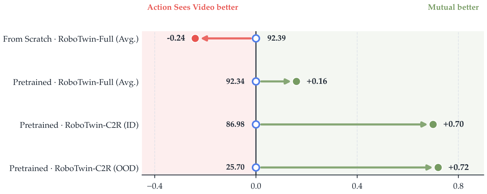

**图 11\.** **预训练改变了偏好的信息流。** 中央标记表示“动作见视频 (Action Sees Video)”的绝对成功率；箭头终点指向对应的“互见 (Mutual)”结果，水平位移表示 $\text{Mutual}-\text{Action Sees Video}$ 的百分点变化。绿色和红色分别表示性能提升和下降。

> **发现 3 (Finding 3)：** 具身预训练主要扩展了 OOD 泛化能力。机器人轨迹保障了动作具身基础，第一人称视频拓展了迁移边界，单阶段协同训练能够高效整合二者。在预训练的大规模数据下，世界与动作的互见（Mutual）模式始终更为优越。

## 总结性评论 (Concluding Remarks)

上述三个问题将继承的世界知识转化为了具体的模型设计：这并非一系列各自孤立的最优超参数列表，而是一个环环相扣的序列，其中每一项决策都在前一项决策所构建的条件下接受检验。下一节将这些默认配置组装为 **OpenWAM-**$\boldsymbol{lpha}$，并检验它们在全尺度异构预训练下是否依然稳健成立。

**表 3\.** **OpenWAM-Study 沉淀的技术配方。** 每一项由实证支撑的选择均构成了 OpenWAM-$\alpha$ 的默认配置。

| 核心维度                 | 实证发现                              | OpenWAM-$\alpha$ 采纳方案  |
| :------------------- | :-------------------------------- | :--------------------- |
| **继承 (Inherit)**     | 强能力的视频主干网络与紧凑的表征潜空间能够最强有力地传递上游先验。 | Wan2.2-TI2V-5B；紧凑潜空间   |
| **交互 (Interact)**    | 专用的动作容量与世界到动作的可见性是必需的；同步去噪表现最佳。   | 双系统联合自注意力；同步去噪         |
| **整合 (Consolidate)** | 具身预训练主要改善 OOD 泛化，且在规模扩展下始终偏好互见模式。 | 单阶段第一人称 + 机器人协同训练；互见模式 |

# OpenWAM-$\alpha$：从原则到预训练模型 (OpenWAM-$\alpha$: From Principles to a Pretrained Model)

**OpenWAM-$\alpha$ 概述。** 受到 OpenWAM-Study 揭示的设计原则与实证洞见的启发，我们在 OpenWAM-$\alpha$ 中将这些发现扩展并实例化为基石模型——一个用于系统化探究世界 - 动作模型在多样化机器人任务中的能力边界与缩放行为（scaling behavior）的开源基础模型。在第 5.1 节中，我们在第 4 节确立的洞见指导下，详细阐述 OpenWAM-$\alpha$ 的最终架构、训练配方与部署方案。第 5.2 节随后详细介绍预训练数据配置以及相关的数据清洗与构建管线。最后，第 5.3 节在丰富的仿真基准测试集上对 OpenWAM-$\alpha$ 展开评估，并剖析其性能及实证结论，第 5.4 节进一步在真实世界任务上对其进行了严格检验。

## OpenWAM-$\alpha$ 的架构、训练与部署 (OpenWAM-$\alpha$ Architecture, Training, and Deployment)

如图 12 所示，从 **OpenWAM-Study** 提炼出的设计原则直接决定了 OpenWAM-$\alpha$ 在架构、训练与部署阶段的各项具体配置。下文将依次进行详细阐述。

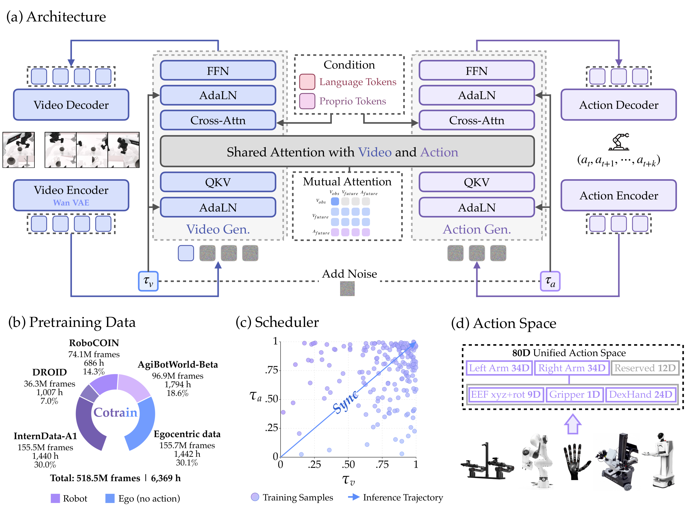

**图 12\.** **OpenWAM-$\alpha$ 概览。** (a) 双系统架构：视频生成 DiT 与 ActionDiT 在互见掩码下通过共享注意力联合去噪未来帧与动作分块，各自通过交叉注意力以语言和本体感知状态为条件，并携带独立的噪声时间步。(b) 预训练数据混合：5.185 亿帧（6,369 小时）的人类第一人称及机器人数据，通过单阶段协同训练。(c) 时间步采样：训练覆盖完整的联合噪声平面，推理遵循同步对角线。(d) 跨具身共享的具有固定槽位语义的 80 维统一动作空间。

### 架构 (Architecture)

**OpenWAM-$\alpha$** 采纳了 **OpenWAM-Study** 收敛确立的架构方案（表 3），由第 3.1 节所述模块按照组合规则 $C(\mathcal{E},\mathcal{S},\mathcal{M})$ 组装而成：以冻结的 Wan2.2-VAE 作为视觉编码器 $\mathcal{E}$；以预训练的 Wan2.2-TI2V-5B DiT \[30\] 执行世界流，以专门的 10 亿参数（1B）ActionDiT 执行动作流，二者通过联合自注意力耦合，构成流主干网络 $\mathcal{S}={\mathcal{W},\mathcal{A}}$；并将视频内部具有首帧因果注意力的*互见 (mutual)* 模式作为可见性掩码 $\mathcal{M}$。以当前观测 $\mathbf{o}*1$（所有相机视角拼接平铺为一个画布）、语言指令 $\ell$ 以及在统一动作空间中表示的本体感知状态 $\mathbf{q}\in\mathbb{R}^{80}$ 为条件，OpenWAM-$\alpha$ 在潜空间中对 $T$ 帧视频窗口 $\mathbf{o}_{1:T}$ 中的未来帧 $\mathbf{o}_{2:T}$，以及连续动作分块 $\mathbf{a}=\mathbf{a}_{1:H}\in\mathbb{R}^{H\times80}$ \[8\] 进行联合去噪（图 12a）。

**分词化与上下文 (Tokenization and Context)。** 冻结的 Wan2.2-VAE 对 $\mathbf{o}_{1:T}$ 进行因果编码——首帧单独编码，后续帧按每四帧一组进行编码——得到 $T'=1+(T-1)/4$ 个潜帧 $\mathbf{z}$，从而使首个潜帧保持为当前时刻的纯净锚点。$(1,2,2)$ 的 Patch 嵌入将潜视频展平为宽度为 3072 的世界流标记，并在（帧、高度、宽度）三维网格上携带 3D RoPE 位置编码；$H$ 个带噪动作步中的每一步都被线性嵌入为宽度为 1024 的动作流标记，并在分块索引上携带 1D RoPE。冻结的 umT5 编码器将 $\ell$ 映射为 4096 维的上下文，线性投影将 $\mathbf{q}$ 作为额外的上下文标记追加其后，两个流通过各自的逐块交叉注意力来消费所得的上下文 $\mathbf{c}$。

**流桥接与预测 (Stream Bridging and Prediction)。** 两个主干网络全部 30 个配对的层均作为桥接层（bridge layers），各流所属的投影层将两者的残差宽度映射到 24 头 $\times$ 128 维的共享注意力空间；在所配置的掩码 $\mathcal{M}$ 下，两个流可以自由互相读取，而纯净的首帧行既不关注带噪的未来帧，也不关注动作。AdaLN 为每个流注入各自的去噪时间步—世界流按标记逐个注入 $t_v$（首帧标记固定在纯净端点 $t_v=1$），动作流注入 $t_a$—线性头将两个流的最终状态解码为速度场预测，从而在任意联合噪声状态 $(t_v,t_a)$ 下实现第 3.2 节的联合前向传播；训练与推理如何覆盖该平面分别在第 5.1.2 节与第 5.1.3 节具体说明。

### 训练 (Training)

**协同训练设定 (Co-Training Setup)。** 遵循第 4.3 节确立的单阶段协同训练策略，OpenWAM-$\alpha$ 在第 5.2 节的第一人称 + 机器人混合数据上进行单阶段端到端训练。视频 DiT（从预训练的 Wan2.2-TI2V-5B 权重初始化）、ActionDiT 以及本体感知编码器全部参与参数更新；仅 umT5 文本编码器与 Wan2.2-VAE 保持冻结。

**统一动作监督 (Unified Action Supervision)。** 异构的具身构型汇聚于第 3.4 节定义的统一动作空间中：这是一个具有固定槽位语义的 80 维向量，包含两个镜像对称的 34 维机械臂块——末端执行器位置 (3)、6D 旋转 (6)、夹爪 (1) 以及灵巧手 (24)——随后是为特定具身保留的 12 个槽位（图 12d）。每个数据集将其原生动作和状态离散散播至这些槽位中，公式 (2) 中的有效性掩码 $\mathbf{m}$ 将动作监督严格限定在被填充的坐标上，而窗口起始处的机器人状态则提供 $\mathbf{c}$ 中的本体感知标记。

**目标函数与时间步采样 (Objective and Timestep Sampling)。** OpenWAM-$\alpha$ 采用公式 (2) 的联合流匹配目标进行训练 \[12\]，实例化为 $\lambda_v=\lambda_a=1$，并采用在中间噪声水平呈峰值的钟形时间步权重 $w(\cdot)$。每个流的时间步独立采样自 $t_v=1-f_{\rho}(u_v)$ 与 $t_a=1-f_{\rho}(u_a)$，其中 $u_v,u_a\sim\mathcal{U}\[0,1\]$，公式 (3) 中的时间步扭曲函数 $f_{\rho}$ 以 $\rho=5$ 相同地应用于两个流，以使采样偏向高噪声区域（图 12c）。

### 部署 (Deployment)

**同步去噪 (Synchronized Denoising)。** 在测试阶段，OpenWAM-$\alpha$ 遵循第 4.2.3 节选定的同步调度：两流在联合噪声平面的对角线上统一步调推进，在训练扭曲函数上具体实现为 $t^i=1-f_{\rho}(1-i/N)$，其中 $\rho=5$，$N=10$ 步，因此两流并无先后之分。去噪从高斯噪声开始——首个潜帧固定为当前观测的编码，且每步之后均重新固定——每一步执行一次联合前向传播以及第 3.3 节的耦合欧拉更新，从而使动作分块在全部 30 个桥接层上与逐渐清晰的世界特征互为参考、逐步提精。最终完成的动作分块通过公式 (4) 的逆映射恢复到每个机器人的原生动作空间。

**推理模式 (Inference Mode)。** 后续所有的基准评测，无论是在仿真环境中还是在真实机器人上，均采用同步推理：每当动作缓冲区清空，系统便暂停执行，直到模型根据当前观测预测出全新的动作分块，随后机器人严格按照预测执行该分块。因此，汇报的成绩以最直接的方式客观反映了模型自身的性能。

**推理加速 (Inference Acceleration)。** OpenWAM-$\alpha$ 通过第 3.3 节的加速组件栈提供服务：联合去噪循环被编译为静态形状计算图并在 CUDA 图下重放，稳定的速度预测在相邻步间复用，提示词嵌入进行缓存，且在控制路径中无需执行 VAE 解码。在 RTX 5090 上，整个 $N$ 步循环每个分块耗时约 $170,$ms，完全满足实时控制的延迟预算。

## 多领域预训练数据与清洗构建 (Multi-Domain Pretraining Data and Curation)

OpenWAM-$\alpha$ 在源自五大来源的多领域数据上进行预训练，涵盖三种数据类型：人类第一人称数据、真实世界机器人数据以及合成机器人数据。从 13.3 亿帧（$\approx$14,300 小时）的原始数据池中，我们通过数据清洗和逐数据源子采样构建了一个包含 5.18 亿帧（$\approx$6,400 小时）的训练集（表 4）。本节阐述该混合集如何构建（第 5.2.1 节）以及各数据源如何清洗（第 5.2.2 节）。我们还在附录 B 中进一步提供了预训练阶段的超参数配置及其他相关细节。

**表 4\.** **OpenWAM-$\alpha$ 预训练数据。** *\#Emb.* 统计每个数据源包含的不同具身构型数量。*Task Coverage（任务覆盖）* 标明每个数据源涵盖的操作场景。*Full* 报告处理前的原始规模，而 *Curated \+ Sampled* 报告清洗（第 5.2.2 节）与按源完整回合子采样（第 5.2.1 节）后实际用于训练的数据；*Share* 为在按比例采样下每个数据源实际的每轮样本占比。

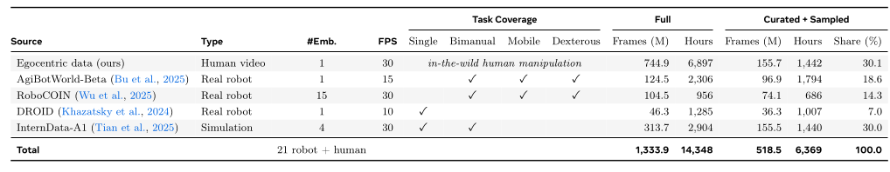
### 预训练数据混合配比 (Pretraining Data Mixture)

**数据构成 (Data Composition)。** 遵循第 4.3 节的协同训练配方，混合集综合了三种互补的数据类型。人类第一人称视角数据来自我们专门为以操作为中心的世界建模而精心构建的数据集——包含 71,600 条时长在 0.25 至 6 分钟的长程第一人称记录，覆盖 3,006 种日常操作任务；它提供了广阔的视觉与交互多样性，但不携带机器人动作标签，因此其动作和本体感知通道完全被掩码遮蔽，仅对世界流提供监督。真实世界机器人数据（AgiBotWorld-Beta \[73\]、RoboCOIN \[72\] 和 DROID \[74\]）利用跨 17 个物理平台的可执行轨迹锚定动作流，同时也提供了机器人与物理世界交互的最真实视觉观测。合成机器人数据（InternData-A1 \[75\]）进一步拓宽了机器人数据的覆盖面，涵盖了在多样化环境变化下更全面的单臂和双臂操作技能。

**数据预算与采样 (Data Budget and Sampling)。** 考虑到预训练的计算资源与时间成本，每个数据源都在设定的时间预算下进行子采样。预算依据基于帧的目标推导——第一人称与合成数据源各贡献总训练帧数的 30%，剩余的 40% 按照清洗后的有效帧数比例分配给三个真实机器人数据源——从而使具有不同原生帧率的数据源能够根据模型实际消费的数据量达到平衡。在各个数据源内部，时长预算通过注水算法分配到各子数据集中，并以固定随机种子从清洗池中按完整回合进行子采样直至满足预算。训练时严格按照各源实际保留的样本数等比例抽取，因此每个保留的样本在每个周期（epoch）中恰好被访问一次。

### 数据清洗 (Data Curation)

汇聚来自不同来源和具身的数据会在视觉和信号通道中引入异构缺陷。我们的清洗协议参考了 Qwen-RobotManip \[66\] 的数据清洗管线，并补充了针对所收集数据源常见失效模式的特定规则，包含两个层级：所有数据源共享的视觉级清洗，以及特定于机器人数据的信号级清洗。

**视觉级清洗 (Vision-Level Cleaning)。** 所有数据源首先通过统一的视觉质量筛选，剔除不可解码的视频、静止冻结或重复帧、纯黑/纯白/纯色帧、过曝/欠曝及曝光闪烁帧、模糊帧以及突然的视觉跳变。第一人称数据还存在其特有的失效模式：人手离开视场的片段不携带任何操作信号，予以剔除；语言标注为空或无效的记录也同样被舍弃。

**信号级清洗 (Signal-Level Cleaning)。** 机器人数据额外包含状态与动作通道，按以下四步进行清洗：

1. **信号完整性。** 当记录的末端执行器状态未能追踪指令动作（振幅比 $\geq 3\times$ 且逐轴相关系数 <0.5），或视频 - 信号失配影响超过 2% 的帧时，该回合直接舍弃。

2. **状态优先的静止检测。** 状态通道作为静止片段的主要判断标准：开头和结尾状态静止的片段被裁剪去除——检测基于单帧差分的 p99.5 校准的每种机器人运动阈值，并在末端执行器平均平移速度和测地线旋转速度分别低于 2 cm/s 和 5 $^\circ$/s 时予以确认；而回合中间的停顿绝不裁剪，因为裁剪会导致时间上不连续的帧被拼接。此外，利用鲁棒的中位数 - 绝对中位差（median–MAD）阈值筛除抖动（jerk）和突刺异常等状态不连续性。

3. **视觉交叉校验。** 当状态确实发生移动时，与视觉图像进行交叉核对：若状态看似移动但所有相机视角在视觉上均保持完全静止，则归因于传感器抖动并予以裁剪；反之，若机械臂真实移动但相机画面冻结，则判定为采集故障并剔除该回合。

4. **回合级舍弃。** 若一个回合因上述步骤损失超过 70% 的帧，或者其视频在 90% 及以上的时长内处于冻结状态，则整个回合被直接丢弃。

## 仿真基准评测 (Simulation Benchmark Evaluation)

以预训练好的 OpenWAM-$\alpha$ 基座模型为起点，我们在 OpenWAM-Infra（第 3.4 节）集成的八个仿真基准上进行了监督微调与评测，涵盖五大具身类别：

- **单臂**：LIBERO \[57\]、LIBERO-Plus \[58\] 以及 VLABench \[59\]；

- **双臂**：RoboTwin2.0 \[60\] 与 RoboDojo \[61\]；

- **移动单臂**：RoboCasa365 \[62\]；

- **移动双臂**：EBench \[65\]；

- **灵巧手**：RoboCasa-GR1 \[63\], \[64\]。

针对 RoboTwin2.0，我们评估了两种变体。**RoboTwin2.0-Full** 在纯净与随机化数据的混合集上微调并在两种环境下测试，探查模型的分布内（ID）能力；**RoboTwin2.0-Clean2Random** 仅在纯净数据上微调并在两种环境下测试，探查其分布外（OOD）泛化能力。

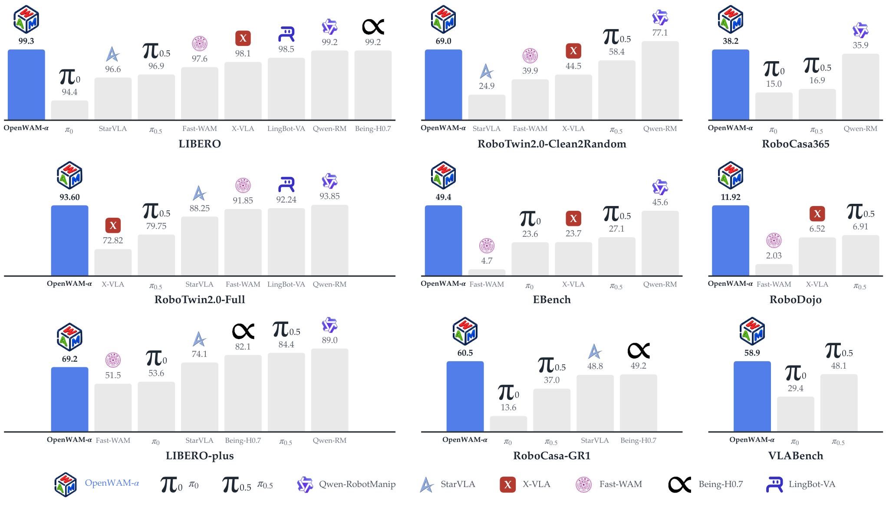

**图 13\.** **OpenWAM-$\alpha$ 与代表性 VLA 及 WAM 基线在各仿真基准上的成绩对比。** 在每个子图中，基线模型按得分排序，每个柱状图均标注了其实际数值。

图 13 汇总了 OpenWAM-$\alpha$ 与代表性 VLA 及 WAM 基线在各个基准上的得分，每个柱状图均标有具体分数，清晰展现了该模型所处的水准。图 14 则进一步将 OpenWAM-$\alpha$ 与各榜单上最强的 VLA 和 WAM 按具身构型分组进行直面对决，以便直接对比这两大技术范式。各基准详细的训练与评测配置（包括超参数设置及评测细节）见附录 B.2。支撑这两幅图的详细分项基准表格见附录 D。通过这些评测得分，我们旨在解答本次评估核心关注的两个问题：**(1) OpenWAM-$\alpha$ 的性能表现究竟如何？(2) 在 VLA 与 WAM 之间，哪种范式更胜一筹？** 接下来的两个小节将依次探讨。

### OpenWAM-$\alpha$ 表现如何？ (How Does OpenWAM-$\alpha$ Perform?)

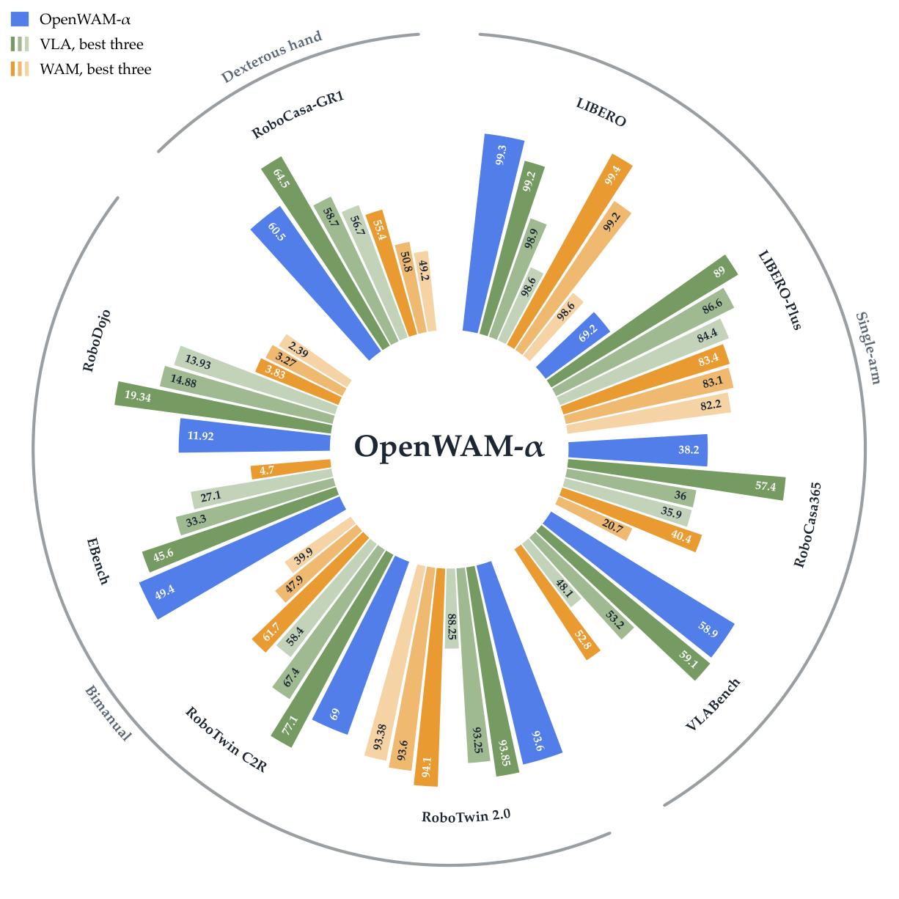

**图 14\.** **按具身构型分组的各基准上，OpenWAM-$\alpha$ 与各族系最优模型的对比。**

在绝大多数基准测试中，OpenWAM-$\alpha$ 均展现出了极为优异的性能：

- 在单臂基准 **LIBERO** 与 **VLABench**、双臂基准 **RoboTwin2.0-Full**、移动单臂基准 **RoboCasa365** 以及灵巧手基准 **RoboCasa-GR1** 上，OpenWAM-$\alpha$ 稳居第一梯队，与榜首模型仅存在极其微小的差距。

- 在移动双臂基准 **EBench** 上，OpenWAM-$\alpha$ 树立了新的 SOTA，在成功率（SR）和得分（Score）上均领先第二名 Qwen-RobotManip 约 4 个百分点。

- 在双臂基准 **RoboTwin2.0-Clean2Random** 与 **RoboDojo** 上，虽然与最强模型（均为 VLA）仍存有差距，但 OpenWAM-$\alpha$ 在两个榜单上均为**表现最强的 WAM**，显著领先于其他同类 WAM 模型。

一个出乎意料的例外是单臂基准 **LIBERO-Plus**，OpenWAM-$\alpha$ 的得分明显落后于其在其他基准上的顶级水准，如表 5 所示。细看 **LIBERO-Plus** 的各项扰动细分表现可以发现：失分高度集中在*相机扰动 (camera)* 与*噪声扰动 (noise)* 下，同时在*背景 (background)* 和*布局 (layout)* 扰动下也存在明显短板。然而，在同一榜单上，ABot-M0.5、ImageWAM 与 Being-H0.7——它们本身同属 WAM 阵营——却表现强劲，成绩逼近顶尖水平。因此，我们从预训练数据和模型架构两个维度将 OpenWAM-$\alpha$ 与这些模型进行深入对比，以剖析根本原因。

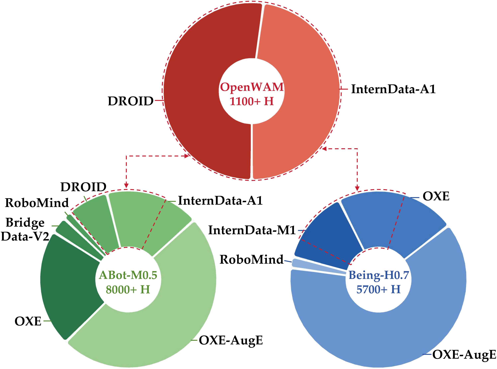

**图 15\.** **ABot-M0.5、Being-H0.7 与 OpenWAM-$\alpha$ 的单臂预训练数据量对比。** 虚线表明 OpenWAM-$\alpha$ 消费的单臂数据仅占 ABot-M0.5 和 Being-H0.7 的极小一部分。

**数据维度的视角。** 图 15 将 ABot-M0.5 和 Being-H0.7 的预训练数据中单臂部分与 OpenWAM-$\alpha$ 进行了对比。这两个基线模型均在规模大得多且更多样化的单臂数据集上进行了预训练，跨越了丰富的具身平台、场景以及相机视点，因此在预训练阶段它们就已经见过了与 LIBERO-Plus 测试场景在视角、噪声、背景和布局上高度相似的视觉信息和世界知识。相比之下，OpenWAM-$\alpha$ 的单臂数据（表 4）在体量和多样性上都小得多，仅依赖两个来源：采集自固定单臂平台和固定相机视角的 DROID，以及合成数据 InternData-A1 中的单臂子集。由于单臂覆盖面如此有限，模型接收到的单臂世界知识严重不足，因而在 LIBERO-Plus 的分布外扰动下，其单臂泛化能力不可避免地受到了制约。反之亦然：OpenWAM-$\alpha$ 的数据混合中富含以人为中心的第一人称、双臂和灵巧手数据，模型在双臂和灵巧手基准上的表现也相应地极为强悍。

**表 5\.** **LIBERO-Plus 评测结果。** 粗体表示最优值，下划线表示次优值。

| 模型 | 相机 (Camera) | 机器人 (Robot) | 语言 (Language) | 光照 (Light) | 背景 (Background) | 噪声 (Noise) | 布局 (Layout) | 平均 (Avg) |
| :---- | :---: | :---: | :---: | :---: | :---: | :---: | :---: | :---: |
| ***VLA*** |  |  |  |  |  |  |  |  |
| **$\pi_0$** \[12\] | 13.8 | 6.0 | 58.8 | 85.0 | 81.4 | 79.0 | 68.9 | 53.6 |
| **OpenVLA-OFT** \[76\] | 56.4 | 31.9 | 79.5 | 88.7 | 93.3 | 75.8 | 74.2 | 69.6 |
| **StarVLA** \[32\] | 52.5 | 49.8 | 88.5 | 95.7 | 95.7 | 73.0 | 76.9 | 74.1 |
| **ABot-M0** \[77\] | 60.4 | 67.9 | 86.4 | 96.2 | 91.6 | 86.4 | 82.6 | 80.5 |
| **$\pi_{0.5}$** \[78\] | 78.4 | 73.6 | 80.8 | 96.2 | 94.1 | 89.0 | 84.5 | 84.4 |
| **ACoT-VLA** \[79\] | 72.6 | 82.6 | 87.5 | 97.7 | 96.5 | 87.8 | 88.1 | 86.6 |
| **Qwen-RobotManip** \[66\] | **87.2** | 75.5 | 85.6 | 96.6 | **97.7** | **97.7** | 87.3 | **89.0** |
| ***WAM*** |  |  |  |  |  |  |  |  |
| **Fast-WAM** \[55\] | 16.4 | 44.5 | 68.9 | 78.2 | 53.7 | 37.7 | 60.7 | 51.5 |
| **Being-H0.7** \[80\] | 82.0 | 59.0 | 82.8 | 97.8 | 90.0 | 93.5 | **88.5** | 82.1 |
| **Cosmos-Policy** \[16\] | 75.8 | 63.3 | 81.7 | 96.5 | 88.9 | 92.7 | 82.2 | 82.2 |
| **ImageWAM** \[81\] | 80.8 | 50.3 | **91.4** | **98.1** | 85.5 | 93.8 | 80.5 | 83.1 |
| **ABot-M0.5** \[82\] | 70.5 | **87.4** | 88.6 | 94.0 | 89.7 | 75.5 | 85.2 | 83.4 |
| **OpenWAM-$\alpha$** | 33.8 | 76.1 | 88.0 | 97.0 | 87.1 | 39.8 | 77.5 | 69.2 |

**架构维度的视角。** Fast-WAM、ABot-M0.5 和 OpenWAM-$\alpha$ 共享同一个核心预测目标——在时间视距上预测未来的像素级视频，其中间潜变量由重建型的 Wan2.2-VAE 生成。在 LIBERO-Plus 上，这三者表现出相同的特征：在*相机*和*噪声*扰动下的得分明显落后于其他扰动类型，唯有得益于海量预训练数据的 ABot-M0.5 相较于 Fast-WAM 和 OpenWAM-$\alpha$ 弥补了大部分劣势。像素级信息对于相机视角和噪声扰动天然高度敏感——这是像素级预测架构的内在局限，往往只有通过极大规模的预训练才能予以代偿。另外两个基线印证了这一判断：ImageWAM 虽未经过大规模具身预训练，但在 LIBERO-Plus 上依然表现优异，原因在于其预测目标虽然同样是像素级潜变量，但它仅预测当前观测的单一未来帧——性质更接近于图像编辑而非长时展开，因此不会出现跨帧的误差累积，未来像素预测对相机和噪声分数的影响随之大幅减小。Being-H0.7 则采用 V-JEPA 2.1 编码观测：其中间潜变量依然具备时序性（多帧联合编码），但属于语义层级的特征而非像素重建，这赋予了模型面对相机和噪声扰动时显著更高的鲁棒性。与其他基准不同，LIBERO-Plus 施加了刻意的相机和噪声干扰，在单臂预训练数据匮乏与像素级潜空间敏感性的双重叠加下，OpenWAM-$\alpha$ 的表现不可避免地下滑。而在未人为引入这类强烈扰动的其他基准上，OpenWAM-$\alpha$ 均维持了极强的竞争力。

> **启示 1 (Takeaway 1)：** 一个具身模型在基准上的泛化水平，最终取决于其预训练混合集是否包含了与该基准在具身形态和环境场景两方面均高度贴近的测试条件数据。延伸第 4.3 节的结论，具身基石模型的决定性基石依然在于大规模、多样化且场景丰富的机器人操作数据，它既覆盖了模型未来可能遇到的广泛测试场景，又提供了扎根于具体具身的高精度动作/视觉信息——这是通向更强泛化能力的最直接路径。

> **启示 2 (Takeaway 2)：** 在海量数据的驱动下，在像素潜空间中预测未来的 WAM 能够取得顶尖的性能，但其对视觉扰动的鲁棒性存在先天局限。呼应第 4.1.2 节的发现，寻找一种对环境变化鲁棒、信息丰富且足够紧凑的视觉表征空间，依然是推动 WAM 性能迈向新高度的核心命题。

### VLA 与 WAM：哪种范式更胜一筹？ (VLA versus WAM: Which Paradigm Prevails?)

纵观所有基准测试（图 14），VLA 阵营与 WAM 阵营在整体成功率上并没有显著的分水岭，双方都在各个榜单顶端拥有代表作：WAM 阵营的 ABot-M0.5 与 OpenWAM-$\alpha$，VLA 阵营的 Xiaomi-Robotics-1 与 Qwen-RobotManip。鉴于这些模型在预训练数据、网络架构以及训练配置上均存在差异，不能简单断言哪种范式绝对优越。然而，细致的分项成绩揭示出一个稳定的规律：两大范式各自拥有独特的优势领域（图 16）。

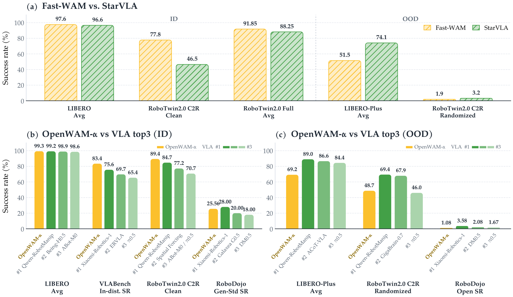

**图 16\.** **两大范式在 ID 和 OOD 场景下的对比。** (a) Fast-WAM 与 StarVLA（两个未经过具身预训练的模型）在 ID 和 OOD 划分上的表现。(b) OpenWAM-$\alpha$ 与三个最强 VLA 模型在 ID 划分上的对比。(c) OpenWAM-$\alpha$ 与三个最强 VLA 模型在 OOD 划分上的对比。

**分布内（ID），WAM 拟合更优。** 最纯粹的对比莫过于 StarVLA 与 Fast-WAM，二者均未经历具身预训练（图 16a）：在 LIBERO、RoboTwin2.0-Clean2Random 的 Clean 划分以及 RoboTwin2.0-Full 上，WAM 在这些分布内任务上取得了明显更高的分数，表明其比 VLA 更有效地拟合了训练分布。经过预训练的模型从两方面验证了同一结论（图 16b）：OpenWAM-$\alpha$ 在 LIBERO、VLABench 的 In-dist. 划分以及 RoboTwin2.0-Clean2Random 的 Clean 划分上均领先于三个最强的 VLA，并在 RoboDojo 的 Gen-Std 划分上与最优者差距极小——尽管这些 VLA 模型的预训练数据规模普遍超出我们。这一优势源于 WAM 训练中存在的视频潜变量监督：VLA 仅针对动作监督进行优化，缺乏中间潜变量目标；而视频潜变量项为参数优化注入了额外的稠密信息流，使得 WAM 能够更严丝合缝地拟合训练数据。

**分布外（OOD），VLA 泛化更强。** 同样的 StarVLA 与 Fast-WAM 对比在分布外场景发生了反转（图 16a）：在 LIBERO-Plus 上，VLA 大幅领先；即使在两个模型几乎均告失效的 RoboTwin2.0-Clean2Random 的 Randomized 划分上，排名依然倾向于 VLA。预训练模型也同样重现了这一反转（图 16c）：在 LIBERO-Plus、RoboTwin2.0-Clean2Random 的 Randomized 划分以及 RoboDojo 的 Open 划分上，OpenWAM-$\alpha$ 与顶尖 VLA 模型相比有显见差距。其机制恰恰是 ID 拟合优势的一体两面：长视距的未来预测增加了有助于训练拟合的监督信号，但在分布偏移下，漫长的未来预测视距意味着更严重的复合误差累积——这是纯动作输出的 VLA 所无需背负的包袱——因而 WAM 在未知评估环境中的表现明显逊于 VLA。

至关重要的是，**这两种短板均可被数据所弥补**。无论是 VLA 的 ID 拟合不足，还是 WAM 的 OOD 泛化缺陷，只要拥有覆盖复杂环境变化并带有精准动作标注的足够充沛的预训练数据，两种范式均能借助继承的先验在测试期同时实现出色的拟合与泛化。因此，数据依然是模型发展的核心第一要素。同时，VLA 和 WAM 本质上都是建立在“从观测到动作”这一核心信息流上的端到端模型；如何结合两大范式的互补优势，进一步拓宽端到端模型的性能边界，是一个极具价值的探索课题。

> **启示 3 (Takeaway 3)：** 两种范式并无绝对胜负：视频潜变量监督赋予了 WAM 在分布内拟合上的独特优势，而 VLA 在分布外泛化上表现更稳健——且任何一方的短板都可以通过足够庞大且多样的预训练数据加以弥补。融合两种端到端范式的互补优势，是推动具身智能能力边界进一步拓展的极具前景的方向。

## 真实机器人评测 (Real-Robot Evaluation)

为了在仿真之外进一步检验 OpenWAM-$\alpha$ 的通用操作能力与泛化性能，我们跨越单臂、双臂和灵巧手三大具身平台进行了全面的真实机器人评测，其实验环境设置如图 17 所示。具体而言：

- **单臂实验**在 Franka-Research-3 平台上展开，涵盖堆叠（stacking）、抓取放置（pick-and-place）以及悬挂（hanging）三大任务族系，旨在考查模型的基础及精细操作能力。性能以任务成功率（SR）衡量。

- **双臂实验**在官方 RoboDojo 真实机器人平台上进行，涵盖三种具身形态（ARX X5、Piper 与 Piper X）；遵循 RoboDojo 任务分类法，评测全面覆盖了泛化、高精度、长视距、记忆以及开放任务，对模型进行综合检验。性能以成功率（SR）和过程进度得分（Progress Score）衡量。

- **灵巧手实验**在搭载无极灵巧手（Wuji hand）与天机机械臂（Tianji arm）的平台上进行——该具身平台及动作空间完全未在 OpenWAM-$\alpha$ 的预训练混合集中出现过——涵盖双臂交互、长视距与精细操作任务，探查模型对未知具身形态和未知动作维度的适应与泛化能力。性能同样以成功率（SR）和进度得分（Progress Score）衡量。

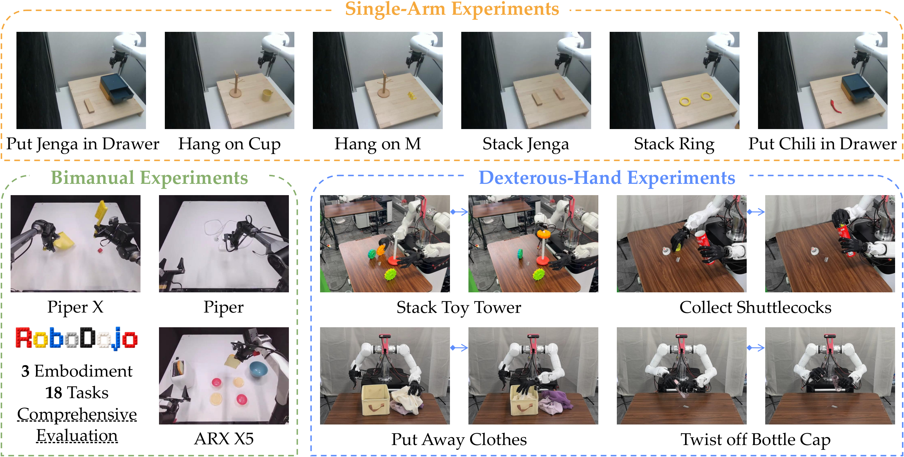

**图 17\.** **跨越三种具身形态的真实机器人实验设置。** *顶部*：Franka-Research-3 平台上的六个单臂任务。*左下*：RoboDojo 真实世界赛道的三个双臂具身平台（Piper X、Piper 与 ARX X5），共涵盖 18 个任务。*右下*：无极灵巧手与天机机械臂平台上的四个灵巧手任务，每行展示了其执行过程的关键中间阶段。

各具身形态的任务设定与评测协议详见附录 C，这些实验所使用的 SFT 配置见附录 B.2。

表 6、表 7 和 表 8 分别报告了单臂、RoboDojo 双臂以及灵巧手实验的详细得分。

**表 6\.** **单臂真实机器人任务评测结果。** 粗体表示最优值，下划线表示次优值。

| 策略模型 | 堆叠积木 (Stack Jenga) | 堆叠圆环 (Stack Ring) | 辣椒入抽屉 (Put Chili in Drawer) | 积木入抽屉 (Put Jenga in Drawer) | 挂 M 物件 (Hang on M) | 挂杯子 (Hang on Cup) | 平均成功率 (Avg) |
| :---- | :---: | :---: | :---: | :---: | :---: | :---: | :---: |
| **$\pi_{0.5}$** \[78\] | 13/20 (65%) | 7/20 (35%) | 14/20 (70%) | 15/20 (75%) | 7/20 (35%) | 10/20 (50%) | 66/120 (55.0%) |
| **LingBot-VA** \[15\] | 16/20 (80%) | **15/20 (75%)** | 17/20 (85%) | 17/20 (85%) | **13/20 (65%)** | 15/20 (75%) | 93/120 (77.5%) |
| **OpenWAM-$\alpha$** | **17/20 (85%)** | 12/20 (60%) | **20/20 (100%)** | **20/20 (100%)** | **13/20 (65%)** | **17/20 (85%)** | **99/120 (82.5%)** |

在单臂平台上（表 6），OpenWAM-$\alpha$ 在绝大多数任务上明显领先于代表性 WAM 模型 LingBot-VA 以及代表性 VLA 模型 $\pi_{0.5}$，并取得了最高的平均成功率，有力印证了其通用及精细操作能力。随后我们转向 RoboDojo-Real（表 7），这是一个跨越三个双臂具身形态并在广泛任务维度上全面评估通用操作策略的真机基准。OpenWAM-$\alpha$ 登顶该榜单：它在不同具身及其任务间保持了一贯的强劲表现，并在绝大多数任务上达到了当前的最优水准，确证了该模型在真实物理世界中的通用性与鲁棒性。

**表 7\.** **RoboDojo-Real 真机基准评测结果（格式：进度得分 / 成功率）。**

| 策略 (Policy) | 具身构型 (Embodiment) | 任务 1 | 任务 2 | 任务 3 | 任务 4 | 任务 5 | 任务 6 | 具身平均 | 综合平均 |
| :---- | :---- | :---: | :---: | :---: | :---: | :---: | :---: | :---: | :---: |
|  | ARX X5 | 0.0 / 0.0 | 0.0 / 0.0 | 0.0 / 0.0 | 2.0 / 0.0 | 20.7 / 10.0 | 18.0 / 0.0 | 6.8 / 1.7 |  |
|  | Piper | 0.0 / 0.0 | 5.3 / 0.0 | 0.0 / 0.0 | 0.0 / 0.0 | 53.0 / 50.0 | 37.0 / 0.0 | 15.9 / 8.3 |  |
| **X-VLA** \[83\] | Piper X | 0.0 / 0.0 | 0.0 / 0.0 | 0.0 / 0.0 | 0.0 / 0.0 | 0.0 / 0.0 | 0.7 / 0.0 | 0.1 / 0.0 | 7.6 / 3.3 |
|  | ARX X5 | 24.0 / **20.0** | 0.0 / 0.0 | 3.0 / 0.0 | 4.0 / 0.0 | 40.0 / 20.0 | 19.0 / 10.0 | 15.0 / 8.3 |  |
|  | Piper | 0.0 / 0.0 | 0.0 / 0.0 | 0.0 / 0.0 | 0.0 / 0.0 | 23.0 / 20.0 | 22.7 / 0.0 | 7.6 / 3.3 |  |
| **Xiaomi-Robotics-0** \[84\] | Piper X | 0.0 / 0.0 | 0.7 / 0.0 | 4.0 / 0.0 | 0.0 / 0.0 | 0.0 / 0.0 | 2.7 / 0.0 | 1.2 / 0.0 | 7.9 / 3.9 |
|  | ARX X5 | 1.0 / 0.0 | 0.0 / 0.0 | 3.0 / 0.0 | 6.0 / 0.0 | 0.0 / 0.0 | 10.3 / 0.0 | 3.4 / 0.0 |  |
|  | Piper | 0.0 / 0.0 | 32.7 / 10.0 | 13.3 / 10.0 | 0.0 / 0.0 | 56.0 / 50.0 | 30.0 / 10.0 | 22.0 / 13.3 |  |
| **GalaxeaVLA (G0)** \[85\] | Piper X | 0.0 / 0.0 | 0.0 / 0.0 | 0.0 / 0.0 | 4.0 / 0.0 | 0.0 / 0.0 | 6.0 / 0.0 | 1.7 / 0.0 | 9.0 / 4.4 |
|  | ARX X5 | 0.0 / 0.0 | 0.0 / 0.0 | 0.0 / 0.0 | 0.0 / 0.0 | 48.0 / 20.0 | 12.0 / 0.0 | 10.0 / 3.3 |  |
|  | Piper | 0.0 / 0.0 | 7.3 / 0.0 | 0.0 / 0.0 | 0.0 / 0.0 | 73.0 / 70.0 | 59.0 / 40.0 | 23.2 / 18.3 |  |
| **InternVLA-A1** \[86\] | Piper X | 0.0 / 0.0 | 0.0 / 0.0 | 4.0 / 0.0 | 2.0 / 0.0 | 0.0 / 0.0 | 10.0 / 0.0 | 2.7 / 0.0 | 12.0 / 7.2 |
|  | ARX X5 | 24.6 / **20.0** | **1.8** / 0.0 | **25.8** / **10.0** | 47.0 / **20.0** | 40.0 / 20.0 | 26.8 / 10.0 | 27.7 / 13.3 |  |
|  | Piper | **10.0** / **10.0** | 28.0 / 0.0 | 10.0 / 10.0 | 0.0 / 0.0 | 72.0 / 60.0 | 72.0 / **50.0** | 32.0 / 21.7 |  |
| **$\pi_{0.5}$** \[78\] | Piper X | 0.0 / 0.0 | 14.8 / **10.0** | 0.0 / 0.0 | 29.5 / 10.0 | 7.5 / 0.0 | 3.0 / 0.0 | 9.1 / 3.3 | 22.9 / 12.8 |
|  | ARX X5 | **31.0** / 0.0 | 0.0 / 0.0 | 13.0 / 0.0 | **52.0** / **20.0** | **100.0** / **100.0** | **38.0** / **20.0** | **39.0** / **23.3** |  |
|  | Piper | 8.3 / 0.0 | **60.0** / **40.0** | **36.7** / **30.0** | 0.0 / 0.0 | **100.0** / **100.0** | **75.0** / **50.0** | **46.7** / **36.7** |  |
| **OpenWAM-$\alpha$** | Piper X | 0.0 / 0.0 | **28.0** / **10.0** | **18.0** / 0.0 | **52.3** / **20.0** | **40.0** / **40.0** | **24.7** / **10.0** | **27.2** / **13.3** | **37.6** / **24.4** |

*任务顺序说明。* **ARX X5**：`cover_blocks`（盖积木）、`make_bread`（做面包）、`make_food`（制作食物）、`pack_and_pour_fruit`（打包倒水果）、`store_in_safe`（存入保险柜）、`insert_tubes`（插试管）。**Piper**：`stack_and_cover_blocks`（叠积木并盖住）、`fill_pen_holder`（插笔入筒）、`put_objects_into_basket`（收纳物品入篮）、`insert_charger`（插充电器）、`stack_bowls`（叠碗）、`stand_up_bottles`（扶正瓶子）。**Piper X**：`classify_objects`（物品分类）、`disassemble_LEGO`（拆解乐高）、`hang_mugs`（悬挂马克杯）、`pack_objects_into_backpack`（物品装入背包）、`sweep_blocks`（清扫积木）、`cap_pen`（盖笔帽）。

**表 8\.** **灵巧手真实机器人任务评测结果（格式：完成数/总数 (进度得分) / 成功数/总轮次 (成功率)）。**

| 方法 | 堆叠玩具塔 (Stack Toy Tower) |  | 收集羽毛球 (Collect Shuttlecocks) |  |
| :---- | :---: | :---: | :---: | :---: |
|  | **分布内 (ID)** | **分布外 (OOD)** | **分布内 (ID)** | **分布外 (OOD)** |
| $\pi_{0.5}$ | 16/30 (53.3) / 1/10 (10%) | 12/30 (40.0) / 1/10 (10%) | 11/35 (31.4) / 2/10 (20%) | 17/54 (31.5) / 3/15 (20%) |
| OpenWAM-$\alpha$ | **21/30 (70.0) / 4/10 (40%)** | **17/30 (56.7) / 3/10 (30%)** | **29/35 (82.9) / 6/10 (60%)** | **30/57 (52.6) / 4/15 (26.7%)** |

&nbsp;

| 方法 | 叠收衣物 (Put Away Clothes) |  | 拧开瓶盖 (Twist off Bottle Cap) |  |
| :---- | :---: | :---: | :---: | :---: |
|  | **分布内 (ID)** | **分布外 (OOD)** | **分布内 (ID)** | **分布外 (OOD)** |
| $\pi_{0.5}$ | 26/30 (86.7) / 6/10 (60%) | 45/60 (75.0) / 9/20 (45%) | 8/10 (80.0) / 3/10 (30%) | 13/20 (65.0) / 6/20 (30%) |
| OpenWAM-$\alpha$ | **30/30 (100.0) / 10/10 (100%)** | **55/60 (91.7) / 17/20 (85%)** | **10/10 (100.0) / 7/10 (70%)** | **18/20 (90.0) / 16/20 (80%)** |

为进一步考查 OpenWAM-$\alpha$ 的可扩展性与泛化性，我们在搭载无极灵巧手与天机机械臂的平台上，针对四项灵巧操作任务微调了预训练模型，并在分布内与分布外环境下进行了测试（表 8）。该平台及其动作空间（9 维末端执行器位姿结合 21 自由度灵巧手）从未在 OpenWAM-$\alpha$ 的预训练混合集中出现过；然而，OpenWAM-$\alpha$ 在所有任务和测试环境中均以显著优势超越了 $\pi_{0.5}$，充分证明该模型能够可靠、稳定地自适应并泛化至完全未见过的具身构型。

综合这些实验，我们跨越三种具身构型并在广泛的真实世界操作任务中对 OpenWAM-$\alpha$ 进行了严苛检验。实验结果表明，OpenWAM-$\alpha$ 在每种设定下均展现出强大性能，比肩当今前沿顶尖模型，表明它可以作为社区进一步探索与横向对比的强有力基线。

# 结论 (Conclusions)

本文提出了 **OpenWAM**，一个将世界 - 动作建模从一系列紧密耦合的工程实现选择转变为受控科学实验项目的开放式研究技术栈。**OpenWAM-Infra** 将 WAM 的设计空间解耦为可组合的模块，组装为三大架构族系，由跨越八个仿真基准及真实机器人的单一训练器、策略服务器和评测协议提供支持。在此基底之上，**OpenWAM-Study** 系统探究了 WAM 应当继承何种世界知识、世界与动作学习如何产生协同、以及该协同效应如何在跨领域下进行整合，将这些答案提炼为明确的技术配方。随后，**OpenWAM-$\alpha$** 在以人为中心的第一人称及机器人数据上通过统一动作空间将该配方在大规模下实例化，在仿真基准以及单臂、双臂和灵巧手平台上的真实机器人实验中均取得了持续出色的优异成绩。

我们开源了整套技术栈，包括基础设施、评测协议、预训练权重以及数据配方，作为世界 - 动作模型研究的通用可复现基石，其中 OpenWAM-$\alpha$ 可作为社区后续开发与横向对比的强力基准。展望未来，这些发现指向了：更大规模且包含精准动作标注的多样化具身数据、既紧凑又对环境变化鲁棒的视觉表征空间、以及融合 WAM 与 VLA 互补优势的端到端架构设计，是未来世界 - 动作模型最具前景的发展方向。附录 A 中提供了关于局限性与未来工作的更为详尽的讨论。

# 致谢 (Acknowledgements)

我们衷心感谢 Nilaksh 与 Chuning Zhu 的有益讨论。感谢无极科技（Wuji Technology）提供算力资源支持，这对于本项目能够顺利完成起到了至关重要的作用。

# 附录 (Appendix)

本附录提供了支撑正文的补充分析与工程实现细节：

- 附录 A 讨论了本研究的局限性以及未来的研究方向。

- 附录 B 记录了预训练配置以及后训练阶段所使用的各数据集特定的监督微调（SFT）配置。

- 附录 C 详述了真实世界实验的任务设置与评测协议。

- 附录 D 汇报了支撑图 13 的各个基准测试的完整仿真评测数据。

# 局限性与未来工作 (Limitations and Future Work)

尽管 OpenWAM 为世界 - 动作模型预训练提供了完全开源且系统化的探索，但它仍存在若干局限性，并引出了若干值得进一步深究的有趣研究方向：

1. **训练阶段。** 我们主要聚焦于世界 - 动作建模的具身预训练阶段。后训练（post-training）与微调适配方法能够为具身基础模型带来显著性能提升，但针对这些方法的实操配方及其底层机理仍是有待解答的开放问题。

2. **网络架构。** 在 OpenWAM 目前支持的六种架构变体中，我们主要通过跨模态注意力或硬路由 MoE 来探索模态融合。借鉴统一多模态模型（UMM）社区的经验，我们鼓励未来工作探索更为原生的模态融合技术，例如分词阶段的早期融合（early fusion）以及软路由 MoE。

3. **预训练数据混合配比。** 我们的预训练未包含 UMI 风格（例如 UMI \[87\]、DexUMI \[88\]）采集的数据。从理论上讲，UMI 风格的数据具有媲美人类第一人称视频的任务与场景多样性，这是实现分布外泛化能力的关键要素。与包含可执行机器人动作但具备丰富场景和任务多样性的数据（既可通过 UMI 风格接口采集，亦可通过后处理管线生成）进行协同训练，或许是通向数据高效型自主具身机器智能的更优路径。此外，我们期待具身 AI 仿真技术的进一步突破：仿真可以原生生成具有多样化场景和真实物理运动轨迹的机器人操作数据，摆脱物理世界时间和人力成本的束缚，因而在将机器人数据规模扩大数个数量级方面拥有无限潜力。

4. **视觉编码器。** 权衡候选编码器在时间维度和标记维度上的压缩效率，我们最终选用了 Wan2.2-VAE 作为 OpenWAM 的最终编码器——这一选择体现的是当前可行方案下的最佳折中，而非终极最优解：我们的评测表明，诸如 Wan2.2-VAE 之类的像素重建型编码器对视角、噪声和场景扰动的鲁棒性仍有不足。寻找一种既紧凑又能携带充足环境信息的潜表征空间，对于推动 WAM 性能进一步突破仍然至关重要，值得深入探索。

# 训练细节 (Training Details)

本节记录了用于训练和适配 OpenWAM-$\alpha$ 的优化和数据加载配置。我们将细节划分为两个阶段：多领域预训练与后训练阶段各数据集特定的监督微调（SFT）。

## 预训练配置 (Pretraining Configuration)

多领域预训练所使用的关键超参数汇总于表 9。预训练使用了 16 个计算节点，每节点配备 8 块 NVIDIA H200 GPU（共 128 块 GPU），耗时约 7 天。每 GPU 处理 24 个片段（clips）且不使用梯度累积，每个优化器步的全局批次大小为 3,072 个片段。各数据源的时长预算及实现的混合比例已在表 4 中单独报告。

**表 9\.** **OpenWAM-$\alpha$ 预训练配置。**

| 配置项 (Configuration) | 取值 (Value) |
| :---- | :---- |
| 计算硬件 (Compute) | 16 节点 (128 块 NVIDIA H200 GPU) |
| 训练耗时 (Training time) | $\approx 7$ 天 |
| 优化器 (Optimizer) | AdamW |
| 全局批次大小 (Batch size) | 3,072 (每卡 24\) |
| 学习率 (Learning rate) | $1\times10^{-4}$ |
| 学习率调度策略 (LR schedule) | 余弦衰减 (Cosine)；5% 步数预热 (warmup)；最小学习率比例 $0.01$ |
| 权重衰减 (Weight decay) | $0.01$ |
| 优化器动量 (Optimizer momentum) | $\beta_1,\beta_2=0.9,0.95$ |
| 训练迭代步数 (Training iterations) | 155,862 步 (1 个 epoch) |
| 梯度裁剪 (Gradient clipping) | 全局范数 (Global norm) $1.0$ |
| 模型数值精度 (Model precision) | bfloat16 |
| 分布式训练框架 (Distributed training) | DeepSpeed ZeRO Stage 2 |
| 输入片段 (Input clip) | 33 帧；视频步长 (stride) 4；窗口步长 1 |
| 图像分辨率 (Image resolution) | $384\times320$ |
| 多视角输入 (Multi-view input) | 启用 |
| 数据增强 (Image augmentation) | `ColorJitter`(0.2, 0.2, 0.2, 0.0) |
| 速度场时间扭曲 (Flow shifts) | 视频 / 动作: $5.0 / 5.0$ |
| 损失权重 (Loss weights) | $\lambda_v=1.0$, $\lambda_a=1.0$ |
| 统一控制空间 (Unified control space) | 80 维动作；80 维本体感知状态 |

## 数据集特定的 SFT 配置 (Dataset-Specific SFT Configuration)

所有下游模型均从同一个预训练好的 OpenWAM-$\alpha$ 检查点进行初始化。监督微调沿用表 9 中的大部分预训练配置，仅在表 10 所汇总的三个与基准相关的设定上有所调整：全局批次大小、训练周期或步数，以及是否应用图像数据增强。训练时长以在微调集上的周期数（epoch）表示（括号中为对应的优化器步数），对于未使用基于 epoch 调度的基准则直接以优化器步数给出。若启用图像增强，均采用与预训练相同的 `ColorJitter`(0.2, 0.2, 0.2, 0.0)。LIBERO-Plus 直接使用 LIBERO 微调所得的检查点进行评测，不再额外微调。

**表 10\.** **OpenWAM-$\alpha$ 数据集特定的 SFT 配置。** 未列出的配置项与预训练（表 9）完全相同；“–”表示未使用图像数据增强。

| 基准测试 (Benchmark) | 批次大小 (Batch size) | 训练轮数 / 步数 (Epochs / Steps) | 数据增强 (Augmentation) |
| :---- | :---: | :---: | :---: |
| ***仿真基准测试*** |  |  |  |
| LIBERO | 256 | 10 epochs (10,690 步) | – |
| VLABench | 196 | 6k 步 | ColorJitter |
| RoboTwin2.0-Full | 256 | 5 epochs (118,655 步) | – |
| RoboTwin2.0-Clean2Random | 256 | 5 epochs (10,740 步) | ColorJitter |
| RoboDojo | 256 | 60k 步 | ColorJitter |
| RoboCasa365 | 1,024 | 60k 步 | ColorJitter |
| EBench | 256 | 100k 步 | ColorJitter |
| RoboCasa-GR1 | 256 | 100k 步 | ColorJitter |
| ***真实机器人实验*** |  |  |  |
| 单臂 (Franka-Research-3) | 256 | 10 epochs (9,860 步) | – |
| 双臂 (RoboDojo 真机赛道) | 256 | 30k 步 | ColorJitter |
| 灵巧手 (无极灵巧手 \+ 天机臂) | 256 | 5 epochs (10,925 步) | – |

# 真实世界评测协议 (Real-World Evaluation Protocols)

本节详细记录了第 5.4 节中的真实世界评测：针对每种具身构型，我们记录了其任务设置与对应的评测协议。

## 单臂真机实验 (Single-Arm Real-Robot Experiments)

#### 任务设置 (Task Setup)。

我们在 Franka-Research-3 平台上利用六个真实桌面任务评测单臂策略，涵盖堆叠、悬挂和抽屉操作。如图 18 所示，任务使用配备平行夹爪与 RGB 观测相机的 Franka-Research-3 机械臂。每个任务均由一条自然语言指令指定，并在固定的物理场景中展开：堆叠任务在桌面上放置两个目标物体，悬挂任务在工作空间内放置物体与架子，抽屉任务则将物体放置在上层抽屉旁的桌面上。

**表 11\.** **单臂真机评测中使用的任务指令。**

| 任务 (Task) | 指令 (Instruction) |
| :---- | :---- |
| 堆叠圆环 (Stack Ring) | Pick the yellow ring on the left side, stack it on the other ring.（拿起左侧黄色圆环，堆叠到另一个圆环上。） |
| 堆叠积木 (Stack Jenga) | Pick the jenga on the left side, stack it on the other jenga.（拿起左侧积木，堆叠到另一块积木上。） |
| 挂杯子 (Hang on Cup) | Pick the cup on the table, hang it on the shelf.（拿起桌上的杯子，挂到架子上。） |
| 挂 M 物件 (Hang on M) | Pick the M-shaped object on the table, hang it on the shelf.（拿起桌上的 M 形物体，挂到架子上。） |
| 辣椒入抽屉 (Put Chili in Drawer) | Pick the chili on the table, put it into the drawer, then push the upper drawer closed.（拿起桌上的辣椒，放入抽屉，然后将上层抽屉推合关闭。） |
| 积木入抽屉 (Put Jenga in Drawer) | Pick up the jenga block on the table, put it into the drawer, then push the upper drawer closed.（拿起桌上的积木块，放入抽屉，然后将上层抽屉推合关闭。） |

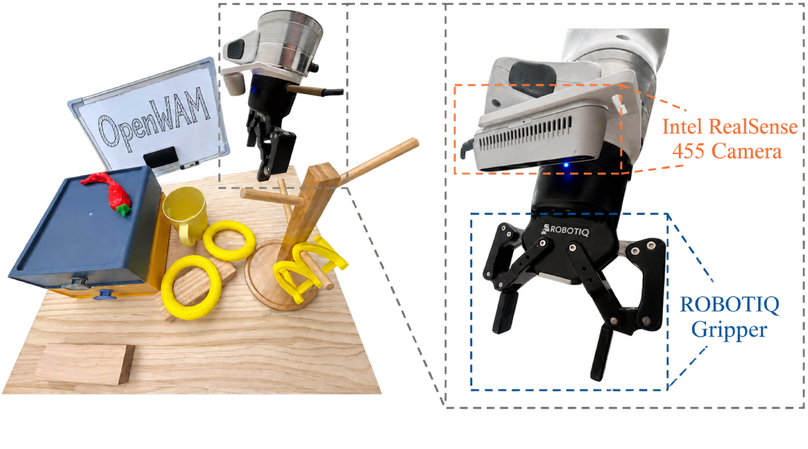

**图 18\.** Franka-Research-3 平台上的单臂真机实验环境设置。工作空间包含六个任务通用的抽屉、堆叠物体和悬挂架固定装置，机器人配备 Intel RealSense 相机和 Robotiq 平行夹爪以进行闭环执行。

对应的任务执行序列在图 19 中进行了可视化，其中每行包含从该任务的一次运行回放视频中均匀采样的六帧图像。

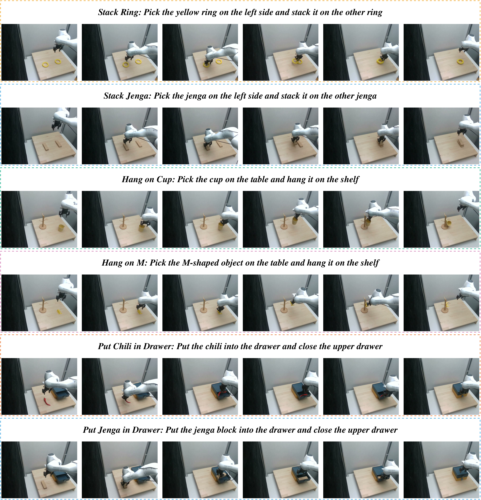

**图 19\.** Franka-Research-3 平台上的单臂任务执行序列。每行展示一个任务，由其左视角回放视频中均匀采样的六帧图像组成。

#### 评测协议 (Evaluation Protocol)。

对于每个单臂任务，我们使用 100 条针对该任务的真实机器人专家演示来微调策略。微调后，每个任务进行 20 次独立的真实世界测试，我们在表 6 中汇报 20 次测试中的成功轮数。堆叠任务仅在左侧物体被抓取并稳定堆叠到目标物体上时才计为成功。悬挂任务仅在物体被抓取并成功保持挂在架子上时才计为成功。抽屉任务仅在物体被放入抽屉且上层抽屉被推至关闭时才判定为成功。

## 灵巧手真机实验 (Dexterous-Hand Real-Robot Experiments)

#### 任务设置 (Task Setup)。

我们在四个真实世界的灵巧操作任务上评估灵巧手策略：堆叠玩具塔（Stack Toy Tower）、收集羽毛球（Collect Shuttlecocks）、拧开瓶盖（Twist off Bottle Cap）以及叠收衣物（Put Away Clothes）。每个任务均由一条定义所需操作目标的自然语言指令进行指定。任务指令汇总于表 12。

**表 12\.** **灵巧手真实世界评测中使用的任务指令。**

| 任务 (Task) | 指令 (Instruction) |
| :---- | :---- |
| 堆叠玩具塔 (Stack Toy Tower) | Stack the discs onto the tower pole in order from largest to smallest.（按从大到小的顺序将圆盘套在玩具塔柱上。） |
| 收集羽毛球 (Collect Shuttlecocks) | Put all the shuttlecocks into the shuttlecock tube.（把所有羽毛球放入羽毛球筒中。） |
| 拧开瓶盖 (Twist off Bottle Cap) | Twist off the bottle cap.（拧开瓶盖。） |
| 叠收衣物 (Put Away Clothes) | Pick up the clothes from the pile on the table and put them into the basket.（从桌上的衣物堆中拿起衣服放进收纳筐。） |

所有实验均在物理灵巧手平台上进行。机器人接收任务指令并在对应场景中自主执行操作。图 20 展示了评测所使用的物理机器人、灵巧手、工作空间、相机视点以及代表性操作物体。

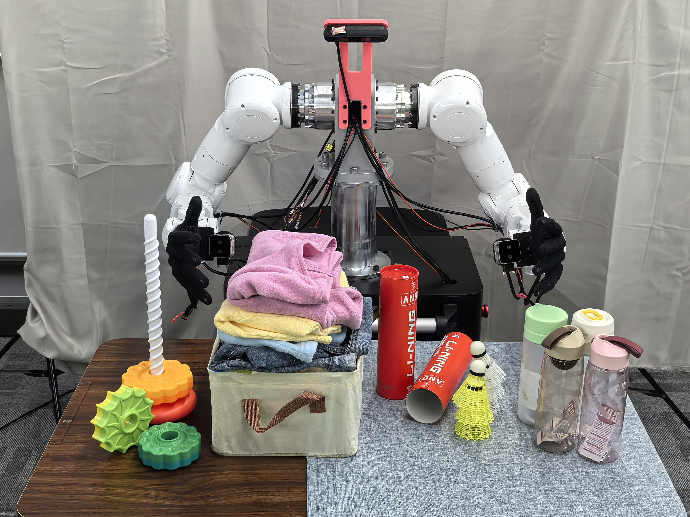

**图 20\.** 真实世界实验设置。图中展示了物理灵巧手平台、工作空间、观测相机以及四个操作任务所涉及的代表性物体。

对于每个任务，我们在一种分布内（ID）条件和若干种分布外（OOD）条件下评估策略。OOD 条件每次改变单一因素，包括物体类别 ID、物体布局、光照条件或背景外观，同时保持任务指令和整体操作目标不变。任务执行序列及对应的 ID/OOD 配置如图 21 所示。

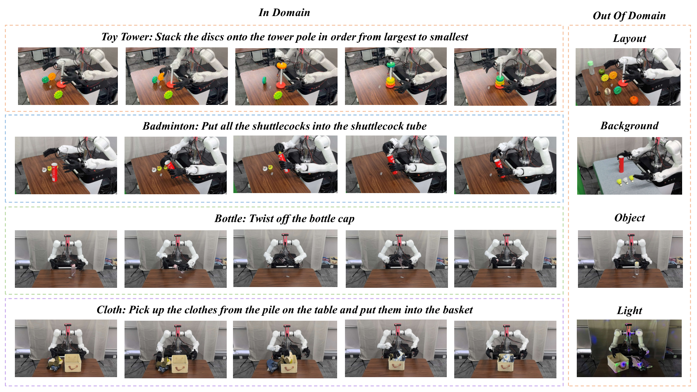

**图 21\.** 任务执行序列与评测条件。每行展示一个任务的主要操作阶段，各列展示对应的 ID 场景与 OOD 变体。OOD 条件包括物体类别 ID、物体布局、光照和背景外观的变化。

#### 评测协议 (Evaluation Protocol)。

每个任务在 ID 和 OOD 条件下分别进行多次独立测试。我们报告两项互补的指标：进度得分（Progress Score, %）和最终成功率（Final Success Rate, %）。

#### 最终成功率 (Final Success Rate)。

# 只有当完整的任务目标达成时，该次测试才被计为最终成功。最终成功率计算公式为： $$ S_{\mathrm{final}}

\frac{N_{\mathrm{success}}}{N_{\mathrm{trial}}} \times 100%, $$ 其中 $N_{\mathrm{success}}$ 为满足完整任务判定标准的测试轮数，$N_{\mathrm{trial}}$ 为有效测试的总轮数。

#### 进度得分 (Progress Score)。

# 进度得分衡量成功完成所需操作环节的比例，无论最终的任务终态是否完全达成。对于第 $i$ 次测试，令 $n_i$ 表示成功完成的操作环节数，$m_i$ 表示该次测试包含的环节总数。进度得分计算公式为： $$ S_{\mathrm{process}}

\frac{\sum_i n_i}{\sum_i m_i} \times 100%. $$

#### 任务具体判定标准。

- **收集羽毛球 (Collect Shuttlecocks)。** 每次测试在桌面上放置两到四个羽毛球。只有当所有羽毛球均被放入羽毛球筒内时，该测试才被判定为最终成功。进度得分表示成功放入球筒的羽毛球占总数的比例。

- **堆叠玩具塔 (Stack Toy Tower)。** 每次测试包含三个圆盘。只有当全部三个圆盘均按从大到小的顺序成功穿套入塔柱上时，该测试才计为最终成功。进度得分表示成功穿套的圆盘占总数的比例。

- **叠收衣物 (Put Away Clothes)。** 每次测试包含三到四件衣物。只有当全部衣物均被放入收纳筐内时，该测试才计为最终成功。进度得分表示成功放入筐内的衣物占总数的比例。

- **拧开瓶盖 (Twist off Bottle Cap)。** 当瓶盖被完全拧开脱离瓶身，且机器人对瓶身或瓶盖保持稳定抓持时，计为最终成功。进度得分记录瓶盖是否成功拧脱，无论最终是否保持稳定抓取。

## 双臂真机实验 (Bimanual Real-Robot Experiments)

我们在 RoboDojo-Real 的全部 18 个任务上进行了全面评测，采用 RoboDojo 官方团队提供的标准真实机器人评测平台，涵盖其三种双臂具身形态：ARX X5、Piper 以及 Piper X。评测严格遵循官方评测团队制定的统一协议；关于该平台及其任务规范的详细文档可在 RoboDojo 官方网站 ([https://robodojo-benchmark.com/](https://robodojo-benchmark.com/)) 及配套官方文档 ([https://robodojo-benchmark.com/doc/real-tasks/](https://robodojo-benchmark.com/doc/real-tasks/)) 中查阅。

# 分项基准仿真结果 (Per-Benchmark Simulation Results)

下述各表报告了图 13 中所汇总的各基准测试的完整得分详情（LIBERO-Plus 的成绩已在正文表 5 中给出）。在每张表中，基线模型按 VLA 或 WAM 族系分组；粗体表示最优值，下划线表示次优值。

**表 13\.** **LIBERO 评测结果。** 粗体表示最优值，下划线表示次优值。

| 模型 | 空间分布 (Spatial) | 物体分布 (Object) | 目标分布 (Goal) | 长视距 (Long) | 平均成功率 (Avg) |
| :---- | :---: | :---: | :---: | :---: | :---: |
| ***VLA*** |  |  |  |  |  |
| **OpenVLA** \[11\] | 84.7 | 88.4 | 79.2 | 53.7 | 76.5 |
| **$\pi_0$** \[12\] | 98.0 | 96.8 | 94.4 | 88.4 | 94.4 |
| **StarVLA** \[32\] | 97.8 | 98.6 | 96.2 | 93.8 | 96.6 |
| **$\pi_{0.5}$** \[78\] | 98.8 | 98.2 | 98.0 | 92.4 | 96.9 |
| **GR00T-N1.6** \[63\] | 97.7 | 98.5 | 97.5 | 94.4 | 97.0 |
| **OpenVLA-OFT** \[76\] | 97.6 | 98.4 | 97.9 | 94.5 | 97.1 |
| **X-VLA** \[83\] | 98.2 | 98.6 | 97.8 | 97.6 | 98.1 |
| **ABot-M0** \[77\] | 98.8 | 99.8 | 99.0 | 96.6 | 98.6 |
| **Being-H0.5** \[89\] | 99.2 | 99.6 | 99.4 | 97.4 | 98.9 |
| **Qwen-RobotManip** \[66\] | – | – | – | – | 99.2 |
| ***WAM*** |  |  |  |  |  |
| **Fast-WAM** \[55\] | 98.2 | **100.0** | 97.0 | 95.2 | 97.6 |
| **Motus** \[17\] | 96.8 | 99.8 | 96.6 | 97.6 | 97.7 |
| **ImageWAM** \[81\] | 97.2 | 99.2 | 98.8 | 98.4 | 98.4 |
| **LingBot-VA** \[15\] | 98.5 | 99.6 | 97.2 | **98.5** | 98.5 |
| **DiT4DiT** \[90\] | – | – | – | – | 98.6 |
| **Being-H0.7** \[80\] | – | – | – | – | 99.2 |
| **ABot-M0.5** \[82\] | **100.0** | 99.8 | 99.4 | 98.4 | **99.4** |
| **OpenWAM-$\alpha$** | 99.6 | 99.6 | **99.8** | 98.2 | 99.3 |

**表 14\.** **VLABench 评测结果。** 粗体表示最优值，下划线表示次优值。

| 模型 | 分布内 (In-dist.) | 类别 (Category) | 常识 (Commonsense) | 指令 (Instruction) | 纹理 (Texture) | 平均 (Avg) |
| :---- | :---: | :---: | :---: | :---: | :---: | :---: |
|  | **SR / PS / IS** | **SR / PS / IS** | **SR / PS / IS** | **SR / PS / IS** | **SR / PS / IS** | **SR / PS / IS** |
| ***VLA*** |  |  |  |  |  |  |
| **$\pi_0$** \[12\] | 47.0 / 62.7 / 67.8 | 21.2 / 33.6 / 44.0 | 29.1 / 43.0 / 54.9 | 17.3 / 38.7 / 58.0 | 32.2 / 42.5 / 50.6 | 29.4 / 44.1 / 55.0 |
| **LoHo-Manip** \[91\] | 54.0 / – / – | 23.0 / – / – | 36.0 / – / – | 42.0 / – / – | 39.0 / – / – | 39.0 / – / – |
| **ACoT-VLA** \[79\] | – / 66.1 / 79.8 | – / 38.9 / 54.1 | – / 37.8 / 52.3 | – / 39.6 / 56.8 | – / 54.6 / 74.6 | – / 47.4 / 63.5 |
| **$\pi_{0.5}$** \[78\] | 65.4 / 77.8 / 80.4 | 38.2 / 49.7 / 52.0 | 43.9 / 57.3 / 60.0 | 48.2 / 64.2 / 67.0 | 44.9 / 62.3 / 65.0 | 48.1 / 62.3 / 64.9 |
| **ERVLA** \[92\] | 69.7 / 81.1 / 84.2 | 47.0 / 61.0 / **66.4** | 44.0 / 55.0 / 57.2 | 58.0 / 70.2 / 73.8 | 47.4 / 62.3 / 70.6 | 53.2 / 65.9 / 70.4 |
| **Xiaomi-Robotics-1** \[93\] | 75.6 / 85.0 / 79.8 | **53.0** / **66.6** / **66.4** | 48.4 / 58.3 / 58.2 | 55.8 / 66.8 / 70.2 | **62.6** / **74.9** / 74.8 | **59.1** / **70.3** / 69.9 |
| ***WAM*** |  |  |  |  |  |  |
| **Bridge-WA** \[94\] | 78.0 / 85.8 / **85.0** | 23.0 / 28.8 / 39.0 | 51.1 / 64.4 / **74.2** | **67.0** / **80.3** / **82.0** | 45.0 / 60.3 / **76.0** | 52.8 / 64.0 / **71.2** |
| **OpenWAM-$\alpha$** | **83.4** / **87.9** / 75.2 | 38.1 / 45.9 / 45.9 | **58.0** / **64.8** / 57.9 | 53.8 / 64.5 / 66.5 | 61.4 / 72.9 / 71.6 | 58.9 / 67.2 / 63.5 |

**表 15\.** **RoboTwin2.0-Clean2Random 评测结果。** 粗体表示最优值，下划线表示次优值。

| 模型 | 纯净场景 (Clean) | 随机化场景 (Randomized) | 平均成功率 (Avg) |
| :---- | :---: | :---: | :---: |
| ***VLA*** |  |  |  |
| **StarVLA** \[32\] | 46.5 | 3.2 | 24.9 |
| **GR00T-N1.7** \[63\] | 43.6 | 20.7 | 32.2 |
| **X-VLA** \[83\] | 68.0 | 20.9 | 44.5 |
| **Spatial Forcing** \[95\] | 77.2 | 26.7 | 52.0 |
| **ABot-M0** \[77\] | 70.7 | 36.0 | 53.4 |
| **$\pi_{0.5}$** \[78\] | 70.7 | 46.0 | 58.4 |
| **GigaBrain-0.7** \[96\] | 66.8 | 67.9 | 67.4 |
| **Qwen-RobotManip** \[66\] | 84.7 | **69.4** | **77.1** |
| ***WAM*** |  |  |  |
| **AHA-WAM** \[97\] | 64.3 | 3.2 | 33.8 |
| **Fast-WAM** \[55\] | 77.8 | 1.9 | 39.9 |
| **X-WAM** \[98\] | 70.0 | 25.8 | 47.9 |
| **4D-WAM** \[99\] | 81.5 | 41.8 | 61.7 |
| **OpenWAM-$\alpha$** | **89.4** | 48.7 | 69.0 |

**表 16\.** **RoboTwin2.0-Full 评测结果。** 粗体表示最优值，下划线表示次优值。

| 模型 | 纯净场景 (Clean) | 随机化场景 (Randomized) | 平均成功率 (Avg) |
| :---- | :---: | :---: | :---: |
| ***VLA*** |  |  |  |
| **X-VLA** \[83\] | 72.80 | 72.84 | 72.82 |
| **$\pi_{0.5}$** \[78\] | 82.70 | 76.80 | 79.75 |
| **ABot-M0** \[77\] | 86.06 | 85.08 | 85.57 |
| **Qwen-VLA** \[100\] | 86.10 | 87.20 | 86.65 |
| **StarVLA** \[32\] | 88.18 | 88.32 | 88.25 |
| **Galaxea G0.5** \[101\] | 93.70 | 92.80 | 93.25 |
| **Qwen-RobotManip** \[66\] | 93.70 | 94.00 | 93.85 |
| ***WAM*** |  |  |  |
| **Motus** \[17\] | 88.66 | 87.02 | 87.84 |
| **Fast-WAM** \[55\] | 91.90 | 91.80 | 91.85 |
| **LingBot-VA** \[15\] | 92.93 | 91.55 | 92.24 |
| **ImageWAM** \[81\] | 93.20 | 93.56 | 93.38 |
| **LingBot-VA 2.0** \[18\] | 93.80 | 93.40 | 93.60 |
| **ABot-M0.5** \[82\] | **94.00** | **94.20** | **94.10** |
| **OpenWAM-$\alpha$** | 93.74 | 93.46 | 93.60 |

**表 17\.** **RoboDojo 评测结果。** 粗体表示最优值，下划线表示次优值。

| 模型 | 标准泛化 (Gen-Std) | 随机泛化 (Gen-Rand) | 精准度 (Precision) | 长视距 (Long-Horizon) | 记忆 (Memory) | 开放式 (Open) | 平均 (Avg) |
| :---- | :---: | :---: | :---: | :---: | :---: | :---: | :---: |
|  | **SR / Score** | **SR / Score** | **SR / Score** | **SR / Score** | **SR / Score** | **SR / Score** | **SR / Score** |
| ***VLA*** |  |  |  |  |  |  |  |
| **StarVLA-$\alpha$** \[33\] | 5.00 / 7.54 | 0.00 / 0.33 | 4.33 / 9.90 | 6.50 / 14.15 | 2.44 / 3.34 | 0.58 / 0.68 | 3.24 / 6.40 |
| **X-VLA** \[83\] | 12.00 / 17.90 | 1.00 / 3.04 | 12.00 / 18.32 | 9.75 / 16.53 | 3.56 / 4.76 | 0.50 / 0.55 | 6.52 / 10.13 |
| **$\pi_{0.5}$** \[78\] | 15.00 / 20.93 | 1.00 / 5.82 | 5.50 / 12.40 | 14.67 / 23.54 | 4.56 / 5.78 | 1.67 / 1.98 | 6.91 / 11.41 |
| **Spatial Forcing** \[95\] | 15.00 / 21.25 | 4.00 / 6.98 | 10.58 / 17.33 | 14.58 / 23.26 | 4.11 / 5.43 | 1.58 / 1.78 | 8.04 / 12.38 |
| **Hy-Embodied-0.5-VLA** \[102\] | 17.00 / 21.98 | 0.00 / 1.57 | 8.00 / 13.81 | 14.92 / 25.74 | 12.11 / 13.37 | 0.58 / 0.65 | 8.80 / 13.07 |
| **Xiaomi-Robotics-1** \[93\] | **28.00** / **35.65** | **6.00** / **11.44** | 18.83 / 26.69 | 23.67 / 38.39 | 6.56 / 7.81 | **3.58** / **3.94** | 13.93 / 20.07 |
| **Galaxea G0.5** \[101\] | 20.00 / 26.74 | **6.00** / 11.16 | **20.42** / **28.25** | **32.25** / **44.12** | 7.33 / 8.61 | 1.58 / 1.73 | 14.88 / 20.23 |
| **DM0.5** \[103\] | 18.00 / 23.49 | 4.00 / 8.06 | 16.75 / 24.82 | 19.50 / 33.70 | **47.44** / **47.74** | 2.08 / 2.43 | **19.34** / **24.90** |
| ***WAM*** |  |  |  |  |  |  |  |
| **Fast-WAM** \[55\] | 2.00 / 4.33 | 0.00 / 0.34 | 0.00 / 1.96 | 5.17 / 9.14 | 3.44 / 3.55 | 0.42 / 0.42 | 2.03 / 3.48 |
| **AHA-WAM** \[97\] | 6.00 / 10.32 | 0.00 / 1.26 | 2.42 / 5.86 | 2.67 / 8.61 | 2.78 / 2.97 | 0.83 / 0.88 | 2.39 / 4.82 |
| **GigaWorld-Policy** \[104\] | 6.00 / 10.28 | 0.00 / 0.41 | 1.83 / 6.15 | 8.92 / 15.51 | 2.22 / 3.46 | 0.50 / 0.54 | 3.27 / 6.20 |
| **X-WAM** \[98\] | 5.00 / 11.24 | 1.00 / 3.54 | 1.83 / 6.72 | 9.08 / 17.47 | 4.67 / 6.32 | 0.25 / 0.57 | 3.83 / 7.69 |
| **OpenWAM-$\alpha$** | 25.56 / 33.16 | 4.11 / 8.26 | 9.25 / 18.45 | 25.33 / 34.93 | 9.11 / 10.41 | 1.08 / 1.41 | 11.92 / 17.18 |

**表 18\.** **EBench 评测结果。** 粗体表示最优值，下划线表示次优值。

| 模型 | 桌面操作 (Table Top) | 基础取放 (Simple PnP) | 长视距任务 (Long Horizon) | 综合整体 (Overall) |
| :---- | :---: | :---: | :---: | :---: |
|  | **SR / Score** | **SR / Score** | **SR / Score** | **SR / Score** |
| ***VLA*** |  |  |  |  |
| **StarVLA-OFT** \[32\] | – / – | – / – | – / – | 0.0 / 0.2 |
| **$\pi_0$** \[12\] | 15.7 / 30.0 | 35.0 / 39.0 | 17.0 / 41.0 | 23.6 / 37.0 |
| **X-VLA** \[83\] | 8.6 / 24.0 | 50.0 / 54.0 | 6.2 / 25.0 | 23.7 / 36.0 |
| **InternVLA-A1** \[86\] | 4.3 / 11.0 | 43.0 / 47.0 | 17.9 / 46.0 | 23.9 / 36.0 |
| **$\pi_{0.5}$** \[78\] | 12.9 / 32.0 | 45.0 / 50.0 | 18.1 / 39.0 | 27.1 / 41.0 |
| **GigaBrain-0.7** \[96\] | – / – | – / – | – / – | 33.3 / 46.0 |
| **Qwen-RobotManip** \[66\] | **50.0** / **70.0** | 56.5 / 60.0 | 29.9 / 55.0 | 45.6 / 60.0 |
| ***WAM*** |  |  |  |  |
| **Fast-WAM** \[55\] | – / – | – / – | – / – | 4.7 / 7.6 |
| **OpenWAM-$\alpha$** | 30.0 / 44.2 | **67.5** / **72.0** | **44.3** / **72.6** | **49.4** / **64.7** |

**表 19\.** **RoboCasa365 评测结果。** 粗体表示最优值，下划线表示次优值。

| 模型 | 原子任务 (Atomic) | 组合已见任务 (Comp.-Seen) | 组合未见任务 (Comp.-Unseen) | 平均成功率 (Avg) |
| :---- | :---: | :---: | :---: | :---: |
| ***VLA*** |  |  |  |  |
| **Diffusion Policy** \[9\] | 15.7 | 0.2 | 1.3 | 6.1 |
| **$\pi_0$** \[12\] | 36.3 | 5.2 | 0.7 | 15.0 |
| **$\pi_{0.5}$** \[78\] | 39.6 | 7.1 | 1.2 | 16.9 |
| **GR00T-N1.5** \[63\] | 50.7 | 14.8 | 2.7 | 23.9 |
| **Qwen-RobotManip** \[66\] | 68.6 | 20.1 | 14.9 | 35.9 |
| **RLDX-1** \[105\] | 67.6 | 27.9 | 8.5 | 36.0 |
| **Xiaomi-Robotics-1** \[93\] | **80.2** | **57.1** | **32.1** | **57.4** |
| ***WAM*** |  |  |  |  |
| **GigaWorld-Policy** \[104\] | 44.4 | 11.8 | 2.9 | 20.7 |
| **ABot-M0.5** \[82\] | 75.9 | 38.3 | 2.7 | 40.4 |
| **OpenWAM-$\alpha$** | 69.7 | 32.1 | 8.9 | 38.2 |

**表 20\.** **RoboCasa-GR1 评测结果。** 粗体表示最优值，下划线表示次优值。

| 模型 | 成功率 SR (%) |
| :---- | :---: |
| ***VLA*** |  |
| **$\pi_0$** \[12\] | 13.6 |
| **$\pi_{0.5}$** \[78\] | 37.0 |
| **GR00T-N1.5** \[63\] | 48.0 |
| **StarVLA** \[32\] | 48.8 |
| **GR00T-N1.6** \[63\] | 49.9 |
| **VP-VLA** \[106\] | 53.8 |
| **Being-H0.5** \[89\] | 53.9 |
| **Qwen-VLA-Instruct** \[100\] | 56.7 |
| **RLDX-1** \[105\] | 58.7 |
| **PhysBrain 1.0** \[107\] | **64.5** |
| ***WAM*** |  |
| **UWM** \[108\] | 20.0 |
| **Being-H0.7** \[80\] | 49.2 |
| **DiT4DiT** \[90\] | 50.8 |
| **LDA-1B** \[69\] | 55.4 |
| **OpenWAM-$\alpha$** | 60.5 |

# 参考文献 (References)

\[1\] Y. Wang, *Instructions for practical living, and other neo-confucian writing*. New York,: Columbia University Press, 1963\.

\[2\] A. Radford *et al.*, “Learning transferable visual models from natural language supervision,” in *International conference on machine learning*, PMLR, 2021, pp. 8748–8763.

\[3\] M. Caron *et al.*, “Emerging properties in self-supervised vision transformers,” in *2021 IEEE/CVF international conference on computer vision (ICCV)*, IEEE, 2021, pp. 9630–9640.

\[4\] S. Tong *et al.*, “Cambrian-1: A fully open, vision-centric exploration of multimodal llms,” *Advances in Neural Information Processing Systems*, vol. 37, pp. 87310–87356, 2024\.

\[5\] J. Ho, T. Salimans, A. Gritsenko, W. Chan, M. Norouzi, and D. J. Fleet, “Video diffusion models,” *Advances in neural information processing systems*, vol. 35, pp. 8633–8646, 2022\.

\[6\] T. Brooks *et al.*, “Video generation models as world simulators.” 2024\. Available: [https://openai.com/research/video-generation-models-as-world-simulators](https://openai.com/research/video-generation-models-as-world-simulators)

\[7\] Y. Ye *et al.*, “Data pyramid for embodied manipulation,” *arXiv preprint arXiv:2607.24744*, 2026\.

\[8\] T. Z. Zhao, V. Kumar, S. Levine, and C. Finn, “Learning fine-grained bimanual manipulation with low-cost hardware,” *arXiv preprint arXiv:2304.13705*, 2023\.

\[9\] C. Chi *et al.*, “Diffusion policy: Visuomotor policy learning via action diffusion,” *The International Journal of Robotics Research*, vol. 44, no. 10–11, pp. 1684–1704, 2025\.

\[10\] A. Brohan *et al.*, “Rt-2: Vision-language-action models transfer web knowledge to robotic control,” *arXiv preprint arXiv:2307.15818*, 2023\.

\[11\] M. J. Kim *et al.*, “Openvla: An open-source vision-language-action model,” *arXiv preprint arXiv:2406.09246*, 2024\.

\[12\] K. Black *et al.*, “$\pi_0$: A vision-language-action flow model for general robot control,” *arXiv preprint arXiv:2410.24164*, 2024\.

\[13\] J. Pai, L. Achenbach, V. Montesinos, B. Forrai, O. Mees, and E. Nava, “Mimic-video: Video-action models for generalizable robot control beyond vlas,” *arXiv preprint arXiv:2512.15692*, 2025\.

\[14\] S. Ye *et al.*, “World action models are zero-shot policies,” *arXiv preprint arXiv:2602.15922*, 2026\.

\[15\] L. Li *et al.*, “Causal world modeling for robot control,” *arXiv preprint arXiv:2601.21998*, 2026\.

\[16\] M. J. Kim *et al.*, “Cosmos policy: Fine-tuning video models for visuomotor control and planning,” *arXiv preprint arXiv:2601.16163*, 2026\.

\[17\] H. Bi *et al.*, “Motus: A unified latent action world model,” in *Proceedings of the IEEE/CVF conference on computer vision and pattern recognition*, 2026, pp. 35101–35113.

\[18\] Q. Zhang *et al.*, “Native video-action pretraining for generalizable robot control,” *arXiv preprint arXiv:2607.08639*, 2026\.

\[19\] Y. LeCun *et al.*, “A path towards autonomous machine intelligence version 0.9. 2, 2022-06-27,” *Open Review*, vol. 62, no. 1, pp. 1–62, 2022\.

\[20\] D. Ha and J. Schmidhuber, “World models,” *arXiv preprint arXiv:1803.10122*, vol. 2, no. 3, p. 440, 2018\.

\[21\] G. Zhou, H. Pan, Y. LeCun, and L. Pinto, “Dino-wm: World models on pre-trained visual features enable zero-shot planning,” *arXiv preprint arXiv:2411.04983*, 2024\.

\[22\] L. Maes, Q. L. Lidec, D. Scieur, Y. LeCun, and R. Balestriero, “Leworldmodel: Stable end-to-end joint-embedding predictive architecture from pixels,” *arXiv preprint arXiv:2603.19312*, 2026\.

\[23\] S. Huang *et al.*, “Nano world models: A minimalist implementation of future video prediction,” *arXiv preprint arXiv:2605.23993*, 2026\.

\[24\] D. Hafner, T. Lillicrap, J. Ba, and M. Norouzi, “Dream to control: Learning behaviors by latent imagination,” *arXiv preprint arXiv:1912.01603*, 2019\.

\[25\] T. M. Moerland, J. Broekens, A. Plaat, and C. M. Jonker, “Model-based reinforcement learning: A survey,” *Foundations and Trends in Machine Learning*, vol. 16, no. 1, pp. 1–118, 2023\.

\[26\] S. Huang, J. Wu, Q. Zhou, S. Miao, and M. Long, “Vid2world: Crafting video diffusion models to interactive world models,” *arXiv preprint arXiv:2505.14357*, 2025\.

\[27\] Y. Wang *et al.*, “Interactive world simulator for robot policy training and evaluation,” *arXiv preprint arXiv:2603.08546*, 2026\.

\[28\] L. Beyer *et al.*, “Paligemma: A versatile 3b vlm for transfer,” *arXiv preprint arXiv:2407.07726*, 2024\.

\[29\] S. Bai *et al.*, “Qwen3-VL technical report.” 2025\. Available: [https://arxiv.org/abs/2511.21631](https://arxiv.org/abs/2511.21631)

\[30\] T. Wan *et al.*, “Wan: Open and advanced large-scale video generative models,” *arXiv preprint arXiv:2503.20314*, 2025\.

\[31\] A. Ali *et al.*, “World simulation with video foundation models for physical ai,” *arXiv preprint arXiv:2511.00062*, 2025\.

\[32\] S. Community, “StarVLA: A lego-like codebase for vision-language-action model developing,” *arXiv preprint arXiv:2604.05014*, 2026\.

\[33\] J. Ye *et al.*, “StarVLA-$\alpha$: Reducing complexity in vision-language-action systems,” *arXiv preprint arXiv:2604.11757*, 2026\.

\[34\] X. Community *et al.*, “XPolicyLab: A unified standard and open ecosystem for robot policy evaluation and deployment,” *arXiv preprint arXiv:2608.09892*, 2026\.

\[35\] Z. Allen-Zhu, “Physics of language models: Part 4.1, architecture design and the magic of canon layers,” *Advances in Neural Information Processing Systems*, vol. 38, pp. 42349–42369, 2026\.

\[36\] T. Karras, M. Aittala, T. Aila, and S. Laine, “Elucidating the design space of diffusion-based generative models,” *Advances in neural information processing systems*, vol. 35, pp. 26565–26577, 2022\.

\[37\] B. McKinzie *et al.*, “Mm1: Methods, analysis and insights from multimodal llm pre-training,” in *European conference on computer vision*, Springer, 2024, pp. 304–323.

\[38\] Z. Liu, H. Mao, C.-Y. Wu, C. Feichtenhofer, T. Darrell, and S. Xie, “A ConvNet for the 2020s,” *CoRR*, vol. abs/2201.03545, 2022, Available: [https://arxiv.org/abs/2201.03545](https://arxiv.org/abs/2201.03545)

\[39\] K. Wen, D. Hall, T. Ma, and P. Liang, “Fantastic pretraining optimizers and where to find them,” in *International conference on learning representations*, 2026, pp. 144731–144838.

\[40\] S. Tong *et al.*, “Beyond language modeling: An exploration of multimodal pretraining,” *arXiv preprint arXiv:2603.03276*, 2026\.

\[41\] J. Han *et al.*, “Towards physics of multimodal pretraining: Knowledge flow, modality synergy, early unification, and recipes,” *arXiv preprint arXiv:2608.05000*, 2026\.

\[42\] M. Simchowitz, D. Pfrommer, and A. Jadbabaie, “The pitfalls of imitation learning when actions are continuous,” *arXiv preprint arXiv:2503.09722*, 2025\.

\[43\] T. T. Zhang, D. Pfrommer, C. Pan, N. Matni, and M. Simchowitz, “Action chunking and exploratory data collection yield exponential improvements in behavior cloning for continuous control,” *arXiv preprint arXiv:2507.09061*, 2025\.

\[44\] F. Lazzati, K. Stachowicz, W. Chen, A. M. Metelli, A. Wagenmaker, and S. Levine, “Why does action chunking improve behavioral cloning performance in robotic control?” *arXiv preprint arXiv:2608.02547*, 2026\.

\[45\] C. Pan *et al.*, “Much ado about noising: Dispelling the myths of generative robotic control,” in *International conference on learning representations*, 2026, pp. 90575–90614.

\[46\] J. Barreiros *et al.*, “A careful examination of large behavior models for multitask dexterous manipulation,” *Science Robotics*, vol. 11, no. 113, p. eaea6201, 2026\.

\[47\] F. Lin *et al.*, “A systematic study of data modalities and strategies for co-training large behavior models for robot manipulation,” *arXiv preprint arXiv:2602.01067*, 2026\.

\[48\] Y. Hu *et al.*, “OpenHLM: An empirical recipe for whole-body humanoid loco-manipulation,” *arXiv preprint arXiv:2606.22174*, 2026\.

\[49\] Black Forest Labs, “FLUX.2: Analyzing and enhancing the latent space of FLUX.” Technical blog, 2025\. Available: [https://bfl.ai/research/representation-comparison](https://bfl.ai/research/representation-comparison)

\[50\] B. Zheng, N. Ma, S. Tong, and S. Xie, “Diffusion transformers with representation autoencoders,” in *International conference on learning representations*, 2026, pp. 35791–35820.

\[51\] O. Siméoni, H. V. Vo, M. Seitzer, F. Baldassarre, M. Oquab, *et al.*, “DINOv3,” *arXiv preprint arXiv:2508.10104*, 2025\.

\[52\] L. Mur-Labadia *et al.*, “V-JEPA 2.1: Unlocking dense features in video self-supervised learning,” *arXiv preprint arXiv:2603.14482*, 2026\.

\[53\] S. Zhang *et al.*, “Both semantics and reconstruction matter: Making representation encoders ready for text-to-image generation and editing,” *arXiv preprint arXiv:2512.17909*, 2025\.

\[54\] S. Mu and S. Lin, “A comprehensive survey of mixture-of-experts: Algorithms, theory, and applications,” *arXiv preprint arXiv:2503.07137*, 2025\.

\[55\] T. Yuan, Z. Dong, Y. Liu, and H. Zhao, “Fast-wam: Do world action models need test-time future imagination?” *arXiv preprint arXiv:2603.16666*, 2026\.

\[56\] A. Baade *et al.*, “Latent forcing: Reordering the diffusion trajectory for pixel-space image generation,” *arXiv preprint arXiv:2602.11401*, 2026\.

\[57\] B. Liu *et al.*, “LIBERO: Benchmarking knowledge transfer for lifelong robot learning,” *arXiv preprint arXiv:2306.03310*, 2023\.

\[58\] S. Fei *et al.*, “LIBERO-plus: In-depth robustness analysis of vision-language-action models,” *arXiv preprint arXiv:2510.13626*, 2025\.

\[59\] S. Zhang *et al.*, “VLABench: A large-scale benchmark for language-conditioned robotics manipulation with long-horizon reasoning tasks,” *arXiv preprint arXiv:2412.18194*, 2024\.

\[60\] T. Chen *et al.*, “Robotwin 2.0: A scalable data generator and benchmark with strong domain randomization for robust bimanual robotic manipulation,” *arXiv preprint arXiv:2506.18088*, 2025\.

\[61\] T. Chen *et al.*, “RoboDojo: A unified sim-and-real benchmark for comprehensive evaluation of generalist robot manipulation policies.” 2026\. Available: [https://arxiv.org/abs/2607.04434](https://arxiv.org/abs/2607.04434)

\[62\] S. Nasiriany, S. Nasiriany, A. Maddukuri, and Y. Zhu, “RoboCasa365: A large-scale simulation framework for training and benchmarking generalist robots,” in *International conference on learning representations (ICLR)*, 2026\.

\[63\] NVIDIA, J. Bjorck, F. Castañeda, N. Cherniadev, *et al.*, “GR00T N1: An open foundation model for generalist humanoid robots,” *arXiv preprint arXiv:2503.14734*, 2025\.

\[64\] S. Nasiriany *et al.*, “RoboCasa: Large-scale simulation of everyday tasks for generalist robots,” in *Robotics: Science and systems (RSS)*, 2024\.

\[65\] N. Gao *et al.*, “EBench: Elemental diagnosis of generalist mobile manipulation policies,” *arXiv preprint arXiv:2606.18239*, 2026\.

\[66\] H. Yuan *et al.*, “Qwen-robotmanip technical report: Alignment unlocks scale for robotic manipulation foundation models,” *arXiv preprint arXiv:2606.17846*, 2026\.

\[67\] J. Singh, B. Zheng, Z. Wu, R. Zhang, E. Shechtman, and S. Xie, “Improved baselines with representation autoencoders,” *arXiv preprint arXiv:2605.18324*, 2026\.

\[68\] S. Jha, A. Zholus, S. Chandar, *et al.*, “Reconstruction or semantics? What makes a latent space useful for robotic world models,” *arXiv preprint arXiv:2605.06388*, 2026\.

\[69\] J. Lyu *et al.*, “Lda-1b: Scaling latent dynamics action model via universal embodied data ingestion,” *arXiv preprint arXiv:2602.12215*, 2026\.

\[70\] W. Peebles and S. Xie, “Scalable diffusion models with transformers,” in *2023 IEEE/CVF international conference on computer vision (ICCV)*, IEEE, 2023, pp. 4172–4182.

\[71\] R. Hoque, P. Huang, D. J. Yoon, M. Sivapurapu, and J. Zhang, “EgoDex: Learning dexterous manipulation from large-scale egocentric video,” *arXiv preprint arXiv:2505.11709*, 2025\.

\[72\] S. Wu *et al.*, “RoboCOIN: An open-sourced bimanual robotic data collection for integrated manipulation,” *arXiv preprint arXiv:2511.17441*, 2025\.

\[73\] Q. Bu *et al.*, “AgiBot world colosseo: A large-scale manipulation platform for scalable and intelligent embodied systems,” *arXiv preprint arXiv:2503.06669*, 2025\.

\[74\] A. Khazatsky *et al.*, “DROID: A large-scale in-the-wild robot manipulation dataset,” *arXiv preprint arXiv:2403.12945*, 2024\.

\[75\] Y. Tian *et al.*, “InternData-A1: Pioneering high-fidelity synthetic data for pre-training generalist policy,” *arXiv preprint arXiv:2511.16651*, 2025\.

\[76\] M. J. Kim, C. Finn, and P. Liang, “Fine-tuning vision-language-action models: Optimizing speed and success,” *arXiv preprint arXiv:2502.19645*, 2025\.

\[77\] Y. Yang *et al.*, “ABot-M0: VLA foundation model for robotic manipulation with action manifold learning,” *arXiv preprint arXiv:2602.11236*, 2026\.

\[78\] Physical Intelligence *et al.*, “$\pi_{0.5}$: A vision-language-action model with open-world generalization,” *arXiv preprint arXiv:2504.16054*, 2025\.

\[79\] L. Zhong, Y. Liu, Y. Wei, Z. Xiong, S. Liu, and G. Ren, “Acot-vla: Action chain-of-thought for vision-language-action models,” in *Proceedings of the IEEE/CVF conference on computer vision and pattern recognition*, 2026, pp. 8152–8162.

\[80\] H. Luo *et al.*, “Being-H0.7: A latent world-action model from egocentric videos,” *arXiv preprint arXiv:2605.00078*, 2026\.

\[81\] Y. Zhang *et al.*, “ImageWAM: Do world action models really need video generation, or just image editing?” *arXiv preprint arXiv:2606.19531*, 2026\.

\[82\] R. Chen *et al.*, “ABot-M0.5: Unified mobility-and-manipulation world action model,” *arXiv preprint arXiv:2607.00678*, 2026\.

\[83\] J. Zheng *et al.*, “X-VLA: Soft-prompted transformer as scalable cross-embodiment vision-language-action model,” in *International conference on learning representations*, 2026\.

\[84\] R. Cai *et al.*, “Xiaomi-robotics-0: An open-sourced vision-language-action model with real-time execution,” *arXiv preprint arXiv:2602.12684*, 2026\.

\[85\] T. Jiang *et al.*, “Galaxea open-world dataset and g0 dual-system vla model,” *arXiv preprint arXiv:2509.00576*, 2025\.

\[86\] J. Cai *et al.*, “Internvla-a1: Unifying understanding, generation and action for robotic manipulation,” *arXiv preprint arXiv:2601.02456*, 2026\.

\[87\] C. Chi *et al.*, “Universal manipulation interface: In-the-wild robot teaching without in-the-wild robots,” *arXiv preprint arXiv:2402.10329*, 2024\.

\[88\] M. Xu *et al.*, “DexUMI: Using human hand as the universal manipulation interface for dexterous manipulation,” in *Conference on robot learning*, PMLR, 2025, pp. 437–459.

\[89\] H. Luo *et al.*, “Being-H0.5: Scaling human-centric robot learning for cross-embodiment generalization,” *arXiv preprint arXiv:2601.12993*, 2026\.

\[90\] T. Ma *et al.*, “Dit4dit: Jointly modeling video dynamics and actions for generalizable robot control,” *arXiv preprint arXiv:2603.10448*, 2026\.

\[91\] I. Liu *et al.*, “Long-horizon manipulation via trace-conditioned VLA planning,” *arXiv preprint arXiv:2604.21924*, 2026\.

\[92\] N. Sun *et al.*, “Revisiting embodied chain-of-thought for generalizable robot manipulation,” *arXiv preprint arXiv:2606.03784*, 2026\.

\[93\] X. R. Team *et al.*, “Xiaomi-robotics-1: Scaling vision-language-action models with over 100K hours of real-world trajectories,” *arXiv preprint arXiv:2607.15330*, 2026\.

\[94\] Y. Bai, H. Wang, M. Dai, Q. Zhong, Y. Liu, and L. Lin, “Bridge-WA: Predicting where and how the world changes for robotic action,” *arXiv preprint arXiv:2607.02195*, 2026\.

\[95\] F. Li *et al.*, “Spatial forcing: Implicit spatial representation alignment for vision-language-action model,” in *International conference on learning representations*, 2026\.

\[96\] G. Team *et al.*, “GigaBrain-0.7: Scaling embodied foundation models to emergent capabilities with a three-system architecture,” *arXiv preprint arXiv:2608.15875*, 2026\.

\[97\] J. Cai *et al.*, “AHA-WAM: Asynchronous horizon-adaptive world-action modeling with observation-guided context routing,” *arXiv preprint arXiv:2606.09811*, 2026\.

\[98\] J. Guo *et al.*, “Unified 4d world action modeling from video priors with asynchronous denoising,” *arXiv preprint arXiv:2604.26694*, 2026\.

\[99\] L. Yang *et al.*, “4D-WAM: Infusing spatiotemporal awareness into world action models through trajectory fields.” 2026\. Available: [https://arxiv.org/abs/2608.08023](https://arxiv.org/abs/2608.08023)

\[100\] Q. Wang *et al.*, “Qwen-vla: Unifying vision-language-action modeling across tasks, environments, and robot embodiments,” *arXiv preprint arXiv:2605.30280*, 2026\.

\[101\] Y. Liu *et al.*, “G0.5: One autoregressive stream for robot reasoning and action,” *arXiv preprint arXiv:2608.11739*, 2026\.

\[102\] H. Zhang *et al.*, “Hy-embodied-0.5-vla: From vision-language-action models to a real-world robot learning stack,” *arXiv preprint arXiv:2606.14409*, 2026\.

\[103\] Dexmal, “DM0.5.” Technical blog, 2026\. Available: [https://www.dexmal.com/blog/dm0.5](https://www.dexmal.com/blog/dm0.5)

\[104\] A. Ye *et al.*, “GigaWorld-policy: An efficient action-centered world–action model,” *arXiv preprint arXiv:2603.17240*, 2026\.

\[105\] D. Kim *et al.*, “Rldx-1 technical report,” *arXiv preprint arXiv:2605.03269*, 2026\.

\[106\] Z. Wang *et al.*, “Vp-vla: Visual prompting as an interface for vision-language-action models,” *arXiv preprint arXiv:2603.22003*, 2026\.

\[107\] X. Lin *et al.*, “PhysBrain: Human egocentric data as a bridge from vision language models to physical intelligence.” 2026\. Available: [https://arxiv.org/abs/2512.16793](https://arxiv.org/abs/2512.16793)

\[108\] C. Zhu, R. Yu, S. Feng, B. Burchfiel, P. Shah, and A. Gupta, “Unified world models: Coupling video and action diffusion for pretraining on large robotic datasets,” *arXiv preprint arXiv:2504.02792*, 2025\.

&nbsp;