# Xiaomi-Robotics-1: Scaling Vision-Language-Action Models with over 100K Hours of Real-World Trajectories

**Xiaomi Robotics**  
*arXiv:2607.15330v2 [cs.RO] 22 Jul 2026*  
Project page: [https://robotics.xiaomi.com/xiaomi-robotics-1.html](https://robotics.xiaomi.com/xiaomi-robotics-1.html)  
Correspondence: `mi-robotics@xiaomi.com`

---

## Abstract

We present **Xiaomi-Robotics-1**, a foundational vision-language-action (VLA) model capable of:
1. Following diverse language instructions to perform a wide range of mobile manipulation tasks in unseen environments out-of-the-box, and
2. Efficiently adapting to novel downstream tasks with minimal fine-tuning data.

We propose a two-stage training recipe consisting of pre-training and post-training. During pre-training, we imbue the model with broad and generalizable action-generation capabilities by training on over 100k hours of real-world manipulation trajectories, collected via UMI devices across a massive scale of environments and tasks. Crucially, we develop a scalable auto-labeling pipeline that annotates trajectory clips with natural languages describing scene state transitions, providing rich and precise conditioning for action learning. During post-training, we aim to align these capabilities with robot embodiments and imperative task instructions that humans naturally use to prompt robots, effectively mapping descriptive state transition understanding into actionable task prompts.

Extensive experiments demonstrate strong scaling behavior. Xiaomi-Robotics-1 consistently improves with increased data scales and model sizes during pre-training. This scaling behavior directly transfers to post-training, where a stronger pre-training model yields better out-of-the-box performance in real-robot evaluations within unseen environments. Furthermore, Xiaomi-Robotics-1 serves as a strong robot foundation policy that can be efficiently fine-tuned on complex, dexterous tasks with high data efficiency. Across multiple simulation benchmarks, Xiaomi-Robotics-1 outperforms state-of-the-art methods. Notably, it establishes a new state-of-the-art with a **57.4%** success rate on RoboCasa365, surpassing the previous best of 46.6%. Furthermore, it achieves an average score of **20.07** on RoboDojo, significantly outperforming the prior state-of-the-art (13.07). Code and model checkpoints will be released.

---

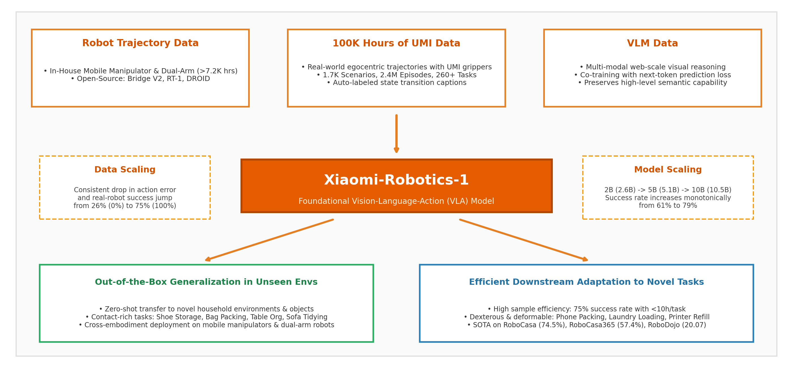
*Figure 1: Overview. Xiaomi-Robotics-1 is pre-trained on over 100k hours of real-world UMI trajectories with auto-labeled state-transition language prompts. It is then aligned to robot embodiments and imperative instruction prompts via cross-embodiment post-training. Xiaomi-Robotics-1 scales effectively with data and model size. It is able to perform multiple tasks in unseen environment out-of-the-box and learn new tasks efficiently.*

---

## 1. Introduction

The remarkable capabilities of modern large models are fundamentally driven by scale, where massive and diverse training corpora have underpinned unprecedented leaps in performance for both large language models [7, 22, 27, 45] and vision-language models [1, 14, 62, 63]. Recent work on vision-language-action (VLA) models [4, 5, 24, 25, 54, 71, 76] and world-action models (WAM) [36, 81, 83] has produced increasingly promising results in robot manipulation, with early evidence that policies become more capable and generalizable as the training data grows in scale and diversity. Following the same scaling trajectory of large models is therefore a natural and appealing direction for robotics.

However, robotics is hindered by a unique bottleneck of data. The dominant data collection paradigm, real-robot teleoperation, is slow, costly, and hardware-bound, making it difficult to scale. Furthermore, teleoperated data tends to be highly redundant, concentrated on a narrow slice of tasks and environments, limiting the diversity of the data.

We present **Xiaomi-Robotics-1** (Figure 1), a foundational vision-language-action (VLA) model trained on a massive scale of real-world manipulation trajectories. Drawing inspiration from the training paradigms of large language models, we propose a two-stage training recipe comprising pre-training and post-training.

During pre-training, we endow the model with robust and generalizable action-generation capabilities by leveraging data sources that scale readily in both volume and diversity. Specifically, we curate a dataset of over 100k hours of real-world manipulation trajectories with UMI devices [17], spanning a wide range of environments and tasks. Traditional trajectory labeling typically requires manual segmentation by task semantics and language annotations—a labor-intensive process that becomes prohibitive at this scale. To address this challenge, we develop a scalable auto-labeling pipeline that leverages a pre-trained vision-language model (VLM) [70] to annotate fixed-length trajectory segments with language descriptions detailing scene state transitions. These annotations provide precise and sufficient semantic supervision. Trained on these data, the model learns to generate actions that transform the scene from its current state to the language-specified target state (Figure 6).

In the post-training phase, we utilize over 10k hours of cross-embodiment data to align the strong action-generation capabilities acquired during pre-training. This stage bridges two gaps:
1. Adapting the model from generating actions for UMI grippers to actions for robot embodiments, and
2. Transitioning from state-transition prompts to imperative instructions typically used by humans to prompt robots.

After post-training, Xiaomi-Robotics-1 is able to follow instructions and perform a wide range of tasks in unseen environments. Furthermore, it serves as a strong robot foundation policy that can be efficiently fine-tuned to learn new tasks.

We perform extensive experiments to study the scaling properties of Xiaomi-Robotics-1:
- Xiaomi-Robotics-1 scales effectively during pre-training, achieving lower validation action errors as data and model scale up.
- The scaling behavior observed in pre-training directly transfers to post-training, where stronger pre-training models yield better post-training success rates in out-of-the-box real-robot evaluation in unseen environments.
- When fine-tuned on four challenging downstream tasks with minimal data (<10 hours/task on average), Xiaomi-Robotics-1 achieves an average success rate of **75%**, outperforming $\pi_{0.5}$ which obtains 40%.
- On simulation benchmarks, Xiaomi-Robotics-1 sets new state-of-the-art results across RoboCasa [52], RoboCasa365 [53], VLABench [87], and RoboDojo [12]. Notably, it achieves **57.4%** on RoboCasa365 (prior best: 46.6%) and **20.07** on RoboDojo (prior best: 13.07).
- In real-robot mobile manipulation, it accomplishes a long-horizon suitcase packing task spanning over 10 minutes autonomously.

---

## 2. Xiaomi-Robotics-1

Xiaomi-Robotics-1 is an end-to-end vision-language-action (VLA) model trained at scale on heterogeneous data sources, including UMI trajectories, cross-embodiment robot trajectories, and vision-language data. Given an observation $o_t$ and a language instruction $l$, the model $\pi_\theta$ is trained to predict an action chunk $a_{t:t+H}$ by maximizing the log-likelihood over the training dataset $\mathcal{D}$:

$$\max_{\theta} \mathbb{E}_{(o_t, l, a_{t:t+H}) \sim \mathcal{D}} \log \pi_\theta(a_{t:t+H} \mid o_t, l)$$

We adopt a two-stage training recipe consisting of pre-training and post-training. Pre-training leverages a scalable non-robot dataset with rich open-world diversity to endow the model with broad and generalizable representations for action generation. Post-training then aligns these representations to robot embodiments and instruction-conditioned action generation, using a high-quality set of cross-embodiment data.

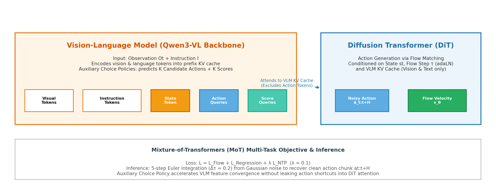
*Figure 2: Model Architecture. Xiaomi-Robotics-1 adopts a Mixture-of-Transformers [44] architecture that couples a pre-trained VLM with a DiT. The VLM encodes the observation and language instruction, and additionally predicts action chunks via Choice Policies [59] to accelerate training convergence. Conditioned on the robot state and the VLM's KV cache of the observation and language tokens, the DiT generates the action chunk via flow matching. Note that the action-related tokens from the VLM are excluded from the DiT's attention computation.*

### 2.1 Model

As illustrated in Figure 2, Xiaomi-Robotics-1 adopts a Mixture-of-Transformers (MoT) [44] architecture consisting of a pre-trained vision-language model (VLM) (i.e., Qwen3-VL [3]) and a diffusion transformer (DiT) [57]. The DiT matches the VLM in the number of layers but employs a smaller hidden size for faster inference speed. The model parameters for different scaling variants of Xiaomi-Robotics-1 are detailed in Table 1.

| Model | # Layers | VLM Hidden Size | VLM Params | DiT Hidden Size | DiT Params | Total Params |
| :--- | :---: | :---: | :---: | :---: | :---: | :---: |
| **Xiaomi-Robotics-1-2B** | 28 | 2048 | 2.1B | 1024 | 470M | **2.6B** |
| **Xiaomi-Robotics-1-5B** | 36 | 2560 | 4.4B | 1024 | 604M | **5.1B** |
| **Xiaomi-Robotics-1-10B** | 36 | 4096 | 8.8B | 2048 | 1.5B | **10.5B** |

*Table 1: Model configurations for different scaling variants of Xiaomi-Robotics-1.*

The VLM takes the current observation $o_t$ and language instruction $l$ as inputs. Conditioned on the robot proprioceptive state $s_t$ and the KV cache produced by the VLM, the DiT generates the action chunk via flow-matching [49]:

$$\mathcal{L}_{\text{Flow}}(\theta) = \left\| v_\theta\left(o_t, l, s_t, \tilde{a}_{t:t+H}^\tau, \tau\right) - u\left(\tilde{a}_{t:t+H}^\tau, a_{t:t+H}, \tau\right) \right\|_2^2$$

where $\tau$ is the flow-matching timestep. $\tilde{a}_{t:t+H}^\tau = \tau a_{t:t+H} + (1 - \tau)\epsilon$ is the noisy action with $\epsilon \sim \mathcal{N}(0, I)$. Following [5], we sample timestep $\tau$ from a Beta distribution, placing more weight on noisier timesteps during training:

$$u \sim \text{Beta}(1.5, 1), \quad \tau = (1 - u) \times 0.999 \in [0, 0.999]$$

Similar to [8], we leverage adaptive normalization layers (adaLN) [57] to inject the flow-matching timestep condition into the DiT for action generation. During inference, we initialize the predicted action chunk from a random noise $a_{t:t+H}^{\tau=0} \sim \mathcal{N}(0, I)$. The clean action chunk is recovered via a 5-step Euler integration:

$$a_{t:t+H}^{\tau + \Delta\tau} = a_{t:t+H}^\tau + \Delta\tau \cdot v_\theta\left(o_t, l, s_t, a_{t:t+H}^\tau, \tau\right)$$

where the step size is set to $\Delta\tau = 0.2$.

To accelerate convergence [58], we introduce an auxiliary action-generation supervision on the VLM. Specifically, we leverage Choice Policies [59] to enable action generation directly within the VLM framework [8]. We encode the robot state into a token using a multi-layer perceptron (MLP) and append it, along with the action and score query tokens, to the end of the vision-language token sequence. The outputs corresponding to the action and score query tokens predict $K$ candidate action chunks and their associated $K$ scores, respectively. We adopt a winner-takes-all paradigm as in [59], where only the candidate with the smallest $L_1$ loss is included in action loss computation:

$$\mathcal{L}_{\text{Regression}}(\theta) = \left\| \hat{a}_{t:t+H}^* - a_{t:t+H} \right\|_1 + \sum_{k=1}^K \left\| \hat{s}_k - s_k \right\|_2^2$$

Let $\hat{a}_{t:t+H}^k$ denote the $k$-th predicted candidate action chunk, then $\hat{a}_{t:t+H}^*$ is the candidate with the smallest $L_1$ distance to the ground truth $a_{t:t+H}$. $\hat{s}_k$ is the predicted score for the $k$-th candidate, and its regression target $s_k$ is defined as $s_k = \left\| \hat{a}_{t:t+H}^k - a_{t:t+H} \right\|_1$. That is, the $L_1$ distances between the $K$ predicted action chunks and the ground-truth action chunk serve as target labels for score prediction.

Applying action-generation supervision directly on the VLM steers its representations toward features that better support action generation, thereby making DiT learning more effective. However, we empirically observe that letting the DiT tokens attend to the KV cache of these action-related tokens degrades performance. We hypothesize that this arises from a shortcut in which the DiT simply copies the actions generated by the VLM rather than effectively grounding its own generation in visual and textual context. To mitigate this issue, we exclude these action-related tokens from the DiT's attention computation, constraining the DiT tokens to attend solely to representations of the language instruction and visual observations.

---

### 2.2 Training & Data

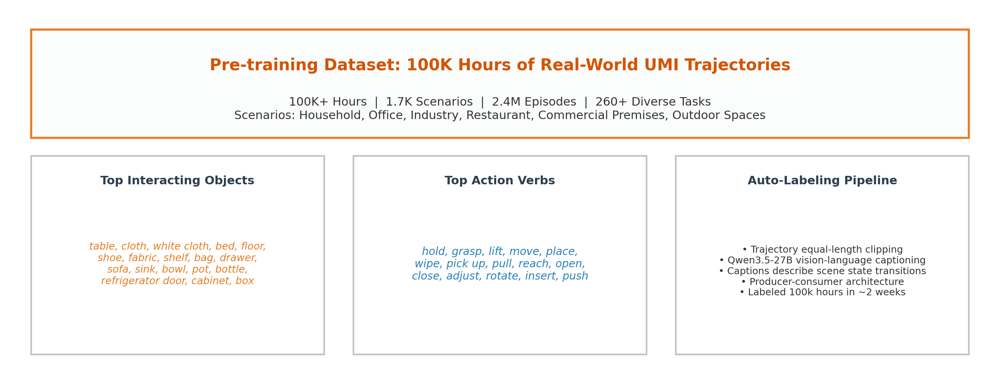
*Figure 3: Pre-training Dataset. The pre-training dataset of Xiaomi-Robotics-1 contains over 100k hours of real-world manipulation trajectories collected with UMI devices.*

#### 2.2.1 Pre-training

During pre-training, our primary objective is to endow the model with broad and generalizable representations that transfer across diverse manipulation scenarios. To this end, we curate a dataset of over **100,000 hours** of real-world manipulation trajectories, captured with Universal Manipulation Interface (UMI) handheld grippers [17] and egocentric cameras (Figure 3). The dataset spans a diverse array of tasks collected across a massive scale of environments, including households, commercial premises, industrial sites, offices, and outdoor spaces. Traditional robot trajectory annotation requires manually segmenting trajectories according to task semantics and labeling each segment with a language instruction—a labor-intensive process that becomes prohibitive at this scale.

To scale language annotation, we develop an auto-labeling pipeline that first divides each trajectory into equal-length segments and leverages Qwen3.5-27B [70] to caption the state transitions of both the grippers and the interacting objects in the scene within each segment (see Figure 11 for examples). To accelerate the annotation process, we develop a producer-consumer pipeline that decouples clip segmentation from caption labeling: while CPU worker threads cut per-segment clips into an in-memory filesystem, client threads keep hundreds of captioning requests in flight. This highly efficient pipeline allows us to label the entire corpus of over 100k hours in roughly two weeks. Trained on this dataset, the model learns to generate actions that drive the scene from the state in the current observation to the target state described by the language annotation.

The model is optimized to predict actions by jointly minimizing the flow-matching loss $\mathcal{L}_{\text{Flow}}$ of the DiT and the regression loss $\mathcal{L}_{\text{Regression}}$ of the VLM choice policy. To preserve the vision-language capabilities of the pre-trained VLM, we further co-train the model on a high-quality vision-language dataset curated in our previous work [8] under the next-token prediction objective $\mathcal{L}_{\text{NTP}}$. The overall training objective is formulated as:

$$\mathcal{L} = \mathcal{L}_{\text{Flow}} + \mathcal{L}_{\text{Regression}} + \lambda \mathcal{L}_{\text{NTP}}$$

where $\lambda$ is set to 0.1 in our experiments. Vision-language data and UMI trajectories are sampled at a ratio of 1:9. To maximize training throughput, we pack all vision-language tokens within a batch into a single sequence for a VLM forward pass. Since the VLM is computationally more expensive than the DiT, we amortize its cost by sampling four flow-matching timesteps per sample. The resulting four DiT inputs are similarly packed and processed in one DiT pass, conditioned on the corresponding unpacked VLM KV cache.

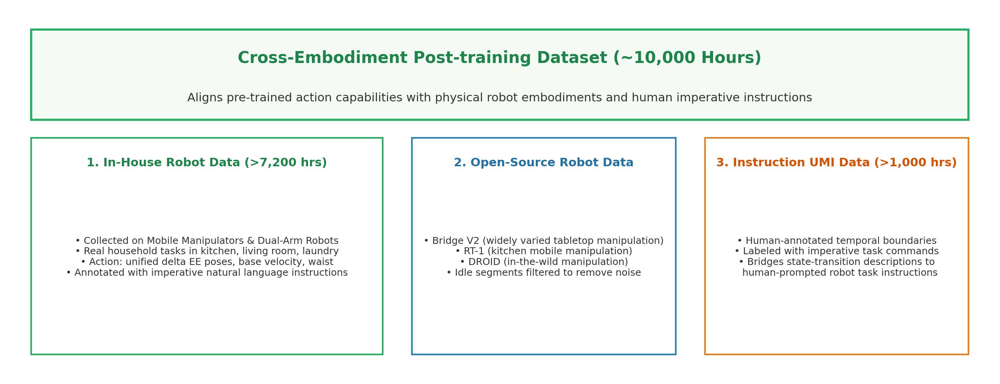
*Figure 4: Post-training Dataset. The post-training dataset of Xiaomi-Robotics-1 comprises about 10k hours of cross-embodiment trajectories, including over 7.2k hours of in-house robot data collected with mobile manipulators and dual-arm robots, over 1k hours of instruction-labeled UMI data, and open-source robot datasets.*

#### 2.2.2 Post-training

The goal of post-training is twofold:
1. Transfer the action-generation capabilities of UMI grippers acquired during pre-training to robot embodiments.
2. Shift the language conditioning from the state-transition descriptions used in pre-training to the imperative instructions humans typically issue when prompting robots to perform tasks.

We curate the post-training dataset with cross-embodiment manipulation trajectories collected using UMI devices, static robot arms, and mobile manipulators. Specifically, we collect over **7,200 hours** of robot data using mobile manipulators and dual-arm robots across a diverse range of household environments and tasks (Figure 4). We leverage Qwen3.5 [70] to annotate human-segmented video clips with language instructions. In addition, we incorporate over **1,000 hours** of human-annotated UMI data labeled with both temporal segments and language instructions. Unlike the state-transition descriptions used in pre-training, these language instructions closely mirror how humans prompt robots to perform tasks, directly matching our alignment objective in the post-training phase (see Figures 11 and 12 for comparison). Finally, we include open-source robot datasets, including Bridge V2 [74], RT-1 [6], and DROID [28]. We filter out idle segments within trajectories to prevent the model from learning uninformative or noisy signals. In total, our post-training dataset comprises about **10,000 hours** of trajectory data.

For arm actions, we adopt relative delta end-effector (EE) poses with respect to the current state:

$$a_{t+i} = \left( {}^{\text{Base}}_{\text{EE}} T_t \right)^{-1} {}^{\text{Base}}_{\text{EE}} \hat{T}_{t+i}$$

where ${}^{\text{Base}}_{\text{EE}} T_t$ denotes the pose of the end-effector with respect to the base at the current timestep $t$, and ${}^{\text{Base}}_{\text{EE}} \hat{T}_{t+i}$ represents the target end-effector pose at timestep $t+i$. To align arm action spaces across different embodiments, we unify the orientation of end-effector frames across all robot data and UMI data in both pre-training and post-training datasets. Consequently, similar arm motions (e.g., moving forward or backward with respect to the end-effector frame) yield consistent action values regardless of the underlying hardware platform.

For mobile robot data, we represent base and waist actions using the base velocity and the relative delta of the waist position, respectively. To accommodate heterogeneous embodiments, we adopt a unified action vector for all trajectory data. Although arm actions are aligned across embodiments, action spaces of different robots still differ in dimensionality. We mask out dimensions corresponding to missing action components during loss computation.

We train the model with the same objective as in pre-training. Vision-language data, open-source robot data, instruction-labeled UMI data, and in-house robot data are sampled at a ratio of 0.5 : 0.5 : 0.5 : 8.5. After post-training, the model can be prompted with language instructions to perform a wide range of tasks in unseen environments out-of-the-box. In addition, it can efficiently adapt to novel downstream tasks with minimal data.

---

## 3. Experiments

We design Xiaomi-Robotics-1 with scaling in mind. In this section, we investigate its scaling properties through extensive experiments:
- Does Xiaomi-Robotics-1 scale effectively with increasing data scale and model size during pre-training?
- Does a stronger pre-trained model translate to better post-training performance when evaluated out-of-the-box in novel environments?
- Can Xiaomi-Robotics-1 adapt to challenging new tasks with a minimal amount of data?
- How does Xiaomi-Robotics-1 compare to other robot foundation models in real-robot experiments and simulation benchmarks?

### 3.1 Pre-training: Data and Model Scaling

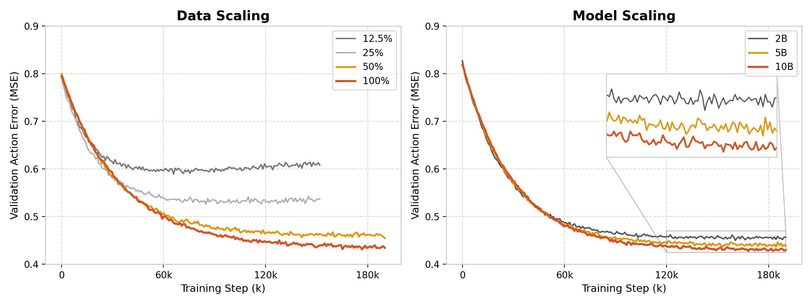
*Figure 5: Scaling of Pre-training. We show validation action errors (MSE) from data-scaling and model-scaling pre-training experiments. We terminate training for 12.5% and 25% data in the data-scaling experiment early as the validation loss indicates overfitting.*

**Data Scaling.** We perform data-scaling experiments with Xiaomi-Robotics-1-5B. Due to compute budget limits, we pre-train the model on 12.5%, 25%, 50%, and 100% of about 20k hours of UMI data, respectively. Each model is evaluated on a held-out validation set using mean-squared error (MSE) between the action predicted by flow-matching and the ground truth. As shown in Figure 5, Xiaomi-Robotics-1 attains lower validation action errors with the increase of data scale. With 12.5% and 25% of data, the validation action errors first decrease and then increase during training, indicating overfitting. In contrast, 50% and 100% data yield a monotonic decrease in loss, with the 20k setting exhibiting a steeper descent. Qualitative action prediction results on validation data are shown in Figure 6.

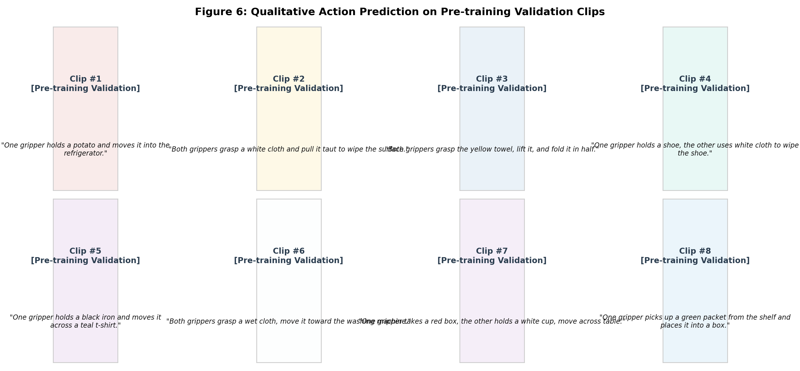
*Figure 6: Qualitative Results of Pre-training. After pre-training, Xiaomi-Robotics-1 is able to predict action trajectories for UMI grippers on a held-out validation set according to the language description of state transitions.*

**Model Scaling.** We perform model-scaling experiments on three size variants of Xiaomi-Robotics-1 (2B, 5B, and 10B) as specified in Table 1. All three models are trained on the same 20k hours of data and evaluated on the same held-out validation set. As shown in Figure 5, Xiaomi-Robotics-1 exhibits consistent improvements in action prediction precision as model size scales up. However, the performance gaps among different model sizes are less pronounced than those observed across data scales. This suggests that model capacity at the billions-parameter scale may already be sufficient to capture the current dataset distribution, making data volume the primary bottleneck for further generalization.

---

### 3.2 Post-training: Out-of-the-Box Evaluation in Novel Environments

We perform post-training experiments on the cross-embodiment post-training dataset and study out-of-the-box performance in novel environments unseen during training. To mitigate overfitting, for in-house robot data, we sample a diverse subset for post-training. Models are evaluated out-of-the-box in unseen environments without any per-task or per-environment fine-tuning across 4 tasks (Figure 7): Shoe Storage, Bag Packing, Table Organization, Sofa Tidying. The tasks are seen in the post-training dataset, but the environments and object instances during evaluation are entirely unseen.

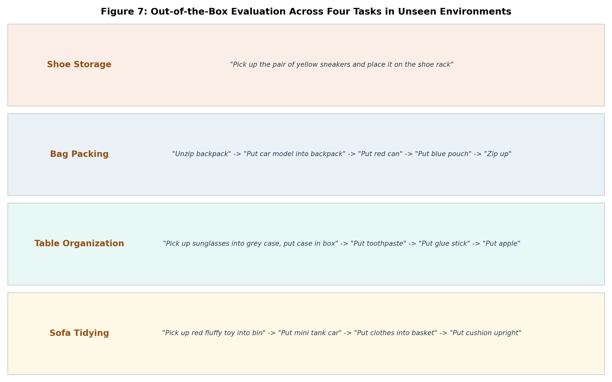
*Figure 7: Post-training Evaluation. We evaluate the post-trained model out-of-the-box across four tasks in novel environments. Crucially, both the environments and object instances are unseen during training.*

#### 3.2.1 Effectiveness of Scaling Pre-training Data

We examine whether benefits of scaling pre-training data transfer to post-training with the 5B variant. Using an identical training recipe, we post-train models initialized from checkpoints pre-trained on 12.5%, 25%, 50%, and 100% of 20k pre-training data, alongside a baseline initialized from Qwen3-VL pre-trained weights without action pre-training (0%).

As shown in Figure 8, the overall success rate increases monotonically with pre-training data scale, rising from 26% without action pre-training to 75% with 100% pre-training data:
- **Average**: 100% data: **75%**, 50%: 69%, 25%: 56%, 12.5%: 53%, 0%: 26%
- **Shoe Storage**: 100%: **75%**, 50%: 83%, 25%: 42%, 12.5%: 42%, 0%: 0%
- **Bag Packing**: 100%: **63%**, 50%: 63%, 25%: 56%, 12.5%: 30%, 0%: 7%
- **Table Organization**: 100%: **82%**, 50%: 67%, 25%: 56%, 12.5%: 63%, 0%: 48%
- **Sofa Tidying**: 100%: **80%**, 50%: 70%, 25%: 67%, 12.5%: 72%, 0%: 33%

Gains from scaling pre-training data are particularly pronounced on tasks demanding contact-rich manipulation (e.g., shoe storage: 0% without pre-training vs. 75% with 100%). Notably, utilizing only 12.5% of pre-training data more than doubles the baseline's overall success rate (53% vs. 26%). Doubling data from 50% to 100% yields an additional 6 percentage point improvement, showing no saturation.

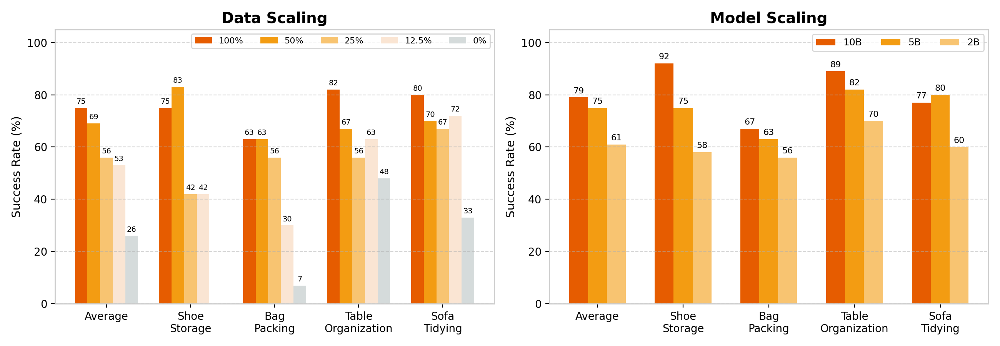
*Figure 8: Quantitative Results of Post-training. We showcase the success rates of post-trained models across different pre-training data scales and model sizes.*

#### 3.2.2 Effectiveness of Scaling Model Size

We investigate the impact of model scale during post-training with 2B, 5B, and 10B variants initialized from checkpoints pre-trained on 20k hours of UMI data (Figure 8). The overall success rate increases monotonically with model size:
- **Average**: 10B: **79%**, 5B: 75%, 2B: 61%
- **Shoe Storage**: 10B: **92%**, 5B: 75%, 2B: 58%
- **Bag Packing**: 10B: **67%**, 5B: 63%, 2B: 56%
- **Table Organization**: 10B: **89%**, 5B: 82%, 2B: 70%
- **Sofa Tidying**: 10B: **77%**, 5B: 80%, 2B: 60%

Model scaling gains are largest on shoe tidying, climbing from 58% (2B) to 75% (5B) and 92% (10B). Pre-training data scale and model size constitute complementary axes for out-of-distribution performance.

---

### 3.3 Downstream Fine-tuning: Efficient Adaptation to New Tasks

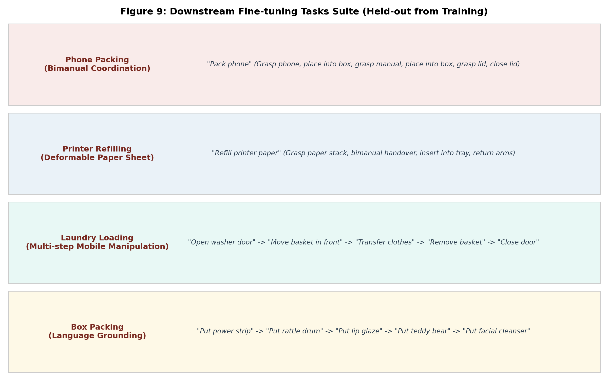
*Figure 9: Downstream Fine-tuning Evaluation. We fine-tune the post-trained model on four new challenging tasks with a minimal amount of data.*

We fine-tune our post-trained model on four novel challenging tasks entirely held out from the in-house dataset (Figure 9):
- **Phone Packing**: requires bimanual coordination.
- **Laundry Loading**: long-horizon mobile manipulation involving multi-step instruction following.
- **Printer Refilling**: handling highly deformable sheets of paper.
- **Box Packing**: language grounding across multiple objects.

Two settings are evaluated:
1. **High-data setting**: 144 hours total across all tasks (<40h/task).
2. **Low-data setting**: 25% subset (36 hours total, average <10h/task; printer refilling has only 10.3h).

We fine-tune using asynchronous training [8] and compare against $\pi_{0.5}$ [5] (official OpenPi protocol) and Xiaomi-Robotics-0 [8]. 10 trials per task are evaluated. We report both success rate and progress score based on milestone completion (Table 6).

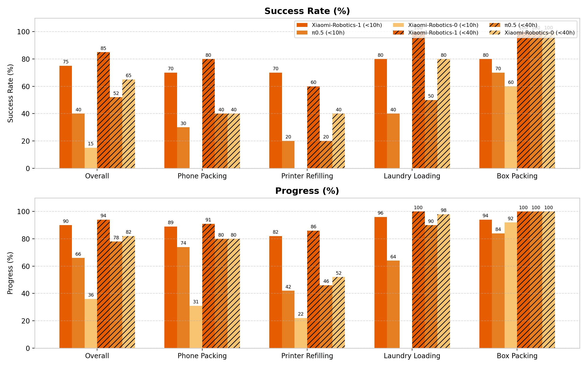
*Figure 10: Quantitative Results of Downstream Fine-tuning. We report the success rates and progresses of different models across the four different tasks.*

| Setting | Metric | Method | Overall | Phone Packing | Printer Refilling | Laundry Loading | Box Packing |
| :--- | :--- | :--- | :---: | :---: | :---: | :---: | :---: |
| **Low-data** (<10h/task) | Success Rate (%) | **Xiaomi-Robotics-1 (Ours)** | **75%** | **70%** | **70%** | **80%** | **80%** |
| | | $\pi_{0.5}$ [5] | 40% | 30% | 20% | 40% | 70% |
| | | Xiaomi-Robotics-0 [8] | 15% | 0% | 0% | 0% | 60% |
| | Progress (%) | **Xiaomi-Robotics-1 (Ours)** | **90%** | **89%** | **82%** | **96%** | **94%** |
| | | $\pi_{0.5}$ [5] | 66% | 74% | 42% | 64% | 84% |
| | | Xiaomi-Robotics-0 [8] | 36% | 31% | 22% | 0% | 92% |
| **High-data** (<40h/task) | Success Rate (%) | **Xiaomi-Robotics-1 (Ours)** | **85%** | **80%** | **60%** | **100%** | **100%** |
| | | $\pi_{0.5}$ [5] | 52% | 40% | 20% | 50% | 100% |
| | | Xiaomi-Robotics-0 [8] | 65% | 40% | 40% | 80% | 100% |
| | Progress (%) | **Xiaomi-Robotics-1 (Ours)** | **94%** | **91%** | **86%** | **100%** | **100%** |
| | | $\pi_{0.5}$ [5] | 78% | 80% | 46% | 90% | 100% |
| | | Xiaomi-Robotics-0 [8] | 82% | 80% | 52% | 98% | 100% |

Xiaomi-Robotics-1 significantly outperforms baselines in both settings. With <10h/task data, it attains **75%** success rate and **90%** progress (vs. $\pi_{0.5}$: 40% SR, 66% progress). In printer refilling, it improves success rate from 20% to 70%. In laundry loading, it reaches 80% SR and 96% progress where Xiaomi-Robotics-0 fails completely.

---

### 3.4 Simulation Benchmarks

#### 1. RoboCasa Benchmark

RoboCasa [52] features single-arm manipulation in realistic kitchen environments across 24 everyday kitchen tasks. Evaluation tests unseen object instances and 2 unseen kitchen scene styles. Following the standard protocol, we evaluate across 100 episodes per task across five scenes.

| Method | Avg. Success (%) |
| :--- | :---: |
| UVA [41] | 50.0 |
| UWM [96] | 60.8 |
| $\pi_{0.5}$ [5] | 62.1 |
| $\pi_0$-FAST [58] | 63.6 |
| GR00T N1.6 [54] | 66.2 |
| Cosmos Policy [32] | 67.1 |
| RLDX-1 [29] | 70.6 |
| World2Act [73] | 72.6 |
| **Xiaomi-Robotics-1 (Ours)** | **74.5** |

*Table 2: Results on the RoboCasa Benchmark. Average success rate (%).*

#### 2. RoboCasa365 Benchmark

RoboCasa365 [53] expands RoboCasa to 365 tasks across 2,500 procedurally generated kitchens and 3,200 object instances, evaluating atomic skills, seen composite tasks, and zero-shot unseen composite tasks. Evaluation covers 50 benchmark tasks (18 atomic, 16 composite-seen, 16 composite-unseen).

| Method | Average | Atomic | Comp.-Seen | Comp.-Unseen |
| :--- | :---: | :---: | :---: | :---: |
| Diffusion Policy [16] | 6.1 | 15.7 | 0.2 | 1.3 |
| $\pi_{0.5}$ [5] | 16.9 | 39.6 | 7.1 | 1.2 |
| GigaWorld-Policy 0.1 [79] | 20.7 | 44.4 | 11.8 | 2.9 |
| GR00T-N1.6 [54] | 21.9 | 51.1 | 9.4 | 1.7 |
| WorldDreamer [75] | 35.3 | 66.3 | 26.7 | 9.0 |
| Qwen-RobotManip [71] | 35.9 | 68.6 | 20.1 | 14.9 |
| RLDX-1 [29] | 36.0 | 67.6 | 27.9 | 8.5 |
| ABot-M0.5 [11] | 40.4 | 75.9 | 38.3 | 2.7 |
| ABot-M0.6 [11] | 46.6 | 79.4 | 48.3 | 7.9 |
| **Xiaomi-Robotics-1 (Ours)** | **57.4** | **80.2** | **57.1** | **32.1** |

*Table 3: Results on the RoboCasa365 benchmark. Task success rates (%).*

Xiaomi-Robotics-1 sets a new state-of-the-art with **57.4%** average success rate (+10.8% over prior best). Crucially, on the zero-shot **Composite-Unseen** split, it achieves **32.1%**, outperforming the closest competitor (14.9%) by more than double (+17.2%).

#### 3. VLABench Benchmark

VLABench [87] evaluates language-conditioned manipulation across 100 categories and 2,000 objects over five tracks: In-distribution, Cross-Category, Commonsense, Instruction, and Texture. We train only on In-distribution demonstrations (10 tasks, 500 demos each) with chain-of-thought (CoT) auxiliary loss [61]. 2,500 rollouts total are evaluated.

| Method | In-dist. | Cross Category | Commonsense | Instruction | Texture | Avg. |
| :--- | :---: | :---: | :---: | :---: | :---: | :---: |
| | **SR / PS / IS** | **SR / PS / IS** | **SR / PS / IS** | **SR / PS / IS** | **SR / PS / IS** | **SR / PS / IS** |
| $\pi_0$-FAST [58] | 56.2 / 72.4 / 67.8 | 31.0 / 47.8 / 25.1 | 48.6 / 56.8 / 48.2 | 35.0 / 59.4 / 56.8 | 39.0 / 56.8 / 54.6 | 41.8 / 58.6 / 51.1 |
| X-VLA [92] | 66.8 / 76.5 / 67.8 | 38.2 / 54.1 / 38.9 | 38.0 / 52.3 / 46.3 | 45.0 / 63.1 / 39.6 | 49.0 / 74.6 / 44.5 | 47.4 / 63.5 / 47.4 |
| ACOT-VLA [94] | 66.1 / 79.8 / 69.4 | 45.2 / 58.6 / 42.1 | 42.6 / 54.8 / 47.2 | 48.2 / 65.4 / 45.3 | 52.4 / 68.2 / 48.6 | 50.9 / 65.4 / 50.5 |
| $\pi_{0.5}$ [5] | 77.8 / 80.4 / 65.4 | 49.7 / 52.0 / 38.2 | 60.0 / 57.3 / 43.9 | 64.2 / 67.0 / 48.2 | 62.3 / 65.0 / 44.9 | 62.8 / 64.3 / 48.1 |
| ERVLA [61] | 69.7 / 81.1 / 84.2 | 47.0 / 61.0 / 66.4 | 44.0 / 55.0 / 57.2 | 73.8 / 70.2 / 58.0 | 47.4 / 62.3 / 70.6 | 56.4 / 65.9 / 67.3 |
| **Xiaomi-Robotics-1 (Ours)** | **75.6 / 85.0 / 79.8** | **53.0 / 66.6 / 66.4** | **58.2 / 68.4 / 58.3** | **55.8 / 66.8 / 70.2** | **62.6 / 74.9 / 74.8** | **61.0 / 72.3 / 69.9** |

*Table 4: Results on the VLABench Benchmark. SR: Success Rate (%), PS: Progress Score (%), IS: Intention Score (%).*

#### 4. RoboDojo Simulation Benchmark

RoboDojo [12] is a comprehensive benchmark evaluating generalist manipulation across 42 simulation tasks along five dimensions: Generalization, Precision, Long-Horizon, Memory, and Open.

| Method | Generalization | Precision | Long-Horizon | Memory | Open | Average |
| :--- | :---: | :---: | :---: | :---: | :---: | :---: |
| GalaxeaVLA (G0) [26] | 4.53 / 2.83% | 8.10 / 3.83% | 12.60 / 5.58% | 3.17 / 1.89% | 0.70 / 0.67% | 5.82 / 2.96% |
| GigaWorld-Policy [79] | 5.34 / 2.89% | 6.15 / 1.83% | 15.51 / 8.92% | 3.46 / 2.22% | 0.54 / 0.50% | 6.20 / 3.27% |
| StarVLA-α [80] | 3.93 / 2.33% | 9.90 / 4.33% | 14.15 / 6.50% | 3.34 / 2.44% | 0.68 / 0.58% | 6.40 / 3.24% |
| Xiaomi-Robotics-0 [8] | 7.43 / 5.56% | 8.42 / 4.58% | 13.51 / 6.92% | 5.07 / 3.67% | 0.22 / 0.17% | 6.93 / 4.18% |
| X-WAM [21] | 7.39 / 3.33% | 6.72 / 1.83% | 17.47 / 9.08% | 6.32 / 4.67% | 0.57 / 0.25% | 7.69 / 3.83% |
| X-VLA [92] | 10.48 / 6.78% | 18.32 / 12.00% | 16.53 / 9.75% | 4.76 / 3.56% | 0.55 / 0.50% | 10.13 / 6.52% |
| $\pi_{0.5}$ [5] | 13.37 / 8.17% | 12.40 / 5.50% | 23.54 / 14.67% | 5.78 / 4.56% | 1.98 / 1.67% | 11.41 / 6.91% |
| Spatial Forcing [35] | 14.12 / 9.33% | 17.33 / 10.58% | 23.26 / 14.58% | 5.43 / 4.11% | 1.78 / 1.58% | 12.38 / 8.04% |
| Hy-Embodied-0.5-VLA [85] | 11.77 / 8.39% | 13.81 / 8.00% | 25.74 / 14.92% | **13.37 / 12.11%** | 0.65 / 0.58% | 13.07 / 8.80% |
| **Xiaomi-Robotics-1 (Ours)** | **23.55 / 17.00%** | **26.69 / 18.83%** | **38.39 / 23.67%** | 7.81 / 6.56% | **3.94 / 3.58%** | **20.07 / 13.93%** |

*Table 5: Results on the RoboDojo Simulation Benchmark. Each entry reports Score / Success Rate (%).*

Xiaomi-Robotics-1 achieves **20.07** score and **13.93%** success rate (+7.0 score and +5.13% SR over prior SOTA). It ranks #1 in Generalization (23.55 vs. 14.12), Precision (26.69 vs. 18.32), Long-Horizon (38.39 vs. 25.74), and Open-ended instruction following (3.94 vs. 1.98).

---

## 4. Related Work

### Scaling for Robot Learning
Research on scaling laws in large language models (LLMs) demonstrates that performance improves predictably when data, compute, and model capacity are scaled in tandem [22, 27]. Large language models [7, 72] and multi-modal foundation models [1–3, 63] further showcase substantial capability gains driven by scaling data and model size. Motivated by these advancements, robot learning has increasingly embraced this scaling paradigm [4–6, 8, 31, 42, 54, 58, 65–67, 97].

Scaling robot learning differs fundamentally from web-scale data: real-robot trajectories require costly and labor-intensive teleoperation, yielding data confined to a narrow slice of environments and tasks. To alleviate this bottleneck, recent work leverages portable UMI devices [17] for in-the-wild manipulation collection without physical robot embodiments [17, 46, 65, 66, 77, 90]. Complementarily, egocentric human manipulation videos provide rich diversity across tasks, objects, and environments via representation alignment or motion retargeting [15, 40, 50]. In this work, we leverage over 100k hours of real-world UMI trajectories to systematically explore the scaling properties of foundational VLA models.

### Robot Foundation Models
Robot foundation models enable robust generalization across environments and efficient adaptation to downstream tasks. World-action models (WAMs) [21, 32, 36, 39, 51, 56, 68, 78, 81, 83, 86] and vision-language-action (VLA) models [4, 5, 8–10, 30, 38, 42, 60, 82, 92] represent two primary paradigms.

WAMs build upon pre-trained video models, modeling future observations or environment dynamics to guide action generation [18, 23, 32, 33, 36, 37, 41, 43, 95, 96], incorporating 3D geometric structures [21, 39, 88, 91], and pre-training on heterogeneous video-action data for zero-shot transfer [81, 86].

VLA models leverage pre-trained vision-language models to harness general semantic knowledge for action prediction [4, 5, 8–10, 24, 25, 30, 47, 54, 97]. Recent VLA advances include:
1. Embodied reasoning tokens and visual chains-of-thought [13, 19, 34, 64, 84, 89, 93],
2. Expressive continuous action representations via learned tokenizers and flow matching [4, 20, 48, 58, 82], and
3. Cross-embodiment pre-training across heterogeneous hardware platforms [8, 30, 54, 55, 69, 82].

Our work follows the VLA paradigm, with a specific focus on scaling laws, supported by scalable data collection and state-transition auto-labeling infrastructure.

---

## 5. Conclusions

In this work, we present **Xiaomi-Robotics-1**, a foundational vision-language-action (VLA) model that is able to follow instructions to perform a wide range of mobile manipulation tasks out-of-the-box in unseen environments, and efficiently adapt to novel challenging tasks with a minimal amount of data. During pre-training, we leverage over 100,000 hours of real-world manipulation trajectories, endowing the model with broad and generalizable manipulation capabilities. To scale training effectively, we propose an auto-labeling pipeline that annotates the large-scale dataset with detailed descriptions of scene state transitions as language prompts. In the post-training phase, we align these strong capabilities acquired during pre-training with robot embodiments and imperative instruction prompts using a cross-embodiment dataset.

Extensive experiments demonstrate that the performance of Xiaomi-Robotics-1 consistently improves with increasing data scale and model size during pre-training. More importantly, the scaling property directly translates to out-of-the-box performance in unseen environments after post-training. Xiaomi-Robotics-1 can also serve as a powerful robot foundation model that is able to adapt to novel challenging real-robot tasks with minimal data. In addition, it achieves strong state-of-the-art results on four challenging simulation benchmarks. We hope this work can serve as a foundation for future exploration of scalable robot policies that can be deployed out-of-the-box in the real world.

---

## Contributions & Acknowledgment

Authors are listed in alphabetical order.

**Core Contributors:**
Jun Guo, Piaopiao Jin, Jason Li, Peiyan Li, Yingyan Li, Futeng Liu, Wanli Peng, Optimus Qin, Yifei Su, Nan Sun, Qiao Sun, Runze Suo, Heyun Wang, Yunhong Wang, Rujie Wu, Caoyu Xia, Lina Zhang, Jack Zhao.

**Contributors:**
Guoliang Chen, Wenlong Chen, Xinze He, Bin Li, Qing Li, Zhuorong Li, Heng Qu, Wenxuan Song, Diyun Xiang, Yifan Xie, Peiran Xu, Hangjun Ye, Wen Ye, Han Zhao, Quanyun Zhou.

**Acknowledgment:**
We express our sincere appreciation to the broader team for their tremendous support, including those not listed above: Li Jiang, Xiaohan Yu, Meichen Mu, Xiaoke Xilinjueluo, Qingyi Li, Qi Liu, Yayun Liu, Jun Xia, Feng Qiu, Donghao Wang, Yan Hou, Dong Wang, Liangliang He, Jiaxin Liu, Kang Zhou, Rui Cai, Shuoxue Bi, Yingchao Zhou, Kun Ma, Yiwei Zhou, and Dongsheng Li.

---

## Appendix

### Progress Milestones for Downstream Fine-tuning

| Task | Progress Milestones | Progress (%) |
| :--- | :--- | :---: |
| **Phone Packing** | Grasp the phone; place the phone into the box; grasp the instruction manual; place the manual into the box; grasp the lid; successfully close the lid. | 10, 10, 30, 10, 10, 30 |
| **Printer Refilling** | Grasp the paper; complete the handover; successfully insert one end of the paper into the printer tray; fully insert the paper stack into the printer tray; return both robot arms to the resting pose. | 20, 20, 20, 30, 10 |
| **Laundry Loading** | Open the washing machine door; move the laundry basket to the door; transfer the clothes into the washing machine; remove the laundry basket; close the washing machine door. | 20 each |
| **Box Packing** | Grasp and place each specified target object into the box according to the language instruction. Five target objects are evaluated in each rollout. | 20 each |

*Table 6: Progress Definition for Evaluation on Efficient Adaptation to New Tasks. Each rollout is assigned a progress score from 0 to 100% according to completed task milestones.*

---

### Dataset Samples and Visualizations

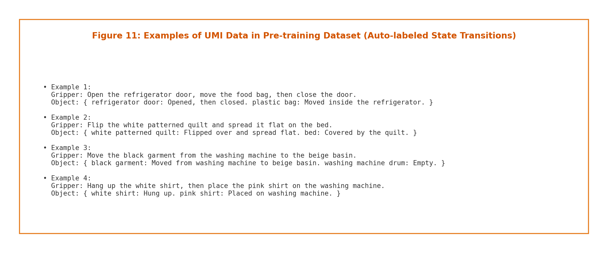
*Figure 11: Examples of UMI data in the Pre-training Dataset. Trajectory segments are auto-captioned with scene state transitions describing both gripper actions and object state changes.*

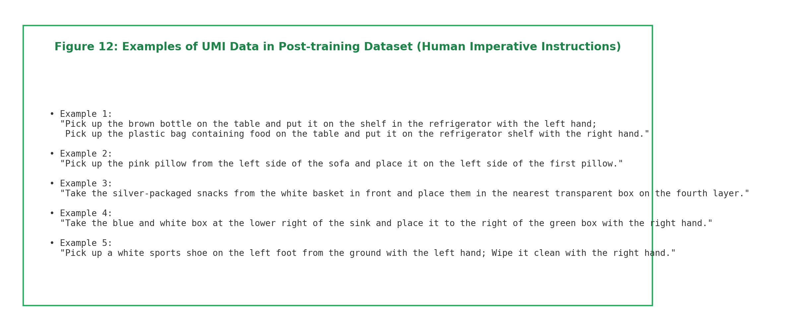
*Figure 12: Examples of UMI data in the Post-training Dataset. Human-annotated trajectories labeled with imperative natural language instructions.*

---

## References

1. J. Achiam, S. Adler, S. Agarwal, L. Ahmad, I. Akkaya, F. L. Aleman, D. Almeida, J. Altenschmidt, S. Altman, S. Anadkat, et al. GPT-4 technical report. *arXiv preprint arXiv:2303.08774*, 2023.
2. N. Agarwal, A. Ali, J. Allen, M. Antolini, A. Aubame, A. Azzolini, J. Bai, M. Bala, Y. Balaji, J. Bapst, et al. Cosmos 3: Omnimodal world models for physical AI. *arXiv preprint arXiv:2606.02800*, 2026.
3. S. Bai, Y. Cai, R. Chen, K. Chen, X. Chen, Z. Cheng, L. Deng, W. Ding, C. Gao, C. Ge, et al. Qwen3-VL technical report. *arXiv preprint arXiv:2511.21631*, 2025.
4. K. Black, N. Brown, D. Driess, A. Esmail, M. Equi, C. Finn, N. Fusai, L. Groom, K. Hausman, B. Ichter, et al. $\pi_0$: A vision-language-action flow model for general robot control. *arXiv preprint arXiv:2410.24164*, 2024.
5. K. Black, N. Brown, J. Darpinian, K. Dhabalia, D. Driess, A. Esmail, M. Equi, C. Finn, N. Fusai, et al. $\pi_{0.5}$: A vision-language-action model with open-world generalization. *arXiv preprint arXiv:2504.16054*, 2025.
6. A. Brohan, N. Brown, J. Carbajal, Y. Chebotar, J. Dabis, C. Finn, K. Gopalakrishnan, K. Hausman, A. Herzog, J. Hsu, et al. RT-1: Robotics transformer for real-world control at scale. *arXiv preprint arXiv:2212.06817*, 2022.
7. T. Brown, B. Mann, N. Ryder, M. Subbiah, J. D. Kaplan, P. Dhariwal, A. Neelakantan, P. Shyam, G. Sastry, A. Askell, et al. Language models are few-shot learners. *Advances in Neural Information Processing Systems*, 33:1877–1901, 2020.
8. R. Cai, J. Guo, X. He, P. Jin, J. Li, B. Lin, F. Liu, W. Liu, F. Ma, K. Ma, et al. Xiaomi-robotics-0: An open-sourced vision-language-action model with real-time execution. *arXiv preprint arXiv:2602.12684*, 2026.
9. C.-L. Cheang, G. Chen, Y. Jing, T. Kong, H. Li, Y. Li, Y. Liu, H. Wu, J. Xu, Y. Yang, et al. GR-2: A generative video-language-action model with web-scale knowledge for robot manipulation. *arXiv preprint arXiv:2410.06158*, 2024.
10. C. Cheang, S. Chen, Z. Cui, Y. Hu, L. Huang, T. Kong, H. Li, Y. Li, Y. Liu, X. Ma, et al. GR-3 technical report. *arXiv preprint arXiv:2507.15493*, 2025.
11. R. Chen, Y. Yang, Z. Tang, D. Huo, T. Lin, H. Wu, H. Liu, Y. Chen, L. Zheng, B. Yuan, T. Li, M. Wang, D. Qi, B. Hu, W. Mei, Y. Xuan, H. Yang, Y. Zhu, M. Xu, Z. Ma, and X. Chang. ABot-M0.5: Unified mobility-and-manipulation world action model. *arXiv preprint arXiv:2607.00678*, 2026.
12. T. Chen, Y. Chen, Z. Li, J. Tang, K. Su, H. Lu, W. Wan, B. Chen, S. Liu, H. Yan, H. Su, Z. Dou, K. Wang, D. Zhang, Y. Liu, Y. Qin, Q. Liang, Q. Wu, Z. Lin, W. Lin, Y. Wang, M. He, T. Wu, R. Wu, J. Zhou, K.-C. Lei, H. Yu, Y. Ji, W. Jin, G. Lin, X. Li, Q. Xiong, R. Xu, Z. Li, W. Chai, E. Xie, Z. Wang, Y. Mu, H. Dong, W. Matusik, M. Ding, W. Ding, P. Luo, and M. Tomizuka. RoboDojo: A unified sim-and-real benchmark for comprehensive evaluation of generalist robot manipulation policies. *arXiv preprint arXiv:2607.04434*, 2026.
13. W. Chen, S. Belkhale, S. Mirchandani, O. Mees, D. Driess, K. Pertsch, and S. Levine. Training strategies for efficient embodied reasoning. *arXiv preprint arXiv:2505.08243*, 2025.
14. X. Chen, X. Wang, S. Changpinyo, A. J. Piergiovanni, P. Padlewski, D. Salz, S. Goodman, A. Grycner, B. Mustafa, L. Beyer, et al. PaLI: A jointly-scaled multilingual language-image model. *arXiv preprint arXiv:2209.06794*, 2022.
15. Y. Chen, Z. Chen, P. Wang, Y.-L. Li, J. Huo, J. Shi, and Y. Gao. WHO: Generative world models as scalable sources of egocentric human hand manipulation data. *arXiv preprint arXiv:2606.22136*, 2026.
16. C. Chi, Z. Xu, S. Feng, E. Cousineau, Y. Du, B. Burchfiel, R. Tedrake, and S. Song. Diffusion policy: Visuomotor policy learning via action diffusion. *The International Journal of Robotics Research*, 2024.
17. C. Chi, Z. Xu, C. Pan, E. Cousineau, B. Burchfiel, S. Feng, R. Tedrake, and S. Song. Universal manipulation interface: In-the-wild robot teaching without in-the-wild robots. *arXiv preprint arXiv:2402.10329*, 2024.
18. Y. Du, S. Yang, B. Dai, H. Dai, O. Nachum, J. Tenenbaum, D. Schuurmans, and P. Abbeel. Learning universal policies via text-guided video generation. *Advances in Neural Information Processing Systems*, 36:9156–9172, 2023.
19. H. Fang, J. Duan, D. Clay, S. Wang, S. Liu, W. Huang, X. Fan, W.-C. Tsai, S. Chen, Y. R. Wang, et al. MolmoAct2: Action reasoning models for real-world deployment. *arXiv preprint arXiv:2605.02881*, 2026.
20. Galaxea Team. Galaxea G0.5 technical report. 2026. [https://opengalaxea.github.io/G05/](https://opengalaxea.github.io/G05/).
21. J. Guo, Q. Li, P. Li, Z. Chen, N. Sun, Y. Su, H. Wang, Y. Zhang, X. Li, and H. Liu. Unified 4D world action modeling from video priors with asynchronous denoising. *arXiv preprint arXiv:2604.26694*, 2026.
22. J. Hoffmann, S. Borgeaud, A. Mensch, E. Buchatskaya, T. Cai, E. Rutherford, D. de Las Casas, L. A. Hendricks, J. Welbl, A. Clark, et al. Training compute-optimal large language models. *arXiv preprint arXiv:2203.15556*, 2022.
23. Y. Hu, Y. Guo, P. Wang, X. Chen, Y.-J. Wang, J. Zhang, K. Sreenath, C. Lu, and J. Chen. Video prediction policy: A generalist robot policy with predictive visual representations. *arXiv preprint arXiv:2412.14803*, 2024.
24. Physical Intelligence, A. Amin, R. Aniceto, A. Balakrishna, K. Black, K. Conley, G. Connors, J. Darpinian, K. Dhabalia, J. DiCarlo, et al. $\pi_{0.6}$: A VLA that learns from experience. *arXiv preprint arXiv:2511.14759*, 2025.
25. Physical Intelligence, B. Ai, A. Amin, R. Aniceto, A. Balakrishna, G. Balke, K. Black, G. Bokinsky, S. Cao, T. Charbonnier, et al. $\pi_{0.7}$: A steerable generalist robotic foundation model with emergent capabilities. *arXiv preprint arXiv:2604.15483*, 2026.
26. T. Jiang, T. Yuan, Y. Liu, C. Lu, J. Cui, X. Liu, S. Cheng, J. Gao, H. Xu, and H. Zhao. Galaxea open-world dataset and G0 dual-system VLA model. *arXiv preprint arXiv:2509.00576*, 2025.
27. J. Kaplan, S. McCandlish, T. Henighan, T. B. Brown, B. Chess, R. Child, S. Gray, A. Radford, J. Wu, and D. Amodei. Scaling laws for neural language models. *arXiv preprint arXiv:2001.08361*, 2020.
28. A. Khazatsky, K. Pertsch, S. Nair, A. Balakrishna, S. Dasari, S. Karamcheti, S. Nasiriany, M. K. Srirama, L. Y. Chen, K. Ellis, et al. DROID: A large-scale in-the-wild robot manipulation dataset. *arXiv preprint arXiv:2403.12945*, 2024.
29. D. Kim, H. Jang, M. Koo, S. Jang, T. Kim, B. Kim, B. Yoon, C. Jang, D. Choi, D. Han, et al. RLDX-1 technical report. *arXiv preprint arXiv:2605.03269*, 2026.
30. M. J. Kim, K. Pertsch, S. Karamcheti, T. Xiao, A. Balakrishna, S. Nair, R. Rafailov, E. Foster, G. Lam, P. Sanketi, et al. OpenVLA: An open-source vision-language-action model. *arXiv preprint arXiv:2406.09246*, 2024.
31. M. J. Kim, C. Finn, and P. Liang. Fine-tuning vision-language-action models: Optimizing speed and success. *arXiv preprint arXiv:2502.19645*, 2025.
32. M. J. Kim, Y. Gao, T.-Y. Lin, Y.-C. Lin, Y. Ge, G. Lam, P. Liang, S. Song, M.-Y. Liu, C. Finn, et al. Cosmos Policy: Fine-tuning video models for visuomotor control and planning. *arXiv preprint arXiv:2601.16163*, 2026.
33. P.-C. Ko, J. Mao, Y. Du, S.-H. Sun, and J. B. Tenenbaum. Learning to act from actionless videos through dense correspondences. In *ICLR*, pages 40938–40958, 2024.
34. J. Lee, J. Duan, H. Fang, Y. Deng, S. Liu, B. Li, B. Fang, J. Zhang, Y. R. Wang, S. Lee, et al. MolmoAct: Action reasoning models that can reason in space. *arXiv preprint arXiv:2508.07917*, 2025.
35. F. Li, W. Song, H. Zhao, J. Wang, P. Ding, D. Wang, L. Zeng, and H. Li. Spatial Forcing: Implicit spatial representation alignment for vision-language-action model. *arXiv preprint arXiv:2510.12276*, 2025.
36. L. Li, Q. Zhang, Y. Luo, S. Yang, R. Wang, F. Han, M. Yu, Z. Gao, N. Xue, X. Zhu, et al. Causal world modeling for robot control. *arXiv preprint arXiv:2601.21998*, 2026.
37. P. Li, H. Wu, Y. Huang, C. Cheang, L. Wang, and T. Kong. GR-MG: Leveraging partially-annotated data via multi-modal goal-conditioned policy. *IEEE Robotics and Automation Letters*, 10(2):1912–1919, 2025.
38. P. Li, Y. Chen, H. Wu, X. Ma, X. Wu, Y. Huang, L. Wang, T. Kong, and T. Tan. BridgeVLA: Input-output alignment for efficient 3D manipulation learning with vision-language models. *Advances in Neural Information Processing Systems*, 38:63635–63673, 2026.
39. P. Li, Y. Chen, Y. Xu, J. Yang, X. Wu, J. Guo, N. Sun, L. Qian, X. Li, X. Xiao, et al. Multi-view video diffusion policy: A 3D spatio-temporal-aware video action model. *arXiv preprint arXiv:2604.03181*, 2026.
40. Q. Li, Y. Deng, Y. Liang, L. Luo, L. Zhou, C. Yao, L. Zeng, Z. Feng, H. Liang, S. Xu, et al. Scalable vision-language-action model pretraining for robotic manipulation with real-life human activity videos. *arXiv preprint arXiv:2510.21571*, 2025.
41. S. Li, Y. Gao, D. Sadigh, and S. Song. Unified video action model. *arXiv preprint arXiv:2503.00200*, 2025.
42. X. Li, P. Li, M. Liu, D. Wang, J. Liu, B. Kang, X. Ma, T. Kong, H. Zhang, and H. Liu. Towards generalist robot policies: What matters in building vision-language-action models. *arXiv preprint arXiv:2412.14058*, 2024.
43. J. Liang, R. Liu, E. Ozguroglu, S. Sudhakar, A. Dave, P. Tokmakov, S. Song, and C. Vondrick. Dreamitate: Real-world visuomotor policy learning via video generation. *arXiv preprint arXiv:2406.16862*, 2024.
44. W. Liang, L. Yu, L. Luo, S. Iyer, N. Dong, C. Zhou, G. Ghosh, M. Lewis, W.-t. Yih, L. Zettlemoyer, et al. Mixture-of-transformers: A sparse and scalable architecture for multi-modal foundation models. *arXiv preprint arXiv:2411.04996*, 2024.
45. A. Liu, B. Feng, B. Xue, B. Wang, B. Wu, C. Lu, C. Zhao, C. Deng, C. Zhang, C. Ruan, et al. DeepSeek-V3 technical report. *arXiv preprint arXiv:2412.19437*, 2024.
46. F. Liu, C. Li, Y. Qin, J. Xu, P. Abbeel, and R. Chen. VITAMIN: Learning contact-rich tasks through robot-free visuo-tactile manipulation interface. *arXiv preprint arXiv:2504.06156*, 2025.
47. S. Liu, L. Wu, B. Li, H. Tan, H. Chen, Z. Wang, K. Xu, H. Su, and J. Zhu. RDT-1B: A diffusion foundation model for bimanual manipulation. In *ICLR*, pages 29982–30009, 2025.
48. S. Liu, B. Li, K. Ma, L. Wu, H. Tan, X. Ouyang, H. Su, and J. Zhu. RDT2: Exploring the scaling limit of UMI data towards zero-shot cross-embodiment generalization. *arXiv preprint arXiv:2602.03310*, 2026.
49. X. Liu, C. Gong, and Q. Liu. Flow straight and fast: Learning to generate and transfer data with rectified flow. *arXiv preprint arXiv:2209.03003*, 2022.
50. H. Luo, Y. Feng, W. Zhang, S. Zheng, Y. Wang, H. Yuan, J. Liu, C. Xu, Q. Jin, and Z. Lu. Being-H0: Vision-language-action pretraining from large-scale human videos. *arXiv preprint arXiv:2507.15597*, 2025.
51. T. Ma, J. Zheng, Z. Wang, C. Jiang, A. Cui, J. Liang, and S. Yang. DiT4DiT: Jointly modeling video dynamics and actions for generalizable robot control. *arXiv preprint arXiv:2603.10448*, 2026.
52. S. Nasiriany, A. Maddukuri, L. Zhang, A. Parikh, A. Lo, A. Joshi, A. Mandlekar, and Y. Zhu. RoboCasa: Large-scale simulation of everyday tasks for generalist robots. *arXiv preprint arXiv:2406.02523*, 2024.
53. S. Nasiriany, S. Nasiriany, A. Maddukuri, and Y. Zhu. RoboCasa365: A large-scale simulation framework for training and benchmarking generalist robots. *arXiv preprint arXiv:2603.04356*, 2026.
54. NVIDIA, J. Bjorck, N. Cherniadev, F. Castañeda, X. Da, R. Ding, L. Fan, Y. Fang, D. Fox, F. Hu, S. Huang, J. Jang, Z. Jiang, J. Kautz, K. Kundalia, L. Lao, Z. Li, Z. Lin, K. Lin, G. Liu, E. Llontop, L. Magne, A. Mandlekar, A. Narayan, S. Nasiriany, S. Reed, Y. L. Tan, G. Wang, Z. Wang, J. Wang, Q. Wang, J. Xiang, Y. Xie, Y. Xu, Z. Xu, S. Ye, Z. Yu, A. Zhang, H. Zhang, Y. Zhao, R. Zheng, and Y. Zhu. GR00T N1: An open foundation model for generalist humanoid robots. *arXiv preprint*, March 2025.
55. A. O'Neill, A. Rehman, A. Maddukuri, A. Gupta, A. Padalkar, A. Lee, A. Pooley, A. Gupta, A. Mandlekar, A. Jain, et al. Open X-Embodiment: Robotic learning datasets and RT-X models. In *ICRA*, pages 6892–6903, 2024.
56. J. Pai, L. Achenbach, V. Montesinos, B. Forrai, O. Mees, and E. Nava. MIMIC-Video: Video-action models for generalizable robot control beyond VLAs. *arXiv preprint arXiv:2512.15692*, 2025.
57. W. Peebles and S. Xie. Scalable diffusion models with transformers. In *ICCV*, pages 4195–4205, 2023.
58. K. Pertsch, K. Stachowicz, B. Ichter, D. Driess, S. Nair, Q. Vuong, O. Mees, C. Finn, and S. Levine. FAST: Efficient action tokenization for vision-language-action models. *arXiv preprint arXiv:2501.09747*, 2025.
59. H. Qi, Y.-J. Wang, T. Lin, B. Yi, Y. Ma, K. Sreenath, and J. Malik. Coordinated humanoid manipulation with choice policies. *arXiv preprint arXiv:2512.25072*, 2025.
60. D. Qu, H. Song, Q. Chen, Y. Yao, X. Ye, Y. Ding, Z. Wang, J. Gu, B. Zhao, D. Wang, et al. SpatialVLA: Exploring spatial representations for visual-language-action model. *arXiv preprint arXiv:2501.15830*, 2025.
61. N. Sun, Y. Zhang, Y. Yang, W. Zhao, P. Li, J. Guo, W. Song, P. Ding, R. Suo, Y. Su, et al. Revisiting embodied chain-of-thought for generalizable robot manipulation. *arXiv preprint arXiv:2606.03784*, 2026.
62. Gemini Team, R. Anil, S. Borgeaud, J.-B. Alayrac, J. Yu, R. Soricut, J. Schalkwyk, A. M. Dai, A. Hauth, K. Millican, et al. Gemini: A family of highly capable multimodal models. *arXiv preprint arXiv:2312.11805*, 2023.
63. Gemini Team, P. Georgiev, V. I. Lei, R. Burnell, L. Bai, A. Gulati, G. Tanzer, D. Vincent, Z. Pan, S. Wang, et al. Gemini 1.5: Unlocking multimodal understanding across millions of tokens of context. *arXiv preprint arXiv:2403.05530*, 2024.
64. Gemini Robotics Team, S. Abeyruwan, J. Ainslie, J.-B. Alayrac, M. G. Arenas, T. Armstrong, A. Balakrishna, R. Baruch, M. Bauza, M. Blokzijl, et al. Gemini robotics: Bringing AI into the physical world. *arXiv preprint arXiv:2503.20020*, 2025.
65. Generalist Team. Gen-0: Embodied foundation models that scale with physical interaction. *Generalist AI Blog*, 2025.
66. Generalist Team. Gen-1: Scaling embodied foundation models to mastery. *Generalist AI Blog*, 2026.
67. Genesis AI Team. Gene-26.5: Advancing robotic manipulation to human level. *Genesis AI Blog*, May 2026.
68. MotuBrain Team, C. Xiang, F. Bao, H. Liu, H. Tan, H. Bi, J. Li, J. Liu, J. Pang, K. Jing, et al. MotuBrain: An advanced world action model for robot control. *arXiv preprint arXiv:2604.27792*, 2026.
69. Octo Model Team, D. Ghosh, H. Walke, K. Pertsch, K. Black, O. Mees, S. Dasari, J. Hejna, T. Kreiman, C. Xu, et al. Octo: An open-source generalist robot policy. *arXiv preprint arXiv:2405.12213*, 2024.
70. Qwen Team. Qwen3.5: Accelerating productivity with native multimodal agents, February 2026.
71. Qwen Team. Qwen-RobotManip technical report: Alignment unlocks scale for robotic manipulation foundation models. 2026.
72. H. Touvron, T. Lavril, G. Izacard, X. Martinet, M.-A. Lachaux, T. Lacroix, B. Rozière, N. Goyal, E. Hambro, F. Azhar, et al. LLaMA: Open and efficient foundation language models. *arXiv preprint arXiv:2302.13971*, 2023.
73. A. D. Vuong, T. V. Vo, A. Sohail, H. Ding, L. Ma, X. Liang, A. Duan, I. Laptev, and I. Reid. World2Act: Latent action post-training from world model dynamics. *arXiv preprint arXiv:2603.10422*, 2026.
74. H. R. Walke, K. Black, T. Z. Zhao, Q. Vuong, C. Zheng, P. Hansen-Estruch, A. W. He, V. Myers, M. J. Kim, M. Du, et al. BridgeData V2: A dataset for robot learning at scale. In *CoRL*, pages 1723–1736, 2023.
75. X. Wang, Z. Zhu, G. Huang, B. Wang, X. Chen, and J. Lu. WorldDreamer: Towards general world models for video generation via predicting masked tokens. *arXiv preprint arXiv:2401.09985*, 2024.
76. W. Wu, F. Lu, Y. Wang, S. Yang, S. Liu, F. Wang, Q. Zhu, H. Sun, Y. Wang, S. Ma, et al. A pragmatic VLA foundation model. *arXiv preprint arXiv:2601.18692*, 2026.
77. M. Xu, H. Zhang, Y. Hou, Z. Xu, L. Fan, M. Veloso, and S. Song. DexUMI: Using human hand as the universal manipulation interface for dexterous manipulation. *arXiv preprint arXiv:2505.21864*, 2025.
78. S. Yang, J. Mu, T. Wei, C. Lu, X. Li, L. Xu, Z. Xue, Z. Yuan, D. Lin, J. Pang, et al. MemoryWAM: Efficient world action modeling with persistent memory. *arXiv preprint arXiv:2606.20562*, 2026.
79. A. Ye, B. Wang, C. Ni, G. Huang, G. Zhao, H. Li, H. Li, J. Li, J. Lv, J. Liu, M. Cao, P. Li, Q. Deng, W. Mei, X. Wang, X. Chen, X. Zhou, Y. Wang, Y. Chang, Y. Li, Y. Zhou, Y. Ye, Z. Liu, and Z. Zhu. GigaWorld-Policy: An efficient action-centered world-action model. *arXiv preprint arXiv:2603.17240*, 2026.
80. J. Ye, N. Gao, S. Yang, J. Zheng, Z. Wang, Y. Chen, P. Chen, Y. Chen, S. Liu, and J. Jia. StarVLA-α: Reducing complexity in vision-language-action systems. In *ECCV*, 2026.
81. S. Ye, Y. Ge, K. Zheng, S. Gao, S. Yu, G. Kurian, S. Indupuru, Y. L. Tan, C. Zhu, J. Xiang, et al. World action models are zero-shot policies. *arXiv preprint arXiv:2602.15922*, 2026.
82. R. Yu, P. Zhang, S. Liu, B. Liu, M. Kang, S. Li, L. Shi, E. Ma, P. Yang, C. Pan, et al. WALL-OSS-0.5 technical report. *arXiv preprint arXiv:2605.30877*, 2026.
83. T. Yuan, Z. Dong, Y. Liu, and H. Zhao. Fast-WAM: Do world action models need test-time future imagination? *arXiv preprint arXiv:2603.16666*, 2026.
84. M. Zawalski, W. Chen, K. Pertsch, O. Mees, C. Finn, and S. Levine. Robotic control via embodied chain-of-thought reasoning. *arXiv preprint arXiv:2407.08693*, 2024.
85. H. Zhang, L. Xiang, H. Lin, Z. Huang, M. Wang, D. Zhong, Y. Dong, Y. Wu, Y. Rao, D. Zhang, et al. Hy-Embodied-0.5-VLA: From vision-language-action models to a real-world robot learning stack. *arXiv preprint arXiv:2606.14409*, 2026.
86. Q. Zhang, L. Li, L. Zhang, S. Yang, Y. Luo, S. Li, R. Wang, J. Wang, J. Shao, G. Xu, et al. Native video-action pretraining for generalizable robot control. *arXiv preprint arXiv:2607.08639*, 2026.
87. S. Zhang, Z. Xu, P. Liu, X. Yu, Y. Li, Q. Gao, Z. Fei, Z. Yin, Z. Wu, Y.-G. Jiang, et al. VLABench: A large-scale benchmark for language-conditioned robotics manipulation with long-horizon reasoning tasks. In *ICCV*, pages 11142–11152, 2025.
88. H. Zhao, X. Zhao, S. Huang, X. Li, D. Zhao, and Z. Li. RynnWorld-4D: 4D embodied world models for robotic manipulation. *arXiv preprint arXiv:2607.06559*, 2026.
89. Q. Zhao, Y. Lu, M. J. Kim, Z. Fu, Z. Zhang, Y. Wu, Z. Li, Q. Ma, S. Han, C. Finn, et al. CoT-VLA: Visual chain-of-thought reasoning for vision-language-action models. In *CVPR*, pages 1702–1713, 2025.
90. Z. Zhaxizhuoma, K. Liu, C. Guan, Z. Jia, Z. Wu, X. Liu, T. Wang, S. Liang, P. Chen, P. Zhang, et al. FastUMI: A scalable and hardware-independent universal manipulation interface with dataset. In *CoRL*, pages 3069–3093, 2025.
91. H. Zhen, Q. Sun, H. Zhang, J. Li, S. Zhou, Y. Du, and C. Gan. Tesseract: Learning 4D embodied world models. *arXiv preprint arXiv:2504.20995*, 2025.
92. J. Zheng, J. Li, Z. Wang, D. Liu, X. Kang, Y. Feng, Y. Zheng, J. Zou, Y. Chen, J. Zeng, et al. X-VLA: Soft-prompted transformer as scalable cross-embodiment vision-language-action model. *arXiv preprint arXiv:2510.10274*, 2025.
93. R. Zheng, Y. Liang, S. Huang, J. Gao, H. Daumé III, A. Kolobov, F. Huang, and J. Yang. TraceVLA: Visual trace prompting enhances spatial-temporal awareness for generalist robotic policies. In *ICLR*, pages 54277–54296, 2025.
94. L. Zhong, Y. Liu, Y. Wei, Z. Xiong, M. Yao, S. Liu, and G. Ren. ACOT-VLA: Action chain-of-thought for vision-language-action models. *arXiv preprint arXiv:2601.11404*, 2026.
95. S. Zhou, Y. Du, J. Chen, Y. Li, D.-Y. Yeung, and C. Gan. RoboDreamer: Learning compositional world models for robot imagination. *arXiv preprint arXiv:2404.12377*, 2024.
96. C. Zhu, R. Yu, S. Feng, B. Burchfiel, P. Shah, and A. Gupta. Unified world models: Coupling video and action diffusion for pretraining on large robotic datasets. *arXiv preprint arXiv:2504.02792*, 2025.
97. B. Zitkovich, T. Yu, S. Xu, P. Xu, T. Xiao, F. Xia, J. Wu, P. Wohlhart, S. Welker, A. Wahid, et al. RT-2: Vision-language-action models transfer web knowledge to robotic control. In *CoRL*, pages 2165–2183, 2023.
